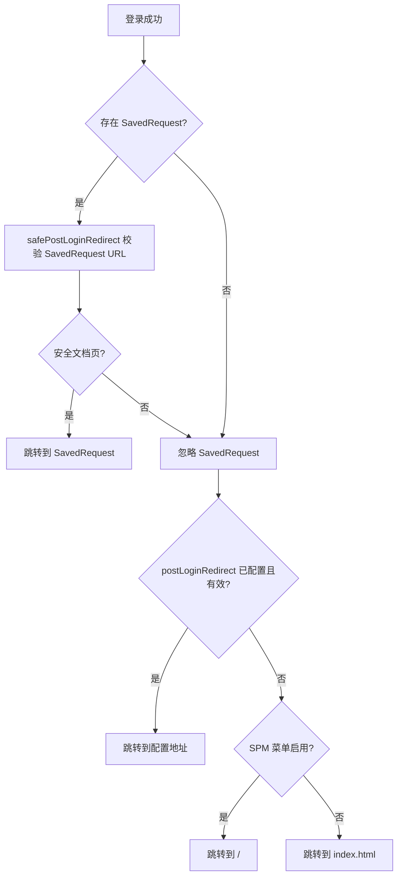

# 账号认证配置与登录后跳转

> **适用对象**：引用 Autumn 的业务工程、运维与二次开发团队  
> **核心类**：`cn.org.autumn.model.AccountAuthConfig`、`cn.org.autumn.config.JsonTypeConfigRefresher`  
> **系统模块**：`cn.org.autumn.modules.sys`（配置存储、登录接口、管理页）  
> **框架版本**：Autumn **2.0.0**（`master`）/ **3.0.0**（`3.0.0` 分支）— 行为一致  
> **命名空间**：2.x 为 `javax.*` · MyBatis-Plus 2.x；3.x 为 `jakarta.*` · MyBatis-Plus 3.x  
> **引入版本**：自 **2.0.0** `b3117467` 起；**3.0.0** 于 `6385eda4` 合并对齐（含本文档）

本文说明 **账号认证 JSON 配置**（含 **登录成功后跳转地址**）的配置方式、解析规则，以及框架升级后 **json_type 配置字段补全** 的用法。OAuth 授权页、扫码 OAuth 分支等 **不读取** `postLoginRedirect`，见 [§6 不受影响的路径](#6-不受影响的路径)。

---

## 目录

1. [快速开始](#1-快速开始)
2. [配置项说明](#2-配置项说明)
3. [登录后跳转解析规则](#3-登录后跳转解析规则)
4. [配置方式](#4-配置方式)
5. [业务代码接入](#5-业务代码接入)
6. [不受影响的路径](#6-不受影响的路径)
7. [json_type 配置字段刷新](#7-json_type-配置字段刷新)
8. [框架升级与已有库数据](#8-框架升级与已有库数据)
9. [FAQ](#9-faq)
10. [相关文档与源码入口](#10-相关文档与源码入口)

---

## 1. 快速开始

**场景**：用户直接打开 `login.html` 登录（无会话过期前的 SavedRequest），希望登录成功后进入业务首页 `/main.html`，而不是默认的 `index.html` 或 SPM 根路径 `/`。

**步骤**：

1. 登录管理后台 → **系统管理 → 系统配置**。
2. 找到 **`ACCOUNT_AUTH_CONFIG`（账号认证配置）**，编辑 JSON，或点击 **「刷新 JSON 字段」** 先补全缺失键（见 [§7](#7-json_type-配置字段刷新)）。
3. 设置 `postLoginRedirect`：

```json
{
  "registerEnabled": false,
  "forgotPasswordEnabled": true,
  "postLoginRedirect": "/main.html"
}
```

4. 保存后，使用 **标准网页登录**（`/sys/login` 等）验证：无 SavedRequest 时应跳转到 `/main.html`（含 context-path 时由框架自动补前缀）。

**留空 `postLoginRedirect` 或删除该字段**：行为与升级前一致——启用 SPM 菜单时默认 `/`，否则默认 `index.html`。

---

## 2. 配置项说明

配置实体：`AccountAuthConfig`  
库表键：`sys_config.param_key = ACCOUNT_AUTH_CONFIG`  
类型：`json`（`options` 存 Java 全限定类名）

| 字段 | 类型 | 默认值 | 说明 |
|------|------|--------|------|
| `registerEnabled` | boolean | `false` | 是否开放自助注册 |
| `forgotPasswordEnabled` | boolean | `true` | 是否开放忘记密码 |
| `postLoginRedirect` | string / null | `null` | **登录成功后默认跳转**（仅在没有可用 SavedRequest 时生效） |

### 2.1 `postLoginRedirect` 填写规范

**允许**（须为浏览器可打开的文档页，而非 API/REST）：

| 示例 | 说明 |
|------|------|
| `/main.html` | 应用内静态页（推荐） |
| `main.html` | 相对路径，保存时会按规则解析 |
| `/` | 显式进入 SPM 根或站点首页 |
| `/pages/foo/list.html?spm=xxx` | 带 `spm=` 的 SPM 页面 |
| `https://同一主机:端口/ctx/page.html` | 同 host/port 的绝对 URL |

**禁止**（保存时 `validateAndFix()` 会清空并记录修正说明）：

| 示例 | 原因 |
|------|------|
| `/sys/user/list` | REST/非文档形态 |
| `/oauth2/token` | 基础设施 API |
| `https://evil.example/` | 与当前站点 host/port 不一致 |

校验入口（无 Request 上下文）：`WebPathUtils.isValidPostLoginRedirectConfig(String)`  
运行时安全跳转：`WebPathUtils.safePostLoginRedirect(request, candidate)`

---

## 3. 登录后跳转解析规则

标准网页登录（`SysLoginController`、`SysAuthAccountController`、扫码 Web 登录、`SpmFilter` 表单登录成功）统一经：

`SysAuthSupport.resolvePostLoginRedirect(request, superPositionModelService, authConfig)`

### 3.1 优先级（从高到低）

```
1. Shiro SavedRequest（用户登录前访问过的「安全文档页」）
       ↓ 若无、或为 REST/API 等不安全 URL
2. AccountAuthConfig.postLoginRedirect（经 configuredPostLoginFallback 校验）
       ↓ 若未配置或无效
3. 系统默认
       · 启用 SPM 菜单 → WebPathUtils.forBrowser(request, "/")
       · 未启用 SPM   → "index.html"
```

### 3.2 流程示意



### 3.3 SavedRequest 与配置的关系

| 用户行为 | 实际跳转 |
|----------|----------|
| 会话过期前正在浏览 `/pages/user/list.html`，被重定向到登录页 | **SavedRequest** → `/pages/user/list.html` |
| 直接打开 `login.html` 登录 | **postLoginRedirect**（若配置）→ 否则系统默认 |
| 会话过期前 AJAX 请求了 `/sys/user/list`（REST） | SavedRequest 不安全 → 回退 **postLoginRedirect** 或系统默认 |
| 配置了 `postLoginRedirect=/main.html`，且 SavedRequest 为合法 HTML 页 | **SavedRequest 优先**，不会强制 `/main.html` |

设计意图：**恢复用户原本要看的页面**；仅在没有可恢复页面时，才使用运维配置的默认落地页。

---

## 4. 配置方式

### 4.1 管理后台（推荐）

路径：**系统管理 → 系统配置 → `ACCOUNT_AUTH_CONFIG`**

- 直接编辑 JSON 中的 `postLoginRedirect`。
- 若升级 Autumn 后 JSON 中缺少新字段，先点 **「刷新 JSON 字段」**（选中该行）或 **「刷新全部 JSON」**，再编辑保存。

### 4.2 程序读写（业务 Service）

```java
@Autowired
private SysConfigService sysConfigService;

// 读取（含 validateAndFix，无效 postLoginRedirect 会被清空）
AccountAuthConfig auth = sysConfigService.getAccountAuthConfig();

// 写入
AccountAuthConfig toSave = new AccountAuthConfig();
toSave.setRegisterEnabled(true);
toSave.setPostLoginRedirect("/main.html");
sysConfigService.updateAccountAuthConfig(toSave);
```

### 4.3 直接改库（不推荐，仅应急）

表：`sys_config`  
条件：`param_key = 'ACCOUNT_AUTH_CONFIG'`  
字段：`param_value`（JSON 字符串）

改库后需等待配置缓存刷新（默认约 30 分钟轮询），或重启应用 / 触发配置 reload 逻辑。

---

## 5. 业务代码接入

### 5.1 复用框架登录接口

以下接口在登录成功响应的 `data` 字段中 **已返回** 解析后的跳转 URL，业务前端 **无需重复实现** 规则：

| 接口 | 说明 |
|------|------|
| `POST /sys/login` | 标准账号密码登录 |
| `POST /sys/auth/account/login` | 统一认证账号登录 |
| 扫码 Web 登录相关成功响应 | 见 `ScanTicketController`（`/qrc/scanticket/web`） |

前端典型用法：读取 `r.data`，`location.href = r.data`（与现有 `login.js` 一致）。

### 5.2 自定义登录 Controller

若业务项目新增登录入口，应 **传入 `AccountAuthConfig`**，不要硬编码 `index.html`：

```java
String redirect = SysAuthSupport.resolvePostLoginRedirect(
        request,
        superPositionModelService,
        sysConfigService.getAccountAuthConfig());
return R.ok().put("data", redirect);
```

依赖：

- `SuperPositionModelService`：判断是否启用 SPM 菜单（决定系统默认是 `/` 还是 `index.html`）。
- `SysConfigService.getAccountAuthConfig()`：读取 `postLoginRedirect`。

### 5.3 自定义 json_type 配置类（其它项目扩展）

若业务仓在 `sys_config` 中新增 **json 类型** 配置：

1. 定义 Java 类，类上 `@ConfigParam`，字段上 `@ConfigField`（与现有 `DistributedLockConfig` 等一致）。
2. 在业务项目的 `SysConfigService` 扩展或初始化项中注册：`param_key`、默认值 JSON、`type=json`、`options=类全名`。
3. 可选：实现 `validateAndFix()` 返回修正说明列表；实现 `normalize()` 做归一化（刷新时会自动调用）。
4. 升级类结构后，在管理页 **刷新 JSON 字段**，或调用 `POST /sys/config/refreshJson?paramKey=YOUR_KEY`。

底层合并逻辑：`JsonTypeConfigRefresher.mergeMissingFields(className, storedJson)`（`autumn-lib`）。

---

## 6. 不受影响的路径

以下流程 **不使用** `AccountAuthConfig.postLoginRedirect`，请勿期望通过该配置改变 OAuth 授权完成后的落地页：

| 路径 | 行为 |
|------|------|
| OAuth2 授权页 `/oauth2/authorize` | `AuthorizationController.resolvePostLoginRedirect` 使用 **authorize callback** 或 SavedRequest，与账号认证配置无关 |
| OAuth 专用登录页 `login.js` | 授权流程内 reload / callback 逻辑独立 |
| 纯 API Token 登录 | 无浏览器跳转 |

标准 **login.html 账号密码登录**、**SPM 表单登录**、**扫码 Web 自站登录** 会走 [§3](#3-登录后跳转解析规则) 的统一解析。

---

## 7. json_type 配置字段刷新

### 7.1 背景

`sys_config` 中 `type = json` 且 `options` 为 Java 类全名的配置，其 `param_value` 为 JSON。  
框架升级若在 Java 类上 **新增 `@ConfigField`**，旧库 JSON **不会自动出现新键**，可能导致：

- 管理页编辑缺少新字段；
- 反序列化后新字段恒为 `null`/默认值，与「在管理页可见可改」的预期不符。

### 7.2 刷新行为

`JsonTypeConfigRefresher`（`autumn-lib`）：

1. 按 Java 类 + `@ConfigField` / `@ConfigParam` 反射生成 **完整默认 JSON**（`Gson` **serializeNulls**，null 字段也会写入）；
2. **递归合并** 到库中已有 JSON——**已有键保留原值**，仅 **补缺失键**；
3. 反序列化后调用 `validateAndFix()`、`normalize()`（若存在）；
4. 有变更则写回 `sys_config`。

适用于 **所有** `type=json` 且 `options` 非空的配置行，不限于内置 11 种。

### 7.3 管理端操作

**系统管理 → 系统配置**：

| 按钮 | 作用 |
|------|------|
| 刷新 JSON 字段 | 刷新 **当前选中行** |
| 刷新全部 JSON | 刷新库中 **全部** json_type 行 |

权限：`sys:config:update`

### 7.4 HTTP API

```
POST /sys/config/refreshJson
POST /sys/config/refreshJson?paramKey=ACCOUNT_AUTH_CONFIG
```

权限：`sys:config:update`

响应示例：

```json
{
  "code": 0,
  "changed": 1,
  "data": [
    {
      "paramKey": "ACCOUNT_AUTH_CONFIG",
      "className": "cn.org.autumn.model.AccountAuthConfig",
      "changed": true,
      "addedFields": ["postLoginRedirect"],
      "fixes": [],
      "message": "已补全缺失字段"
    }
  ]
}
```

### 7.5 内置 json_type 配置（框架自带）

| param_key | Java 类 |
|-----------|---------|
| `SYSTEM_UPGRADE` | `cn.org.autumn.modules.sys.entity.SystemUpgrade` |
| `LOADING_THEME` | `cn.org.autumn.modules.sys.entity.LoadingTheme` |
| `DISTRIBUTED_LOCK_CONFIG` | `cn.org.autumn.model.DistributedLockConfig` |
| `CLOUD_STORAGE_CONFIG_KEY` | `cn.org.autumn.modules.oss.cloud.CloudStorageConfig` |
| `RSA_CONFIG` | `cn.org.autumn.model.RsaConfig` |
| `AES_CONFIG` | `cn.org.autumn.model.AesConfig` |
| `ROBOT_QUOTA_CONFIG` | `cn.org.autumn.model.RobotQuotaConfig` |
| `PAY_CREDENTIAL_CONFIG` | `cn.org.autumn.model.PayCredentialConfig` |
| `QRC_CONFIG` | `cn.org.autumn.model.ScanLoginConfig` |
| `ACCOUNT_AUTH_CONFIG` | `cn.org.autumn.model.AccountAuthConfig` |

---

## 8. 框架升级与已有库数据

从 **未包含 `postLoginRedirect`** 的 Autumn 版本升级时，建议依赖方按序执行：

| # | 动作 | 说明 |
|---|------|------|
| 1 | 对齐 GAV 并全量编译 | 见 `docs/AI_UPGRADE.md` |
| 2 | 启动应用 | `AccountAuthConfig` 新字段默认 `null`，**不改变** 现有跳转行为 |
| 3 | 管理页 **刷新全部 JSON** | 补全 `postLoginRedirect` 等缺失键（值为 `null`） |
| 4 | （可选）配置 `postLoginRedirect` | 按业务需要设置默认落地页 |
| 5 | 回归 | 见下表 |

**回归检查清单**：

| 场景 | 期望 |
|------|------|
| 未配置 `postLoginRedirect`，直接登录 | 与升级前相同（SPM `/` 或 `index.html`） |
| 配置 `/main.html`，直接登录 | 跳 `/main.html` |
| 访问 HTML 页过期后登录 | 回到原 HTML 页（SavedRequest） |
| REST/AJAX 过期后登录 | 不跳到 REST；走配置或默认 |
| OAuth 授权登录 | 不受 `postLoginRedirect` 影响 |
| 刷新 `ACCOUNT_AUTH_CONFIG` | JSON 含 `"postLoginRedirect":null` 或已配置值 |

---

## 9. FAQ

**Q：配置了 `postLoginRedirect` 但登录后仍去 `index.html`？**  
A：检查是否存在 **SavedRequest**（会话过期前访问的页面会优先）。用「直接打开 login.html 登录」验证配置是否生效。

**Q：能否跳到外部域名？**  
A：不允许。`safePostLoginRedirect` 要求 https 时 **host/port 与当前请求一致**。

**Q：刷新 JSON 会覆盖我已改的配置吗？**  
A：**不会**。仅 **新增缺失字段**；已有键的值保持不变。若 `validateAndFix()` 判定某值非法（如错误的 `postLoginRedirect`），可能 **修正或清空** 该字段并记录在 `fixes` 中。

**Q：业务仓能否只拷贝 `AccountAuthConfig` 而不升级整个 autumn-modules？**  
A：不建议。跳转链还依赖 `SysAuthSupport`、`WebPathUtils`、`SpmFilter` 等协同改动；应 **对齐 autumn 版本** 后通过配置使用。

**Q：密码校验是否因本次升级改变？**  
A：**否**。仍为 SHA-256 + salt；本次变更仅涉及登录 **成功后浏览器跳转** 与 **JSON 配置结构补全**。

---

## 10. 相关文档与源码入口

| 文档 / 代码 | 说明 |
|-------------|------|
| `docs/AI_SESSION_GUARD.md` | 会话过期登录页提示、`login.html?sessionExpired=1` |
| `docs/AI_OAUTH_INTEGRATION.md` | OAuth2 第三方对接（与本文跳转配置正交） |
| `docs/AI_UPGRADE.md` | 依赖方升级清单 |
| `AccountAuthConfig.java` | 配置模型与 `validateAndFix` |
| `JsonTypeConfigRefresher.java` | JSON 字段合并与刷新核心 |
| `SysAuthSupport.java` | 登录后跳转统一解析 |
| `WebPathUtils.java` | 安全 URL 校验与 context-path |
| `SysConfigService.refreshJsonConfigFields` | 刷新入口 |
| `SysConfigServiceJsonRefreshTest` / `JsonTypeConfigRefresherTest` | 回归单测 |
