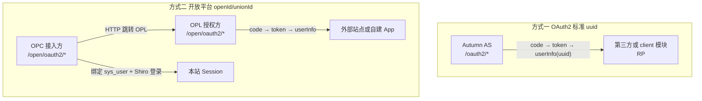

# 双轨授权登录开发手册

> **适用对象**：需要在 Autumn 中接入「授权登录」的全栈 / 后端 / 第三方对接开发者  
> **版本**：Autumn 2.0.0（master）/ 3.0.0（`3.0.0` 分支）— OAuth 报文格式一致，3.x 为 `jakarta.*` + SpringDoc  
> **目的**：厘清系统内 **两套并行、互不替代** 的授权体系，给出 **自连 / 跨实例第三方** 全拓扑对接步骤，避免混用 `client_id` 与 `app_id`、混用 `uuid` 与 `openId`。

---

## 目录

1. [先读本节：两套体系为何不冲突](#1-先读本节两套体系为何不冲突)
2. [总览与选型](#2-总览与选型)
3. [Autumn OAuth2 Parallel Profile（流程契约）](#3-autumn-oauth2-parallel-profile流程契约)
4. [方式一：OAuth2 标准授权（`uuid` 体系）](#4-方式一oauth2-标准授权uuid-体系)
5. [方式二：开放平台授权（`openId` / `unionId` 体系）](#5-方式二开放平台授权openid--unionid-体系)
6. [四种对接拓扑（两套体系通用）](#6-四种对接拓扑两套体系通用)
7. [场景对比与选型表](#7-场景对比与选型表)
8. [并存、边界与禁止事项](#8-并存边界与禁止事项)
9. [安全规范（共性）](#9-安全规范共性)
10. [实现索引（代码与表）](#10-实现索引代码与表)
11. [故障排查与防迷路清单](#11-故障排查与防迷路清单)
12. [相关文档](#12-相关文档)

---

## 1. 先读本节：两套体系为何不冲突

Autumn **同时实现** 下列两套授权登录能力，它们 **并行存在、互不替代**：

| 体系 | 模块 | 凭证 | 用户标识 | 端点前缀 |
|------|------|------|----------|----------|
| **方式一：OAuth2 标准** | `oauth` + `client` | `client_id` / `client_secret` | **`uuid`**（`sys_user` 业务主键） | `/oauth2/*` |
| **方式二：开放平台** | `opl`（授权方）+ `opc`（接入方） | `app_id` / `app_secret` | **`openId`** + **`unionId`** | `/open/*`（见 §1.5） |

**关键结论（防迷路）**：

- 文档写「OAuth2」时，默认指 **方式一** `/oauth2`；写「开放平台 / OPL / OPC」时，指 **方式二**。
- **方式二不是方式一的子集**：`app_id` ≠ `client_id`，`/open/oauth2/token`（OPL）≠ `/oauth2/token`。
- **OPC 不是第三种体系**：它是方式二里「本系统作为接入方（RP）」的实现；**OPL** 是「本系统作为授权方（AS）」。
- 同一部署可同时启用：例如本站既提供 `/oauth2`（给老第三方），又提供 OPL/OPC（`/open/*`）。

---

## 1.5 HTTP 路径规则（`/open` 统一前缀）

OPL（授权方 AS）与 OPC（接入方 RP）共用 **`/open`**。**无冲突**的路径不加命名空间；**与对端冲突**时在路径中插入 **`opl`** 或 **`opc`**。

### OAuth2（`OplConstants.OAUTH2_ROOT` = `OpcConstants.OAUTH2_ROOT` = `/open/oauth2`）

| 路径 | 归属 | 说明 |
|------|------|------|
| `/open/oauth2/authorize` | OPL | AS 授权页（`app_id` + `redirect_uri`） |
| `/open/oauth2/authorize/approve` | OPL | 用户确认 POST |
| `/open/oauth2/token` | OPL | 换票 |
| `/open/oauth2/userInfo` | OPL | 用户信息 |
| `/open/oauth2/opl/login` | OPL | 授权页内登录 POST（与 RP `/login` 冲突） |
| `/open/oauth2/opc/authorize` | OPC | RP 发起授权（`appId`，与 AS `/authorize` 冲突） |
| `/open/oauth2/login` | OPC | 接入登录入口页 GET |
| `/open/oauth2/callback` | OPC | OAuth 回调 |
| `/open/oauth2/success` | OPC | 成功页 |

### Open API（`/open/api/v1/platform`）

| 路径 | 归属 |
|------|------|
| `/open/api/v1/platform/account/open`、`app/register`、… | OPL |
| `/open/api/v1/platform/opl/app/list` | OPL（与 OPC 列表冲突） |
| `/open/api/v1/platform/app/apply`、`app/save`、`login/url` | OPC |
| `/open/api/v1/platform/opc/app/list` | OPC（与 OPL 列表冲突） |

### 管理 API

| 路径 | 归属 |
|------|------|
| `/open/admin/opl/platform/*` | OPL（`oplmanage.html`） |
| `/open/admin/opc/platform/*` | OPC（`opcmanage.html`） |

**已废弃 HTTP 前缀**：`/opl/oauth2`、`/opl/api/v1`、`/opl/admin` 及旧 `/opc/oauth2` 路由 — 以 `OplConstants` / `OpcConstants` 为准。
- **QRC 扫码登录**、**Bot Open API**、**支付安全 API** 等与本文两套 **独立**，见文末相关文档。

---

## 2. 总览与选型

### 2.1 架构鸟瞰



### 2.2 一分钟选型

| 你的目标 | 选 |
|----------|-----|
| 第三方要平台 **真实用户 uuid**，标准 OAuth 生态 | **方式一** |
| 本站登录委托给已注册的 **OAuth Client** | 方式一 + `LOGIN_AUTHENTICATION=oauth2:{clientId}` |
| 对外运营 **开放平台**，类似微信 openId（不暴露 uuid） | **方式二 · OPL** |
| 本站用户用 **中心开放平台账号** 登录 | **方式二 · OPC** |
| 中心平台 + 多个子站（同一 openId 体系） | **OPL 在中心，子站用 OPC** |

---

## 3. Autumn OAuth2 Parallel Profile（流程契约）

> **核心原则**：**流程统一 ≠ 字段统一**。两套 AS 遵循同一套 OAuth2 授权码四步；凭证参数名与 userInfo 响应字段刻意保留差异，便于选型识别。

### 3.1 统一流程（两套 AS 相同）

```
1. GET  {base}/oauth2/authorize     → 用户登录 + 确认
2. 302  redirect_uri?code&state
3. POST {base}/oauth2/token         → access_token + refresh_token
4. GET  {base}/oauth2/userInfo      → 用户 JSON
```

`{base}` 为 `/oauth2`（OAuth 模式）或 `/open/oauth2`（OPL 模式）。

### 3.2 统一端点相对路径

| 相对路径 | OAuth | OPL |
|----------|-------|-----|
| `authorize` | ✓ | ✓ |
| `authorize/approve` | ✓ | ✓ |
| `token` | ✓ | ✓ |
| `userInfo` | ✓ | ✓ |

### 3.3 刻意差异（选型标识，非缺陷）

| 维度 | OAuth 模式 | OPL 模式 |
|------|------------|----------|
| AS 根路径 | `/oauth2` | `/open/oauth2` |
| 应用凭证 | `client_id` / `client_secret` | **`app_id` / `app_secret`** |
| userInfo 主键字段 | **`uuid`**、`username` | **`openId`**、**`unionId`** |
| userInfo 公共字段 | `nickname`、`icon` | `nickname`、`icon` |
| userInfo 推荐传参 | Bearer（新增）或 JSON 包裹 query（**历史兼容**） | **`Authorization: Bearer`** 或 query `access_token` |

### 3.4 框架内共享实现

| 组件 | 路径 |
|------|------|
| Token 解析 | `cn.org.autumn.modules.oauth.oauth2.support.OAuthAccessTokenResolver` |
| 错误响应 / redirect | `OAuthResponseSupport`、`OAuthRedirectSupport` |
| RP HTTP 客户端 | `OAuth2HttpClient`（`CredentialParam.OAUTH` / `OPL`） |

### 3.5 对接伪代码（单客户端形态）

```java
enum AuthMode { OAUTH, OPL }

String base = mode == OAUTH ? origin + "/oauth2" : origin + "/open/oauth2";
// 步骤 1～3：仅 base 与 client_id vs app_id 不同
// 步骤 4 userInfo：
//   OAUTH → 解析 UserProfile（uuid）
//   OPL   → 解析 OpenUserInfoSnapshot（openId, unionId）
```

### 3.6 页面路由表（联调与验收）

| 角色 | OAuth 模式 | OPL/OPC 模式 |
|------|------------|--------------|
| **AS 授权页（登录+确认）** | `login.html` 分栏 `oauthAuthorize` | `login.html` 分栏 `oplAuthorize`（`/open/oauth2/authorize`） |
| **RP 授权登录入口** | `/oauth2/login?client_id=...` | `/open/oauth2/login?appId=...` |
| **RP 发起授权** | — | `/open/oauth2/opc/authorize?appId=...` |
| **RP 回调成功页** | `/oauth2/success`（无 `callback` 时默认跳转） | `/open/oauth2/success` |
| **RP OAuth 回调** | `/client/oauth2/callback` | `/open/oauth2/callback?appId=...` |
| **运维联调入口** | `oauthasmanage.html` / `oauthrpmanage.html` | `oplmanage.html` / `opcmanage.html` 行内按钮 |
| **用户绑定自助** | `client/weboauthbind`（codegen，运维） | **`/modules/opc/connectbind`**（友好页，用户+管理员） |

**同实例自连验收（OAuth）**

1. `oauthasmanage.html` 创建 AS Client，`redirect_uri` = `{ORIGIN}/client/oauth2/callback`；`oauthrpmanage.html` 一键接入同 `clientId`
2. 访问 `{ORIGIN}/oauth2/login?client_id=...` → 授权登录
3. AS `login` 分栏确认 → 回调 → `/oauth2/success`

**同实例自连验收（OPL+OPC）**

1. `oplmanage` 注册 App，`redirectUri` = `{ORIGIN}/open/oauth2/callback?appId=...`
2. `opcmanage` 保存 ConnectApp（`platformBaseUrl` = 本机）
3. 访问 `{ORIGIN}/open/oauth2/login?appId=...` → OPL 授权 → `/open/oauth2/success`

### 3.7 授权页扩展（PageHandler + auth-flow.js）

与 `login.html` 相同，授权相关页面经 **`PageFactory`** 链式调用 **`PageHandler`**：业务工程实现 `PageHandler` 并设置更小 `@Order`，对下列方法返回**非空**模板名即可覆盖默认页（空字符串表示交给下一实现）。

| PageHandler 方法 | 默认模板 | 路由入口 |
|------------------|----------|----------|
| `login` | `login` | `/login`、`/oauth2/login`、`/open/oauth2/opl/login` |
| `register` | `register` | `/register` |
| `forgotPassword` | `forgotpassword` | `/forgotpassword` |
| `oauthAuthorize` | `login`（分栏 `oauthAuthorize`） | `/oauth2/authorize` |
| `oplAuthorize` | `login`（分栏 `oplAuthorize`） | `/open/oauth2/authorize` |
| `oauthLoginEntry` | `oauth2/login` | `/oauth2/login`（OAuth 客户端入口） |
| `oauthLoginSuccess` | `oauth2/success` | `/oauth2/success` |
| `openLoginEntry` | `open/oauth2/login` | `/open/oauth2/login` |
| `openLoginSuccess` | `open/oauth2/success` | `/open/oauth2/success` |
| `authCallbackError` | `oauth2/callback-error` | `/client/oauth2/callback`、`/open/oauth2/callback` 失败分支 |

**服务端 Model 准备**：`AuthPageSupport`（`cn.org.autumn.site`）在路由进入 `PageFactory` 前写入 `clientId`/`appId`/`authFlowKind` 等；扩展实现可继续 `model.addAttribute`，或只换模板。

**前端 JS 库**：`statics/js/auth-flow.js`（全局 `AuthFlow`），与 `login-auth.js` / `login.js` 并列。扩展模板可：

```html
<#include "/_auth_flow_boot.html">
<script>AuthFlow.bindOAuthLoginEntryButton();</script>
```

或手工构造 URL：`AuthFlow.buildOauthAuthorizeUrl({ clientId, redirectUri })`、`AuthFlow.buildOpenAuthorizeEntryUrl({ appId })`、`AuthFlow.buildOpenAsAuthorizeUrl({ appId, redirectUri })`。

**参考实现**：框架内置 `oauth2/login.html`、`open/oauth2/login.html`、`login.html`（`oauthAuthorize`/`oplAuthorize` 分栏）。

### 3.8 站点门户（品牌 / 备案 / 法律链接）

登录、注册、忘记密码、法律页及 OAuth/OPL 授权分栏共用 **`_auth_site_header.html`** / **`_auth_site_footer.html`**，数据来自 **`SITE_PORTAL_CONFIG`**（后台 **系统管理 → 站点门户**）。未配置字段不展示。

- 配置与备案类型默认 URL：**`docs/AI_SITE_PORTAL.md`**
- 下游覆盖法律链接：实现 **`SiteLegalLinksHandler`**（`@Order` 首个非空生效）
- 下游覆盖法律正文：同名模板 `user/privacy.html`、`user/service.html`、`user/about.html`

---

## 4. 方式一：OAuth2 标准授权（`uuid` 体系）

### 3.1 角色与模块

| 角色 | 说明 | 代码包 |
|------|------|--------|
| **AS（授权服务器）** | 签发 code / token，提供 userInfo | `cn.org.autumn.modules.oauth` |
| **RP（接入方）** | 引导用户授权，换票，建立本地会话 | `cn.org.autumn.modules.client`（同实例示例）或任意第三方 |
| **Resource Owner** | 终端用户 | `sys_user` / `UserProfile` |

**核心 Controller**：`AuthorizationController`（`@RequestMapping("/oauth2")`）

### 3.2 HTTP 端点（AS）

设授权服务器根地址为 `{ORIGIN}`：

| 用途 | 方法 | 路径 |
|------|------|------|
| 授权页（含登录） | GET/HEAD | `{ORIGIN}/oauth2/authorize` |
| 用户确认授权 | POST | `{ORIGIN}/oauth2/authorize/approve` |
| 换 Token | POST | `{ORIGIN}/oauth2/token` |
| 用户信息 | GET/POST | `{ORIGIN}/oauth2/userInfo` |
| 授权页登出 | GET | `{ORIGIN}/oauth2/authorize/logout` |
| 内置登录跳转 | — | `{ORIGIN}/oauth2/login` |

**Shiro**：`/oauth2/**` 为 `anon`（见 `ShiroConfig`）。

### 3.3 授权码流程（第三方必读）

```
1. 在 AS 登记 OAuth Client（oauth_client_details）
2. 浏览器 GET /oauth2/authorize?response_type=code&client_id=...&redirect_uri=...&state=...
3. 用户登录 + 确认授权
4. 302 → redirect_uri?code=...&state=...
5. 服务端 POST /oauth2/token（client_secret 仅服务端）
6. GET/POST /oauth2/userInfo → UserProfile（含 uuid）
7. 第三方用 uuid 建立/绑定本地账号
```

**授权请求 Query**：

| 参数 | 必填 | 说明 |
|------|------|------|
| `response_type` | 是 | 固定 `code` |
| `client_id` | 是 | 注册客户端 ID |
| `redirect_uri` | 是 | 与库表登记 **字符级一致** |
| `scope` | 否 | 建议 `basic` |
| `state` | 强烈推荐 | CSRF 防护 |

**换 Token Body**（`application/x-www-form-urlencoded`）：

| 参数 | 说明 |
|------|------|
| `grant_type` | `authorization_code` 或 `refresh_token` |
| `client_id` / `client_secret` | 客户端凭证 |
| `code` | 授权码（一次性，默认 **5 分钟**） |
| `redirect_uri` | 须与授权请求一致 |

**userInfo 返回**：`uuid`、`username`、`nickname`、`icon` 等 `UserProfile` 字段（**不返回 openId**）。

> userInfo 传参细节（JSON 形式 `access_token` 参数等）见 **`docs/AI_OAUTH_INTEGRATION.md` §5**。

### 3.4 数据模型（AS）

| 表 / 存储 | 说明 |
|-----------|------|
| `oauth_client_details` | Client 登记：`client_id`、`client_secret`、`redirect_uri`、`trusted`、`grant_types` |
| Redis / 内存 | `oauth2:auth_code:`、`oauth2:access_token:`、`oauth2:refresh_token:`（`ValueType`） |

**Client 登记检查**：

- [ ] `trusted = 1` 且 `archived = 0`
- [ ] `grant_types` 含 `authorization_code`（或 `all`）
- [ ] 第三方用户表以 **`uuid`** 作为 Autumn 关联键

**管理入口**：

- `oauthasmanage.html` — 上游 AS 管理（推荐）
- `oauthrpmanage.html` — 下游 RP 管理（推荐）
- `/modules/oauth/clientdetails` — 单表 CRUD

### 3.5 本站作为 RP：`client` 模块 + `LOGIN_AUTHENTICATION`

同实例下，Autumn 可配置为 **用自己的 AS 登录自己**。

**系统配置**（`sys_config` 键 `LOGIN_AUTHENTICATION`）：

| 值 | 含义 |
|----|------|
| `localhost` | 本地账号密码登录（不走 OAuth 委托） |
| `oauth2:{clientId}` | 登录走 OAuth，回调由 `client` 模块处理 |
| `shell:{clientId}` | 壳/宿主场景变体（按 Host 解析 client） |

**RP 回调实现**：`ClientOauth2Controller`

- 路径：`GET /client/oauth2/callback`
- 流程：收 `code` → 读 `WebAuthenticationEntity`（按 Host 或 `LOGIN_AUTHENTICATION` 解析 client）→ POST 远端 `/oauth2/token` → GET `/oauth2/userInfo` → **`WebOauthBindService.resolveAndBind`**（`client_web_oauth_bind` 表）→ **`UserProfileService.establishSession`**（已登录同用户时内部 NO-OP）→ Shiro Session

**`WebAuthenticationEntity`**：存 AS 地址、`client_id`、`client_secret`、`redirect_uri`、token/userInfo URI、`userInfoDelivery`（`legacy` / `bearer`，空则自动：同实例 `legacy`、跨实例 `bearer`）等（`client_web_authentication` 表）。

**`client_web_oauth_bind`**：经典 OAuth RP 侧 **上游 uuid ↔ 本地 `sys_user.uuid`** 绑定表（字段 `authentication` / `upper` / `user`）。新用户本地 `UuidNamespaceService.allocate()`，**不再**默认 `local.uuid == upstream.uuid`；存量同 uuid 用户可懒迁移写绑定。

**同实例自连幂等**：AS/RP 同 JVM 且 userInfo.uuid 在本地 `sys_user` 已存在时，以 **token 内 upstream uuid 为权威本地用户**（对齐 OPC `platformUser`），**不依赖** RP 回调域 Session/Cookie；重复授权仅补写绑定或 NO-OP（`idempotent=true`）。`establishSession` 始终调用，已登录同用户时内部跳过。

**绑定冲突**：上游已绑其他本地用户、或当前 Session 已绑其他上游时，回调错误页展示自助方案（含退出登录、**绑定管理** `/modules/client/weboauthbind`）；登录态可 `POST /client/oauth2/bind/unbind?clientId=...` 解绑后重试。无效 userInfo 走普通授权失败页，不走冲突页。

**运维**：后台 **OAuth 绑定** 管理页（`client/weboauthbind`）可 CRUD 绑定行，仅供排查/解绑；日常绑定应走 OAuth 回调编排，勿手工写入冲突数据。

**RP 扫码联邦（模式 D）**：浏览器 `POST /client/oauth2/qrc/web/ticket/complete` 在服务端取得授权码后，调用 **`WebOauthLoginService.completeRemoteOAuthCallback`**，与 **`GET /client/oauth2/callback`** 共用 **`finishOAuthLogin` → `resolveAndBind` → `establishSession`**。配置与时序见 **`docs/AI_AUTH_SITE_ROLES.md`** §2～§3。

### 3.6 方式一 · 同实例自连（AS + RP 同一 JVM）

**目标**：`https://my.example.com` 既当 AS 又当 RP。

1. **登记 Client**  
   - `client_id` = `my-web`  
   - `redirect_uri` = `https://my.example.com/client/oauth2/callback`  
   - `trusted = 1`

2. **配置 WebAuthentication**（或通过 `LOGIN_AUTHENTICATION` 默认 client）  
   - `accessTokenUri` = `https://my.example.com/oauth2/token`  
   - `userInfoUri` = `https://my.example.com/oauth2/userInfo`  
   - 与上一步 `client_id` / `secret` / `redirect_uri` 一致

3. **设置** `LOGIN_AUTHENTICATION` = `oauth2:my-web`

4. **用户访问** `/login` → 授权 → 回调 `/client/oauth2/callback` → 绑定解析 → 本站 Session

**重复授权（幂等）**：同实例且 userInfo.uuid=A 在本地已存在时，回调 **不会** 重复建号，仅补写绑定或 NO-OP；跨域回调无 Session 时仍会 `establishSession` 登录为 A（见 `WebOauthBindService` 同实例分支）。

### 3.7 方式一 · 跨实例（第三方 AS 或第三方 RP）

#### 3.7.1 本实例仅 AS，第三方为 RP

- 第三方按 **§3.3** 对接 `{ORIGIN}/oauth2/*`
- 无需启用 `client` 模块回调（除非你自己也要登录）
- 详 **`docs/AI_OAUTH_INTEGRATION.md`**

#### 3.7.2 本实例仅 RP，第三方为 AS

1. 在 **第三方 AS** 登记 Client，拿到 `client_id` / `secret` / `redirect_uri`
2. 在本站 `WebAuthenticationEntity` 填写 **第三方** `{ORIGIN}/oauth2/token` 与 `userInfo`
3. 跨实例时 `userInfoDelivery` 留空即可默认 **Bearer**；若第三方 AS 也是 Autumn 且需 JSON 包裹传参，显式设为 `legacy`
4. `redirect_uri` 指向本站 `/client/oauth2/callback`（或自建 RP 端点）
5. 登录页链到第三方 `/oauth2/authorize?client_id=...`

#### 3.7.3 两个 Autumn 实例互相当 AS/RP

- 实例 A：登记 Client，`redirect_uri` = `https://b.example.com/client/oauth2/callback`
- 实例 B：配置 `WebAuthentication` 的 `originUri` = A 根地址，或分别填写 A 的 `/oauth2/*` URI
- 用户在 B 登录即跳转 A 授权，回到 B 经 **`WebOauthBindService`** 建立 Session
- RP 扫码联邦（超然信 App + bighub Web）见 **`docs/AI_AUTH_SITE_ROLES.md`**

---

## 5. 方式二：开放平台授权（`openId` / `unionId` 体系）

### 4.1 OPL 与 OPC 分工（同一体系的两面）

| 组件 | 包名 | 本系统角色 | 典型使用者 |
|------|------|------------|------------|
| **OPL** | `cn.org.autumn.modules.opl` | **授权方（AS）** | 开放平台运营方、对外发 appId 的团队 |
| **OPC** | `cn.org.autumn.modules.opc` | **接入方（RP）** | 需要「用开放平台账号登录本站」的业务站 |

```
本系统 (opc)  ──HTTP──▶  开放平台 (opl)
   │                         │
   ├─ opc_connect_app        ├─ opl_open_app (appId)
   ├─ opc_connect_bind       ├─ opl_open_identity (openId)
   └─ 本地 sys_user          └─ opl_open_union (unionId)
```

**重要**：`opc` **不依赖** `opl` Java 包，仅 HTTP 调用 `/open/api/v1/platform/*` 与 `/open/oauth2/*`（可对接 **远程 OPL**）。

### 4.2 OPL 端点（授权方）

常量：`OplConstants.OAUTH2_BASE` = `/open/oauth2`，`API_PLATFORM` = `/open/api/v1/platform`

#### 4.2.1 OAuth2

| 用途 | 方法 | 路径 |
|------|------|------|
| 引导授权 | GET/HEAD | `{ORIGIN}/open/oauth2/authorize` |
| 用户确认 | POST | `{ORIGIN}/open/oauth2/authorize/approve` |
| 授权页内登录 | POST | `{ORIGIN}/open/oauth2/opl/login` |
| 换 Token | POST | `{ORIGIN}/open/oauth2/token` |
| 用户信息 | GET/POST | `{ORIGIN}/open/oauth2/userInfo` |

**授权 Query**（注意参数名是 **`app_id`**，不是 `client_id`）：

| 参数 | 必填 | 说明 |
|------|------|------|
| `app_id` | 是 | 注册的 appId |
| `redirect_uri` | 是 | 与注册值 **字符级一致** |
| `response_type` | 是 | 固定 `code` |
| `scope` | 否 | 默认 `basic` |
| `state` | 推荐 | CSRF |

**换 Token Body**：

```
app_id=...&app_secret=...&grant_type=authorization_code&code=...&redirect_uri=...
```

支持 `grant_type=refresh_token` 续期。

**userInfo 响应**（**不暴露 uuid**）：

```json
{
  "openId": "o_...",
  "unionId": "u_...",
  "nickname": "...",
  "icon": "..."
}
```

**默认 TTL**（`OplConstants`）：授权码 5 分钟；access_token 24h；refresh_token 7d。

#### 4.2.2 开发者 Open API（需用户令牌 `@Authenticated`）

| 方法 | 路径 | 说明 |
|------|------|------|
| POST | `/open/api/v1/platform/account/open` | 开通开发者主体 |
| POST | `/open/api/v1/platform/app/register` | 注册 App |
| POST | `/open/api/v1/platform/opl/app/list` | 列出主体下 App |
| POST | `/open/api/v1/platform/app/resetSecret` | 重置密钥 |
| POST | `/open/api/v1/platform/app/update` | 更新 App |

**管理端**：`/open/admin/opl/platform/*`，页面 `oplmanage.html`。

**框架内扩展**：`OpenPlatformService` / `OpenPlatformExtension`，见 **`docs/AI_OPL_SPI.md`**。

### 4.3 openId 与 unionId 语义

| 标识 | 作用域 | 存储表 | 唯一约束 |
|------|--------|--------|----------|
| **openId** | 单个 `appId` | `opl_open_identity` | `(appId, user)` |
| **unionId** | 开发者主体 `account` | `opl_open_union` | `(account, user)` |

- `OpenUnionService` 签发 **unionId**；`OpenIdentityService` 签发 **openId**
- 同一开发者主体下多个 App 共享 **unionId**，但 **openId  per App 不同**

### 4.4 OPC 端点（接入方）

常量：`OpcConstants.OAUTH2_AUTHORIZE` = `/open/oauth2/opc/authorize`，`API_PLATFORM` = `/open/api/v1/platform`

#### 4.4.1 浏览器登录链

| 用途 | 方法 | 路径 |
|------|------|------|
| 登录入口页 | GET | `{ORIGIN}/open/oauth2/login?appId=...` |
| 发起授权 | GET | `{ORIGIN}/open/oauth2/opc/authorize?appId=...` |
| OAuth 回调 | GET | `{ORIGIN}/open/oauth2/callback?code=...&appId=...` |

**回调编排**（`ConnectLoginService.completeOAuthCallback`）：

```
exchangeCode(app, code)           → ConnectOauthService（HTTP POST 远端 /open/oauth2/token）
fetchUserInfo(app, accessToken)   → HTTP GET 远端 /open/oauth2/userInfo
resolveAndBind(app, userInfo, platformUser) → ConnectBindService（同平台 platformUser 来自 OPL token）
userProfileService.establishSession(profile)   → 已登录同用户时内部 NO-OP
userTokenService.saveToken(...)   → 可选保存 access_token
```

#### 4.4.2 用户 Open API（需 `@Authenticated`）

| 方法 | 路径 | 说明 |
|------|------|------|
| POST | `/open/api/v1/platform/app/apply` | 向远程 OPL 申请 appId 并落库 |
| POST | `/open/api/v1/platform/app/save` | 手动保存配置 |
| POST | `/open/api/v1/platform/opc/app/list` | 当前用户的接入 App |
| POST | `/open/api/v1/platform/login/url` | 获取登录入口 URL |

**管理端**：`/open/admin/opc/platform/*`，页面 `opcmanage.html`。

### 4.5 本地用户绑定策略（OPC 核心，与经典 OAuth 对称）

`ConnectBindService.resolveAndBind` 顺序：

1. `(connectApp, openId)` 已存在 → 若同平台带 **platformUser** 则校验与绑定用户一致 → **幂等** 返回本地用户
2. `(connectApp, unionId)` 已存在 → 更新 openId 后同上
3. **同平台**（`appId` 在本 JVM OPL 注册，与域名/OPC Session 无关）且 token 解析出 **platformUser** → 绑定 `(openId → platformUser)`，**不**新建账号
4. **已登录** 本地 Session → 绑定当前 Session 用户
5. **跨平台 + 未登录 + 无绑定** → **`BIND_CHOICE_REQUIRED`** → 绑定选择页（用户自选「登录并绑定」或「创建新账号」）

**绑定选择端点**（与方式一共用 `oauth2/bind-choice.html`）：

| 方法 | 路径 | 说明 |
|------|------|------|
| GET | `/open/oauth2/bind/choice?token=&appId=` | 选择页 |
| GET | `/open/oauth2/bind/confirm?token=` | 已登录后确认绑定 Session |
| POST | `/open/oauth2/bind/create` | 用户确认创建新账号（`opc_` 前缀） |

**同平台判定**：`ConnectBindSupport.isSamePlatform` — 本 JVM 存在 `OpenPlatformService` 且 `appId` 在本地 OPL 已注册；**不依赖** OPC 回调域名的 Session/Cookie。

**platformUser 来源**：同平台时 `ConnectOauthService` **直调** `OpenPlatformService.resolvePlatformUserUuid(accessToken)`（不经 HTTP userInfo JSON，不对外泄露 uuid）；跨实例仍仅 openId/unionId。

**幂等**：已有 openId 绑定或 unionId 命中 → `idempotent=true`（绑定解析 NO-OP）；同平台重复授权时 **platformUser 为权威**，可校正陈旧绑定行；`ConnectLoginService` **始终** `establishSession`，未登录或跨域回调时仍能登录，已登录同用户时内部跳过。

**自助解绑**：

| 场景 | 方式 |
|------|------|
| 授权回调上下文 | 登录态 `POST /open/oauth2/bind/unbind?appId=...`（`ConnectBindService.unbindForSessionUser`） |
| 冲突页 / 用户自助 | **`/modules/opc/connectbind`**（`ConnectBindManageService` + 脱敏 API，见 **`docs/AI_OPC_INTEGRATION.md` §2.3**） |

**运维绑定 CRUD**：`opcmanage.html` 绑定 Tab → `/open/admin/opc/platform/binds`（`OpcBindAdminView`）；勿与友好管理页混用 codegen 列表 `modules/opc/connectbind`（已由 `opc/connectbind.html` 替代）。

**禁止**：后台 `sys_config` 开关决定「是否自动注册」；跨实例首次授权须用户在选择页确认。

**销户联动**：实现 `AccountHandler`，用户注销时删除其 `opc_connect_bind` 行。

### 4.6 OPC 数据模型

| 表 | 说明 |
|----|------|
| `opc_connect_app` | 接入配置：`appId`、`platformBaseUrl`、`redirectUri`；`appSecret` 经 `@FieldEncrypt` 存库 |
| `opc_connect_bind` | 本地 `user` ↔ `openId` / `unionId`（按 `connect_app` 隔离） |

### 4.7 方式二 · 同实例自连（OPL + OPC 同一 JVM）

**目标**：`http://localhost:8080` 上开放平台与接入站共存（开发常见）。

1. **OPL 注册 App**（用户令牌）  
   ```http
   POST /open/api/v1/platform/account/open
   POST /open/api/v1/platform/app/register
   ```
   `redirectUri` 必须为：
   ```
   http://localhost:8080/open/oauth2/callback?appId={返回的appId}
   ```
   记录 `appId`、`appSecret`。

2. **OPC 保存 ConnectApp**  
   ```http
   POST /open/api/v1/app/save
   ```
   - `appId` / `appSecret`：与上一步相同  
   - `platformBaseUrl`：`http://localhost:8080`（指向本机 OPL）  
   - `redirectUri`：与 OPL 注册 **完全一致**

3. **发起登录**  
   ```
   GET http://localhost:8080/open/oauth2/opc/authorize?appId={appId}&state=xyz
   ```

4. **预期**：跳转 `/open/oauth2/authorize`（OPL 授权页）→ 用户确认 → `/open/oauth2/callback` → 本地 Session + `opc_connect_bind` 写入。

**同实例重复授权（幂等）**：OPL 授权用户 A 首次回调写 `openId→A`；再次授权命中已有绑定 → **不** 注册 `opc_` 新用户，**不** 重复 `establishSession`（与域名/OPC Session 无关，依赖 token 内 platformUser）。

### 4.8 方式二 · 跨实例对接

#### 4.8.1 本实例仅 OPL（第三方接你的开放平台）

1. 第三方开发者按 **`docs/AI_OPL_INTEGRATION.md`** 调用 `/open/api/v1/platform/*` 与 `/open/oauth2/*`
2. 其 `redirect_uri` 指向 **第三方自己的回调地址**（不是 `/open/oauth2/callback`）
3. 你用 `openId` / `unionId` 识别用户，**不要假设对方有 `uuid`**

#### 4.8.2 本实例仅 OPC（接第三方 OPL）

1. 在 **中心 OPL**（可为另一家 Autumn 或自建兼容实现）注册 App  
   - `redirectUri` = `https://my.example.com/open/oauth2/callback?appId=...`
2. 本站 `POST /open/api/v1/app/save`：  
   - `platformBaseUrl` = 中心平台根地址（如 `https://auth.example.com`）  
   - `appId` / `appSecret` 与中心一致
3. 业务页按钮链到 `/open/oauth2/opc/authorize?appId=...`

或使用 `POST /open/api/v1/app/apply` 由本站代向远程 OPL 申请（需传 `accessToken` = 中心平台用户令牌）。

#### 4.8.3 中心 OPL + 多个 OPC 子站

- **中心**：只部署 OPL（或 OPL 为主）
- **各子站**：部署 OPC，`platformBaseUrl` 均指向中心
- 同一用户在中心主体下 **unionId 相同**，在各子站 **openId 不同**；绑定表在各自 `opc_connect_bind`

---

## 6. 四种对接拓扑（两套体系通用）

下列拓扑对 **方式一** 与 **方式二** 均适用，仅替换端点与凭证列：

| 拓扑 | 本实例角色 | 对端 | 方式一示例 | 方式二示例 |
|------|------------|------|------------|------------|
| **A. 自连** | AS + RP | 自己 | `/oauth2` + `/client/oauth2/callback` | `/open/oauth2/*` + `/open/oauth2/callback` |
| **B. 仅 AS** | 仅授权方 | 外部 RP | 第三方调你 `/oauth2/*` | 第三方调你 `/open/oauth2/*` |
| **C. 仅 RP** | 仅接入方 | 外部 AS | `WebAuthentication` 指外部 `/oauth2` | `ConnectApp.platformBaseUrl` 指外部 OPL |
| **D. 双实例互联** | A 为 AS，B 为 RP | 另一 Autumn | B 的 callback 登记在 A 的 Client | B 的 opc 指向 A 的 opl |

**自连时 redirect_uri 铁律**：OPL 注册的 `redirectUri`、OPC 存的 `redirectUri`、浏览器授权请求中的 `redirect_uri`、换 token 时的 `redirect_uri` **四者必须字符级一致**（含 query，如 `?appId=...`）。

---

## 7. 场景对比与选型表

### 6.1 能力对比

| 维度 | 方式一 OAuth2 | 方式二 OPL（授权方） | 方式二 OPC（接入方） |
|------|---------------|----------------------|----------------------|
| 协议外形 | OAuth2 授权码 | OAuth2 授权码 | OAuth2 客户端 |
| 应用凭证 | `client_id` / `client_secret` | `app_id` / `app_secret` | 存于 `opc_connect_app` |
| 用户主键对外 | **uuid** | **openId** + **unionId** | 映射到本地 uuid |
| 跨 App 识别用户 | 同一 uuid | **unionId**（同开发者主体） | 依赖 OPL 的 unionId |
| 典型 AS 路径 | `/oauth2` | `/open/oauth2` | （调用远端 OPL） |
| 典型 RP 路径 | `/client/oauth2/callback` | 任意第三方 URL | `/open/oauth2/callback` |
| 本站登录配置 | `LOGIN_AUTHENTICATION` | — | `/open/oauth2/authorize` |
| 管理页 | `oauthasmanage.html` / `oauthrpmanage.html` | `oplmanage.html` | `opcmanage.html` |
| 与 QRC 扫码 | 可结合（见 QRC 文档） | 独立 | 独立 |

### 6.2 适用场景详述

#### 方式一 适用于

- 企业内多个系统 SSO，关联键用 **uuid**
- 对接只认标准 OAuth2 / 已有 `client_id` 体系的 SaaS
- 需要 **`/oauth2/userInfo` 返回完整 `UserProfile`**
- 扫码登录、授权页与 AS 深度集成（`AuthorizationController` 与 QRC 共用登录体验）

#### 方式二 · OPL 适用于

- 对外提供 **开发者平台**，App 维度隔离用户（openId）
- 同一开发者多个 App 需 **打通用户**（unionId）但不暴露内部 uuid
- 移动应用 / 小程序 / 第三方网站接入你的账号体系
- 需要 **`/open/api/v1/platform`** 自助开户、注册 App、重置密钥

#### 方式二 · OPC 适用于

- 业务站、子站、边缘节点需要 **用中心账号登录**
- 多实例部署：中心 OPL + 多地 OPC
- 希望用户在 **授权回调后自主选择** 创建新账号或绑定已有账号（绑定选择页，与方式一对称）
- 登录页增加「开放平台登录」按钮，与密码登录、方式一并存

---

## 8. 并存、边界与禁止事项

### 7.1 可以并存

- `LOGIN_AUTHENTICATION=oauth2:xxx` **与** `/open/oauth2/authorize` 同时提供
- `/oauth2` **与** `/open/oauth2` 同时对外服务
- 同一用户：本地 `uuid`（Session）+ `opc_connect_bind` 存 openId（各管各层）

### 7.2 禁止混用

| 错误做法 | 正确做法 |
|----------|----------|
| 用 `client_id` 调 `/open/oauth2/token` | 用 `app_id` + `/open/oauth2/token` |
| 用 `app_id` 调 `/oauth2/token` | 用 `client_id` + `/oauth2/token` |
| 在第三方系统用 openId 当 uuid 查 `sys_user` | openId 仅在该 appId 下有效；跨 App 用 unionId |
| OPL 注册 redirect 与 OPC callback 差一个 query | 四处 redirect_uri **完全一致** |
| 把 `appSecret` 写进前端或移动端 | 仅服务端换 token |
| 认为 OPC 回调后第三方能拿到 uuid | userInfo 只给 openId/unionId；uuid 仅 OPC 内部绑定 |

### 7.3 与 `LOGIN_AUTHENTICATION` 的关系

- **仅影响方式一** 下「本站默认 OAuth 登录用哪个 client」
- **不影响** Open 接入登录入口（走独立 `/open/oauth2/*`）
- `shell:{clientId}` 用于按 Host 解析壳应用，仍属方式一

---

## 9. 安全规范（共性）

- **state**：OPC 在 `authorize` 时将 `(appId, state)` 写入 Session，`callback` 必须校验并 consume；OPL AS 原样回传 `state` 给第三方 RP
- **CSRF**：OPL/OAuth 授权确认 POST 须带 Session 一次性 `consentCsrf`（`OAuthConsentCsrfSupport`）
- **Open API 鉴权**：`/open/api/v1/platform/**` 禁止仅凭 `userUuid` hint 无令牌访问，须 Bearer 或 Shiro 会话
- **code**：一次性，约 5 分钟有效；换 token 时 `redirect_uri` **必填**且与注册值**字符级精确匹配**
- **PKCE**（可选）：OPL authorize 可传 `code_challenge` / `code_challenge_method=S256`，换 token 时须 `code_verifier`
- **secret**：仅服务端保存；OPC 库内 `appSecret` 加密存储，接口不回显明文
- **redirect_uri**：默认精确匹配；扩展点 `relaxedRedirectMatch` 可放宽大小写
- **HTTPS**：生产回调须 `https://`（`OPL_ALLOW_HTTP_REDIRECT=true` 或本地/内网例外）
- **Token 端点限流**：OPL `/open/oauth2/token` 按 IP+appId 滑动窗口限流
- **Token 失效**：Redis/重启后 token 可能失效，RP 应实现「重新授权」兜底

---

## 10. 实现索引（代码与表）

### 10.1 公共 OAuth2 支持包

| 类 | 路径 |
|----|------|
| `OAuthAccessTokenResolver` | `modules/oauth/oauth2/support/` |
| `OAuth2HttpClient` | 同上 |
| `OAuthResponseSupport` / `OAuthRedirectSupport` / `OAuthConsentSupport` | 同上 |
| `OAuthTokenResponseParser` | 同上 |
### 10.2 方式一

| 类型 | 路径 |
|------|------|
| AS Controller | `modules/oauth/oauth2/AuthorizationController.java` |
| RP 回调 | `modules/client/oauth2/ClientOauth2Controller.java` |
| RP 编排 | `modules/client/service/WebOauthLoginService.java` |
| uuid 绑定 | `modules/client/service/WebOauthBindService.java`（表 **`client_web_oauth_bind`**） |
| 同实例/ userInfo | `modules/client/oauth2/WebOauthBindSupport.java` |
| Client 配置 | `modules/client/service/WebAuthenticationService.java` |
| 登录配置 | `modules/sys/service/SysConfigService`（`LOGIN_AUTHENTICATION`） |
| Session | `modules/usr/service/UserProfileService.java`（**`establishSession`**） |
| Token 存储 | `modules/oauth/store/ValueType.java` |

### 10.3 方式二

| 类型 | 路径 |
|------|------|
| OPL OAuth | `modules/opl/oauth2/OplAuthorizationController.java` |
| OPL API | `modules/opl/controller/OplApiController.java` |
| OPL 核心服务 | `modules/opl/service/OpenPlatformServiceImpl.java` |
| openId / unionId | `OpenIdentityService.java`、`OpenUnionService.java` |
| OPC OAuth | `modules/opc/oauth2/OpcOauth2Controller.java` |
| OPC 登录编排 | `modules/opc/service/ConnectLoginService.java` |
| OPC 绑定 | `modules/opc/service/ConnectBindService.java` |
| 绑定管理（友好页 / opcmanage） | `modules/opc/service/ConnectBindManageService.java` |
| 绑定管理 API / 页面 | `ConnectBindManageController.java`、`opc/connectbind.html`、`OpcConstants.CONNECTBIND_*` |
| 同平台判定 / platformUser | `modules/opc/support/ConnectBindSupport.java`、`ConnectOauthService.fetchUserInfoForBind` |
| OPL platformUser | `OpenPlatformService.resolvePlatformUserUuid` |
| OPC HTTP 客户端 | `modules/opc/service/ConnectOauthService.java` |
| 常量 | `autumn-lib/.../opl/OplConstants.java`、`opc/OpcConstants.java` |
| SPI | `autumn-lib/.../opl/spi/OpenPlatformService.java` |

### 10.4 表前缀

| 前缀 | 模块 |
|------|------|
| `oauth_*` | 方式一 Client/Token（+ Redis） |
| `client_web_oauth_bind` | 方式一 RP **上游 uuid ↔ 本地 user** 绑定 |
| `opl_*` | 开放平台授权方 |
| `opc_*` | 开放接入 RP（含 **`opc_connect_bind`**） |

---

## 11. 故障排查与防迷路清单

### 11.1 选错体系

| 现象 | 检查 |
|------|------|
| token 接口 404 或 invalid_client | 是否把 `app_id` 发到了 `/oauth2/token` 或反之 |
| userInfo 没有 openId | 是否误用 `/oauth2/userInfo`（只返回 uuid） |
| userInfo 没有 uuid | 是否误用 `/open/oauth2/userInfo`（故意不返回 uuid） |

### 11.2 redirect_uri 不一致

| 现象 | 检查 |
|------|------|
| 授权后换 token 失败 | 注册、授权、换票三处 `redirect_uri` 逐字符比对 |
| OPC 自连失败 | OPL 注册是否含 `?appId=`  query |

### 11.3 OPC 绑定失败

| 现象 | 检查 |
|------|------|
| 跨平台首次授权未登录 | 是否进入 `/open/oauth2/bind/choice` 由用户选择绑定方式 |
| 绑错用户 | 是否同一 `connectApp` 下 openId 冲突 |
| 远程 OPL 不通 | `platformBaseUrl` 无尾斜杠；网络可达 |

### 11.4 方式一本站 OAuth 不跳转

| 现象 | 检查 |
|------|------|
| 仍停留密码登录 | `LOGIN_AUTHENTICATION` 是否为 `oauth2:...` |
| callback 无用户 | `WebAuthenticationEntity` 的 token/userInfo URI 是否指向正确 AS |
| client 未信任 | `oauth_client_details.trusted = 1` |

### 11.5 开发自检表（上线前）

**方式一（AS）**

- [ ] Client 已登记且 trusted
- [ ] 第三方以 uuid 关联用户
- [ ] 文档交付 **`docs/AI_OAUTH_INTEGRATION.md`**

**方式一（RP）**

- [ ] `redirect_uri` 与 AS 登记一致
- [ ] `client_secret` 不在前端

**方式二（OPL）**

- [ ] 开发者已 `account/open`
- [ ] App `redirectUri` 与第三方一致
- [ ] 文档交付 **`docs/AI_OPL_INTEGRATION.md`**

**方式二（OPC）**

- [ ] `ConnectApp` 与 OPL 注册信息一致
- [ ] `platformBaseUrl` 正确
- [ ] 跨平台首次授权展示绑定选择页（非后台静默建号）
- [ ] 文档交付 **`docs/AI_OPC_INTEGRATION.md`**

---

## 12. 相关文档

| 文档 | 内容 |
|------|------|
| [`AI_OAUTH_INTEGRATION.md`](AI_OAUTH_INTEGRATION.md) | 方式一完整 API、userInfo 传参、Refresh Token |
| [`AI_OPL_INTEGRATION.md`](AI_OPL_INTEGRATION.md) | 方式二 OPL 第三方 HTTP 对接 |
| [`AI_OPC_INTEGRATION.md`](AI_OPC_INTEGRATION.md) | 方式二 OPC 接入与绑定 |
| [`AI_OPL_SPI.md`](AI_OPL_SPI.md) | 框架内扩展 OPL（Extension/Service） |
| [`AI_QRC_INTEGRATION.md`](AI_QRC_INTEGRATION.md) | 扫码登录与 OAuth 分支 |
| [`AI_AUTH_SITE_ROLES.md`](AI_AUTH_SITE_ROLES.md) | AS/RP 双角色、RP QRC 联邦、`WebOauthBind` 跨站绑定 |
| [`AI_AUTH_LOGIN_PROVIDERS.md`](AI_AUTH_LOGIN_PROVIDERS.md) | `/login` 授权 Provider 列表、`pageLogin`、client_id 路由 |
| [`AI_ACCOUNT_AUTH_CONFIG.md`](AI_ACCOUNT_AUTH_CONFIG.md) | 登录后跳转、账号认证 JSON |
| [`AI_SESSION_GUARD.md`](AI_SESSION_GUARD.md) | 会话终止与重登守卫 |
| 站内 `/modules/docs/auth-flow` | 授权流程说明页 |
| 站内 `/modules/docs/opl-integration` | OPL 文档页 |
| 站内 `/modules/docs/opc-integration` | OPC 文档页 |

---

**维护说明**：新增授权端点或变更绑定策略时，请同步更新本文 §3–§4 端点表与 §10 排查项，并更新子文档 `AI_OAUTH_INTEGRATION` / `AI_OPL_INTEGRATION` / `AI_OPC_INTEGRATION` 中的细节参数。
