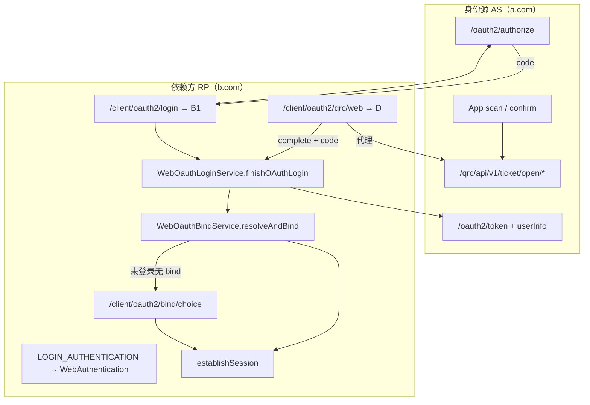

# Autumn 认证站点双角色（AS / RP）

> 版本线：**Autumn 2.0.0（master）** 与 **3.0.0** API 契约一致（3.x 为 `jakarta.*`，语义相同）。  
> **扫码登录标准（Web + 服务端建票）**：**`docs/AI_SCAN_LOGIN_STANDARD.md`**。  
> **时序图 / 拓扑 / 鉴权**：**`docs/AI_SCAN_LOGIN_FLOWS.md`**。  
> 授权登录总览见 **`docs/AI_AUTH_LOGIN_MODES.md` §3（方式一 · 经典 OAuth）**；扫码 HTTP 字段见 **`docs/AI_QRC_API.md`**；OAuth API 见 **`docs/AI_OAUTH_INTEGRATION.md`**。

---

## 1. 角色与配置分层

### 1.1 站点角色（`AUTH_SITE_CONFIG`）

系统参数键 **`AUTH_SITE_CONFIG`**（JSON → `cn.org.autumn.model.AuthSiteConfig`），**只描述站点行为**，不存 OAuth 凭证或远程地址：

| 字段 | 含义 |
|------|------|
| `siteRole` | `AS_ONLY` / `RP_ONLY` / `AS_AND_RP` |
| `qrcWebMode` | `auto` / `as` / `rp` — 登录页扫码走哪条 HTTP 前缀 |

### 1.2 OAuth 客户端（单一事实来源）

**RP 扫码联邦与浏览器 Redirect 共用同一条 `client_web_authentication` 记录**，由系统默认解析：

| 配置 | 键 / 表 | 作用 |
|------|---------|------|
| 默认 client | `LOGIN_AUTHENTICATION` = `oauth2:{clientId}` | 解析 RP 用哪条 WebAuthentication |
| 凭证与端点 | `client_web_authentication` | `clientId` / `secret` / `redirectUri` / `originUri` / OAuth URI |
| 绑定关系 | `client_web_oauth_bind` | `authentication` + `upper`（上游 uuid）→ `user`（本地 uuid） |

**不要**在 `AUTH_SITE_CONFIG` 重复配置 clientId 或 origin；运维只需维护 **`LOGIN_AUTHENTICATION` + WebAuthentication 一行**。

### 1.3 端点推断（`WebOauthEndpointResolver`）

| 字段 | 已填写 | 未填写 |
|------|--------|--------|
| `authorizeUri` | 使用填写值 | `{originUri}/oauth2/authorize` |
| `accessTokenUri` | 使用填写值 | `{originUri}/oauth2/token` |
| `userInfoUri` | 使用填写值 | `{originUri}/oauth2/userInfo` |
| QRC 联邦代理（仅 RP） | — | `{originUri}/qrc/api/v1/ticket/open/*` |

同实例 AS+RP：`WebAuthenticationService.create` 会预填本站 `/oauth2/*` URI；跨站 RP 通常只填 **`originUri`**（远程 AS 根地址，如 `https://a.com`）。

---

## 2. 与框架授权登录的整合（回归结论）

框架方式一（经典 OAuth RP）的**标准编排**为：

```text
授权码 code
  → WebOauthLoginService.finishOAuthLogin
      → 换 token（本地或远程 accessTokenUri）
      → 拉 userInfo（legacy / bearer，WebOauthBindSupport 自动）
      → WebOauthBindService.resolveAndBind
      → UserProfileService.establishSession
      → UserTokenService.saveToken
```

**扫码 RP 联邦（模式 D）与浏览器 Redirect（B1）在各自编排服务处汇合**，差异仅在「如何拿到 `code`」：

| 入口 | 拿 code 的方式 | 进入编排的方法 | 凭证类型 |
|------|----------------|----------------|----------|
| **B1** `GET /client/oauth2/callback` | AS 302 回调 `?code=` | `WebOauthLoginService.complete*OAuthCallback` | `oauth2_classic` |
| **B1** `GET /open/oauth2/callback` | OPL 302 回调 `?code=` | `ConnectLoginService.completeOAuthCallback` | `oauth2_open` |
| **D** `qrc.authorized` 入站 | Webhook `data.code` | 按 `credentialType` 分支上述两服务 | classic / open |

因此：

- **经典**：绑定表 `client_web_oauth_bind`、冲突页 `/client/oauth2/bind/choice`。
- **开放**：绑定表 `opc_connect_bind`、冲突页 `/open/oauth2/bind/choice`。
- **禁止**在扫码 complete 路径绕过 `resolveAndBind` 直接 `login(upstreamProfile)`。
- QRC 联邦仅多 **Open API 建票代理**；`OauthRpQrcService` 保留 **cancel** 代理，完成登录由 `RpQrcCallbackService` + 上述编排服务承担。

### 2.1 与 AS 同源扫码（模式 B2）的边界

| 模式 | 凭证类型 | 前端 `autumn-qrc-core.js` | 登录结果 |
|------|----------|---------------------------|----------|
| **B2 经典同源** | `oauth2_classic` | `/qrc/scanticket/web/*` | `session/exchange` → Session |
| **B2 开放同源** | `oauth2_open` | `/qrc/scanticket/web/*` + `complete` | `OAUTH_DEVICE` 轮询 code → `POST /open/oauth2/qrc/web/complete` → `ConnectLoginService` |
| **D RP 联邦** | classic / open | `/client/oauth2/qrc/web/*` SSE | `qrc.authorized` → 对应编排服务 |

经典 B2 **不走** `WebOauthBindService`；开放 B2 **走** `ConnectLoginService`（与 Tab 一致）。D **必须走** 与 B1 相同的 RP 编排。

### 2.2 整合架构图



---

## 3. 端到端：B网站扫码登录（A应用客户端）

典型：**a.com = AS**，**b.com = RP**。

### 3.1 配置

**AS（a.com）**

1. `oauthasmanage.html` 登记 OAuth Client `b-web`，`redirect_uri` = `https://b.com/client/oauth2/callback`，`trusted=1`
2. `qrc_client_grant`：`enabled=1`（建票时可 payload 覆盖 `delivery=WEBHOOK`）

**RP（b.com）**

1. `LOGIN_AUTHENTICATION` = `oauth2:b-web`
2. `client_web_authentication`（`b-web`）：
   - `originUri` = `https://a.com`
   - `clientId` / `clientSecret` / `redirectUri` 与 AS 登记一致
   - `pageLogin` = `2` 或 `3`（登录页扫码）
3. `AUTH_SITE_CONFIG.siteRole` = `RP_ONLY`（或 `AS_AND_RP` + `qrcWebMode=rp`）

### 3.2 运行时序（双 Webhook + SSE）

1. 登录页引入 **`autumn-qrc-core.js`**，`AutumnQrc.createMethods({ mode: 'rp', type, id })` 或 `qrProviders`
2. `POST /client/oauth2/qrc/web/ticket/create` → RP 代理 AS `open/create`（注入 WEBHOOK）→ 返回 `qrUrl`
3. 浏览器 `GET /client/oauth2/qrc/web/ticket/stream?uuid=`（SSE）
4. A应用扫 `https://a.com/qrc/api/v1/t/{uuid}` → scan → AS Webhook `qrc.scanned` → B SSE `SCANNED`
5. confirm → AS Webhook `qrc.authorized` → B 自动 **`completeRemoteOAuthCallback`** → SSE `COMPLETED` + `redirectUrl`
6. 若需绑定选择则 `redirectUrl` 为 **`/client/oauth2/bind/choice?token=`**（与 B1 callback 同一套 bind 端点）

---

## 4. 账号绑定（`WebOauthBindService`）

跨站关联 **仅写 `client_web_oauth_bind`**（`authentication` / `upper` / `user`），**不写** `sys_user.union_id`。

| 场景 | 行为 |
|------|------|
| 已有 `upper` 绑定 | 登录已绑定的本地用户 |
| 已登录 Session | 绑定当前 Session 用户 |
| 同实例 AS+RP，上游 uuid 本地已存在 | 以 upstream uuid 为权威本地用户，幂等补写绑定（**不依赖 Session**） |
| 跨实例未登录且无 bind | **`BIND_CHOICE_REQUIRED`** → 绑定选择页 |
| 用户选「登录已有账号」 | 先 `/login`，再 `GET /bind/confirm?token=` |
| 用户选「创建新账号」 | `POST /bind/create` → `bindCreateNewUser` + `establishSession` |

**不要**假设 `local.uuid == upstream.uuid`；用户显式「创建新账号」时始终 `provisionConnectUser` 分配新本地 uuid。

绑定冲突（上游已绑他人、本地已绑其他上游）：错误/冲突页 + `POST /client/oauth2/bind/unbind?clientId=`。

---

## 5. HTTP 接口

### 5.1 RP 联邦扫码 Web

前缀：`/client/oauth2/qrc/web`（Shiro：`/client/**` anon）

| 方法 | 路径 | 说明 |
|------|------|------|
| POST | `/ticket/create` | 代理 AS `open/create`（WEBHOOK payload），body `{ data: { callback, type?, id? } }` |
| GET | `/ticket/stream?uuid=` | **SSE** 推送扫码状态（`SCANNED` / `COMPLETED` / 终端态） |
| POST | `/ticket/cancel?uuid=` | 取消票据 |
| POST | `/inbound` | AS Webhook 入站（`qrc.scanned` / `qrc.authorized`） |
| POST | `/inbound` | AS Webhook 回调入口（签名校验） |
| POST | `/ticket/cancel?uuid=` | 代理 AS `open/cancel` |

### 5.2 浏览器 Redirect（B1）

| 方法 | 路径 | 说明 |
|------|------|------|
| GET | `/client/oauth2/login?callback=` | 跳转 AS 授权（`OauthRpLoginService.buildAuthorizeRedirect`） |
| GET | `/client/oauth2/callback` | 收 `code`；远程 RP 时 `handleCallback` → 同上 finish 链路 |

### 5.3 绑定选择（B1 / D 共用）

| 方法 | 路径 | 说明 |
|------|------|------|
| GET | `/client/oauth2/bind/choice?token=` | 选择页 |
| GET | `/client/oauth2/bind/confirm?token=` | 已登录后确认绑定 Session |
| POST | `/client/oauth2/bind/create` | 创建新账号并绑定 |

---

## 6. 前端

- **`statics/js/autumn-qrc-core.js`**：`AutumnQrc.createMethods({ mode: 'as'|'rp', ctx, boxId, callback, onSuccess })`
- **`mode: 'as'`** → `/qrc/scanticket/web/*`（B2，Session exchange）
- **`mode: 'rp'`** → `/client/oauth2/qrc/web/*`（D，complete 后框架 RP 登录）
- **`qrcWebMode`**（`AuthSiteConfig`）= `auto` 时：`RP_ONLY` → `rp`，否则 → `as`

---

## 7. 配置检查清单

**AS（a.com）**

- [ ] `oauth_client_details`：`client_id`、`redirect_uri`、`trusted=1`
- [ ] `qrc_client_grant`：`enabled=1`，`delivery=POLL_CODE`
- [ ] App 对接 `/qrc/api/v1/ticket/scan|confirm`

**RP（b.com）**

- [ ] `AUTH_SITE_CONFIG.siteRole` 含 RP（`RP_ONLY` 或 `AS_AND_RP`）
- [ ] `LOGIN_AUTHENTICATION` = `oauth2:{clientId}`
- [ ] 对应 `client_web_authentication`：`originUri` 或完整 OAuth URI + `redirectUri`
- [ ] 登录页 `autumn-qrc-core.js`，`qrcWebMode` 为 `rp` 或 `auto`（RP 站点）

---

## 8. 相关代码

| 类 | 职责 |
|----|------|
| `AuthSiteRoleService` | 站点角色、`resolveRpClient`（`LOGIN_AUTHENTICATION`） |
| `WebOauthEndpointResolver` | `originUri` → OAuth / QRC 端点推断；`hasRemoteOrigin` 判定远程 RP |
| `WebOauthLoginService` | **统一 RP 编排**（B1 callback + D complete） |
| `WebOauthBindService` | `resolveAndBind` / 绑定选择后续 |
| `OauthRpLoginService` | B1 授权跳转与 callback |
| `OauthRpQrcService` | D 模式取消票据（代理 AS cancel） |
| `RpQrcCallbackService` | D 模式建票 WEBHOOK + 本地会话 + complete |
| `ClientOauth2Controller` | callback、bind 页、冲突页 |
| `ClientOauth2QrcController` | `/client/oauth2/qrc/web/*` REST |
| `ScanTicketService` / QRC Open API | AS 侧建票与 POLL_CODE |
| `autumn-qrc-core.js` | 前端 AS/RP 双模式轮询 |

---

## 9. 回归自检（整合是否「完美」）

| 检查项 | 状态 |
|--------|------|
| D `complete` 与 B1 callback 共用 `finishOAuthLogin` | ✅ |
| 绑定只写 `client_web_oauth_bind`，经 `resolveAndBind` | ✅ |
| 跨实例未登录不 silent 建号，走 bind choice | ✅ |
| 同实例幂等与 B1 一致（`isSameInstance` 分支） | ✅ |
| 配置单一来源：`LOGIN_AUTHENTICATION` + WebAuthentication | ✅ |
| B2 同源扫码仍走 Session exchange（不强行走 bind） | ✅ 有意分离 |
| 远程 RP 判定：`WebOauthEndpointResolver.hasRemoteOrigin` → `completeRemoteOAuthCallback` | ✅ |
| 3.0.0 线 API 与 master 契约一致 | ✅（包名 `jakarta.*`） |

**已知注意点（非缺陷）**：

- RP 联邦扫码 **必须**配置 `originUri`（或显式 OAuth URI + QRC 仍依赖 `originUri` 拼 open 路径）。
- `complete` 返回 JSON 跳转 URL；B1 callback 为 302/HTML — 入口形态不同，**后端编排相同**。
- 同实例集成测试可同时设 `originUri=本站` + `LOGIN_AUTHENTICATION`；生产同实例扫码常用 **B2（as 模式）**，不必走 RP 代理。

---

**维护**：变更 `finishOAuthLogin`、`resolveAndBind` 或 QRC complete 行为时，同步更新本文 §2、§4、§9 与 **`docs/AI_AUTH_LOGIN_MODES.md` §3.5**、**`docs/AI_QRC_API.md` §8**。
