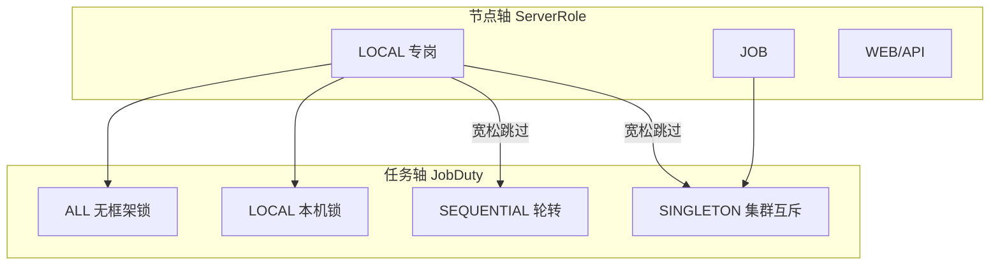

# 集群节点与边缘专岗（Cluster Node）

> **实现为准（Autumn 3.0.0）**：`JobDuty.LOCAL` / `ServerRole.LOCAL` / `Registry` / `cluster.html` / `/sys/node/*`。  
> **配套细读**：`AI_NODE_PROFILE.md`（画像与写盘）、`AI_SERVER_ROLE.md`（角色门禁）、`AI_CLUSTER_JOB_ORCHESTRATION.md`（JobDuty 编排）。  
> **互补**：分布式锁 → `AI_DISTRIBUTED_LOCK.md`；Redis 总开关 → `REDIS_STANDALONE.md`。

## 0. 功能完整性一览

| 能力 | 状态 | 说明 |
|------|------|------|
| `JobDuty.LOCAL` 本机进程锁 | 已完成 | 不参与集群互斥；`oncePerPeriod` 忽略 |
| `ServerRole.LOCAL` + LOCAL 专岗宽松门禁 | 已完成 | 专岗跳过 SINGLETON/SEQUENTIAL；ALL 仍跑 |
| 节点画像 `node-profile.json` | 已完成 | 写盘只覆盖框架字段，扩展顶层键保留；`labels` patch 合并 |
| Registry 心跳 / 远程 assign | 已完成 | 跟随 `autumn.redis.open`；无 Redis/Redisson 时降级不阻断启动 |
| 本机同步落盘（assign 自己） | 已完成 | 不依赖 Pub/Sub 回环 |
| `POST /registry/beat` | 已完成 | 改本机 roles 后立刻刷新成员表 |
| 管理页 `cluster.html` | 已完成 | 本机/成员/批量/轮询同步；管理员入口 |
| JobDuty 运维 | 复用 | 不新建第二套；链到 `loopjob.html` |
| 远程改 labels / home / uuid | 不做 | 仅本机 API；符合「危险操作不上远程」 |
| 菜单存量库自动插入 | 依赖 Init | 老库需菜单合并/手工补「集群节点」 |



---

## 1. 目标与场景

| 场景 | 做法 |
|------|------|
| 边缘节点只做本机清理/本地锁 | 节点 `roles: ["LOCAL","WEB","API"]`；任务 `duty=LOCAL` |
| 中心节点跑全集群汇总 | 节点含 `JOB`；任务 `duty=SINGLETON`（可选 `roles={"JOB"}`） |
| 改全集群节点角色 | 开 Registry → `cluster.html` 单机/批量 assign |
| 单机无 Redis | 只管本机画像；Registry 自动 inactive，启动不受影响 |

---

## 2. 配置

```yaml
autumn:
  redis:
    open: true                 # Registry 未显式配置时跟随此值
  node:
    # registry: true           # 可选覆盖；false=Redis 开着也不登记
    namespace: default          # 同 ns 才互相可见/可指挥
    home: ${user.home}/.autumn
    profile:
      cache-ttl-ms: 60000
```

| 键 | 含义 |
|----|------|
| `autumn.redis.open` | Redis 栈总开关；Registry 默认跟随 |
| `autumn.node.registry` | 显式 true/false 覆盖跟随逻辑 |
| `autumn.node.namespace` | Redis Hash/Topic 后缀 |
| `autumn.node.home` | `node-profile.json` 目录 |

**生效条件**：配置要求开启 **且** `redis.open=true` **且** `RedissonClient` 可用 → `Registry.enabled()==true`。否则 `enabled=false`，打一次 info：`Node registry inactive (...); startup continues`。

---

## 3. JobDuty.LOCAL

```java
@JobMeta(name = "清理本机缓存", duty = JobDuty.LOCAL, lock = "cache:local-cleanup", skipIfRunning = true)
public class LocalCacheCleanupJob implements LoopJob.OneMinute {
    @Override public void onOneMinute() { /* ... */ }
}
```

| 项 | 行为 |
|----|------|
| 锁 | 进程内 `tryLock`；键 `local:{nodeUuid}:{lock}` |
| 集群 | **不**走 `withClusterMutexOrSkip` / SEQUENTIAL / `oncePerPeriod` |
| 抢锁失败 | 跳过（与 SINGLETON 静默跳过一致） |
| 仅边缘跑 | 再加 `roles = {"LOCAL"}` |

类/方法合并：方法级非 ALL 覆盖类级；缺省 ALL 不把类级 LOCAL 打回。详见 `AI_CLUSTER_JOB_ORCHESTRATION.md`。

---

## 4. ServerRole.LOCAL 与专岗

**LOCAL 专岗**：`!isUnrestricted` 且含 `LOCAL` 且不含 `JOB`。

| 本机 roles | ALL（无 roles） | LOCAL duty | SINGLETON / SEQUENTIAL |
|------------|-----------------|------------|------------------------|
| 空 / ALL | 跑 | 跑 | 跑 |
| LOCAL（可兼 WEB/API） | **跑**（宽松） | 跑 | **跳过** |
| LOCAL + JOB | 跑 | 跑 | 跑 |

预置角色：ALL / WEB / API / WORKER / **LOCAL** / JOB / MONITOR。业务可 `ServerRoleRegistry.register(...)` 扩展。

---

## 5. 节点画像与扩展保留

框架字段：`uuid` / `version` / `create` / `update` / `roles` / `labels`。

- 写盘（`roles()` / assign / `patch` / ensure 回写）：**只覆盖**上述键，子项目顶层扩展键保留。
- `PUT /profile` 的 `labels`：**合并**（`null` 值删键），不整表替换。
- 推荐业务扩展进 `labels` 或顶层自定义键均可；勿依赖框架解释未知键。

---

## 6. Registry 网络模型

**不是**节点间 HTTP 互调，而是共享 Redis：

| 动作 | 通道 |
|------|------|
| 发现成员 | Hash `autumn:cluster:nodes:{ns}`（约 1min 心跳，180s 判离线） |
| 改他机 roles | Topic `autumn:cluster:profile-cmd:{ns}`（异步；成功=已 publish） |
| 改本机 | 直接写盘；若 Registry 可用则 `beat` |

任一台已启用 Registry 的管理端，均可对同 ns 成员发 assign。

---

## 7. HTTP API（`/sys/node`）

| Method | Path | 说明 |
|--------|------|------|
| GET/PUT | `/profile` | 本机画像；PUT 可含 `roles`（及合并 `labels`） |
| POST | `/profile/reload` | 强制读盘 |
| GET | `/roles` | 角色目录 |
| GET | `/registry` | `enabled` / `configured` / `redisOpen` / `followsRedis` / `namespace` / `staleMs` / `members` |
| POST | `/registry/beat` | 立即心跳 |
| PUT | `/registry/assign` | `{uuid,roles}`；目标为本机时同步落盘 |
| PUT | `/registry/assign-batch` | `{uuids,roles}` |

页面：运维监控 → **集群节点**（`cluster.html`，系统管理员）。JobDuty → `loopjob.html`。

---

## 8. 推荐启用步骤

1. 各节点：`autumn.redis.open=true`，相同 `autumn.node.namespace`，共用 Redis。  
2. 重启后确认日志无 `Node registry inactive`；打开 **集群节点** 页见 Registry 已开启。  
3. 边缘：`roles=["LOCAL","WEB","API"]`；中心：含 `JOB`。  
4. 本机清理任务标 `duty=LOCAL`；汇总任务标 `SINGLETON`。  
5. 远程改角色后看「同步中」至一致，或等下一次自动刷新。

---

## 9. 边界与排障

| 现象 | 处理 |
|------|------|
| Registry 未开启且 `configured=true` | 查 `redis.open` / Redisson Bean；看 info 日志 |
| assign 成功但角色未变 | 目标须启用 Registry；同 namespace；等心跳或页内轮询超时提示 |
| 菜单无「集群节点」 | Init 菜单种子未合并；手工加或等菜单初始化 |
| 子项目 JSON 扩展被冲掉 | 已保留顶层非框架键；确认走的是框架 `ProfileStore.write` |

**明确不做**：远程改 `home`/`reset-uuid`；用 Registry 替代 JobDuty；无 Redis 时强制集群编排。
