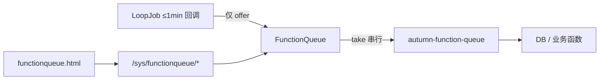

# Autumn 全局函数队列（`FunctionQueue`）

> **实现为准**：`autumn-lib` → `cn.org.autumn.thread.FunctionQueue` / `FunctionQueues` / `FunctionTaskRecord` / `OverflowPolicy`；运维 `SysFunctionQueueController` + `functionqueue.html`。  
> **分支**：本能力在 **Autumn 3.0.0** 线落地；业务工程须依赖已含该类的 autumn 版本。  
> **互补**：线程池异步 / 单飞 drain → `docs/AI_ASYNC_TASK.md`；持久化队列 → `BaseQueueService`；跨节点互斥 → `docs/AI_DISTRIBUTED_LOCK.md`。

## 1. 方案目标

降低 **≤1 分钟 `LoopJob`** 因频繁起线程或在回调内跑重活带来的开销与调度拖慢：

| 原则 | 实现 |
|------|------|
| 常驻不销毁 | 守护线程名 `autumn-function-queue`，`@PostConstruct` 启 / `@PreDestroy` 停 |
| 空闲零忙等 | `LinkedBlockingQueue.take()` 阻塞；有任务才醒 |
| 调用简单 | `FunctionQueues.offer(name, runnable)` / `offer(name, arg, consumer)` |
| 可运维 | 有界容量、溢出策略、耗时/历史、管理页动态刷新 |
| 热路径轻 | 入队 O(1) 计数；不采集堆栈、不序列化参数 |



## 2. 选型（与实现一致）

| 需求 | 使用 |
|------|------|
| ≤1min 回调内有 **DB**，要简单串行滚动 | **`FunctionQueues.offer`**（本文） |
| 业务自建 map + 单飞 drain / `onFinished` / 线程管理 UI | `TagTaskExecutor` + `JobPhaseGate`（`AI_ASYNC_TASK.md`） |
| 持久化 / Redis / 重试死信 | `QueueService` / `BaseQueueService` |
| 回调内仅内存清理、无 DB | **不必**入函数队列（如 `ShieldService` 清 list） |

**纪律**：业务禁止私建 `Executors` / `ScheduledExecutorService`；`FunctionQueue` 为框架 `@Component`。

## 3. 实现参数（默认值）

| 项 | 默认 | 说明 |
|----|------|------|
| 容量 | `10000`（**软上限**） | `LinkedBlockingQueue` 实例**永不替换**；热更新只改上限并按需丢最旧 |
| 溢出 | `REJECT` | 满则 `offer→false`；可选 `DROP_OLDEST` |
| 同名去重 | 开启 | 相同 `name` 仅保留一条排队，避免 `syncProfile` 等重复堆积 |
| 任务硬超时 | `60000` ms | 超时先 `interrupt`；历史可能记 `TIMED_OUT` |
| 硬废弃宽限 | `5000` ms | interrupt 后仍未结束 → **废弃旧 worker + 新线程**，历史 `ABANDONED`，继续下一任务 |
| Watchdog | 每 `1s` | 自动跑自愈，不依赖管理页刷新 |
| 空闲卡死自愈 | `recoverIfStalled` | 有积压且空闲：interrupt 唤醒；超时 / worker 死亡：重启线程 |
| 历史 | `500` | 超出 trim 队头 |
| 慢任务阈值 | `30000` ms | 超阈 `slowCount++` + warn |

其它行为：

- `offer` 捕获 **`CrudGuard.capture()`**，执行时 `CrudGuard.with`。
- 单任务异常 → 记 `FAILED` 历史，worker **继续**。
- `clear()` 只清排队，不中断当前任务；`interruptCurrent()` 仅协作式 interrupt。
- **防卡死（串行槽必保）**：
  1. Watchdog（每秒）触发自愈；`offer` **不再**每次做 stall 检查（入队会自然唤醒 `take`，避免空闲后误报）；
  2. 超 `maxTaskTimeoutMs` → interrupt；
  3. 再超 `hardAbandonMs` → **硬废弃**：抬升 `workerGeneration`、拉起新 worker 继续 `take()`（旧线程若卡在不可中断 I/O 可能成孤儿，但**队列不再被堵住**）；
  4. 空闲卡死仅当 **有积压且持续未执行 ≥5s**；普通空闲 `take` 不告警；
  5. 管理页「解除卡死」→ `POST /sys/functionqueue/recover`（有当前任务则**立即硬废弃**）。
- **容量热更新**：只改软上限，**不再** `drainTo` 换队列实例（从根上消除「IDLE 但排队非空」）。
- **诚实边界**：JVM 无法强制杀掉卡在部分 native/同步块里的线程；自愈保证的是**队列进度**，不是旧线程一定立刻消失。网络调用请尽量设 connect/read timeout，便于 interrupt 生效。

## 4. 调用方式

```java
// 注入
@Autowired FunctionQueue functionQueue;
functionQueue.offer("sync-orders", () -> syncOrders());
functionQueue.offer("process-order", orderId, this::processOrder);

// 静态（LoopJob / 工具类）
FunctionQueues.offer("IpBlackService.clear", this::clear);
boolean ok = FunctionQueues.offer("job", this::work); // false=拒绝/未启动
```

`ClearHandler.clear()` 等**管理端同步清理**可仍直接调业务方法；仅 **LoopJob 周期路径**改为 `offer`。

## 5. LoopJob ≤1min：迁移规则与框架现状

**规则**：周期 ≤ `OneMinute` 的 `onXxx` 若**同步访问数据库** → 回调内只 `FunctionQueues.offer(...)`，DB 进队列执行；无 DB → 不迁。

### 5.1 已迁移（框架内）

| 类 | 周期 | 队列任务名 |
|----|------|------------|
| `WallCounter`（含 `IpVisitService`） | 1 分钟 | `{SimpleName}.flushCounter` |
| `IpBlackService` / `IpWhiteService` / `HostService` / `UrlBlackService` | 1 分钟 | `*.clear` |
| `UserProfileService` | 10 秒 / 1 分钟 | `syncProfile`（批 50）/ `syncVisitIp`（批 100） |

### 5.2 未迁移（无 DB 或已异步）

`ShieldService`、`JumpService`、`SysConfigService`、`SysUserService`、`PayGateTokenStore`、`PayCredentialTokenStore`、`RegistryHeartbeatJob`；`RpQrcPendingStore`（`JobPhaseGate` + `TagTaskExecutor`）。

### 5.3 推荐写法

```java
@Override
public void onOneMinute() {
    FunctionQueues.offer("MyService.refresh", this::refreshFromDb);
}
```

大批量写库须**分批**并在批末再 `offer` 续跑（见 `UserProfileService`），避免占死全局串行槽。

## 6. 共享串行槽

进程内**一条** worker，所有 `offer` 共用：

| 风险 | 应对 |
|------|------|
| 长任务推迟防火墙刷新等 | 分批 + 再 offer；或改 `TagTaskExecutor`；依赖硬超时兜底 |
| 网络 hang 占死串行槽 | 业务设 I/O timeout；框架硬超时 + 硬废弃保证后续任务继续 |
| 队列满丢周期任务 | 看 `rejected`；调容量 / `DROP_OLDEST` |
| 单任务扫全表 | 禁止 |

运维看：排队长度、当前任务与耗时、`timedOut`/`abandoned`、慢任务、`rejected`/`dropped`。

## 7. 运维入口

| 项 | 路径 |
|----|------|
| 菜单 | 运维监控 → 函数队列管理 |
| 页 | `functionqueue.html`（`SysPageController`） |
| API | `POST /sys/functionqueue/info\|status\|pending\|history\|interrupt\|stacktrace\|recover\|clear\|clearHistory\|resetStats\|config` |
| 权限 | 登录 + 系统管理员 |

`info` 返回 `queue`（含 `current`）与 `pending`；前端读 `queue.current`。

## 8. 反模式

- ≤1min `onXxx` 内直接打 DB。
- 业务私建单线程池「山寨 FunctionQueue」。
- 持久化消息塞进本队列（应用 `BaseQueueService`）。
- 当跨节点唯一执行手段（应用锁 / `JobDuty`）。
- 无上限单帧扫 map/表；热路径打堆栈。

## 9. 源码索引

- `autumn-lib/.../thread/FunctionQueue.java`（及 `FunctionQueues`、`FunctionTaskRecord`、`OverflowPolicy`）
- `autumn-modules/.../sys/controller/SysFunctionQueueController.java`
- `autumn-modules/.../templates/functionqueue.html`
- 单测：`autumn-lib/.../FunctionQueueTest.java`
- 地图：`docs/AI_MAP.md` §2.2D；异步对照：`docs/AI_ASYNC_TASK.md` §4.1
