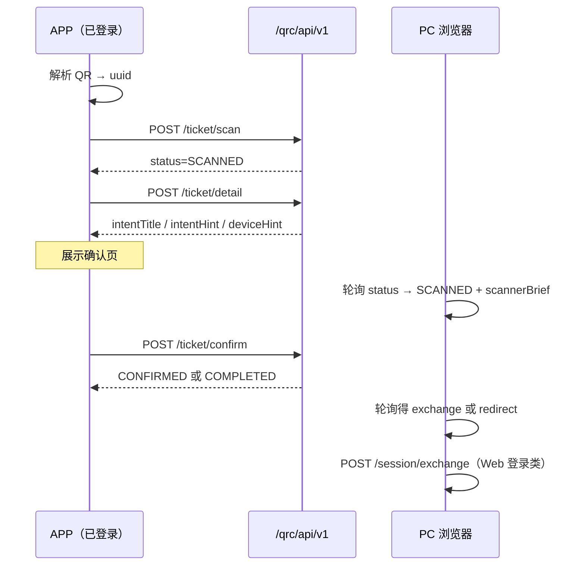

# QRC APP / 客户端 API 手册

> 面向 **Autumn 官方 APP** 或任何已接入用户 Token 的移动客户端。
>
> - HTTP 字段与错误码：**`docs/AI_QRC_API.md`**
> - 第三方 OAuth 全链路：**`docs/AI_OAUTH_INTEGRATION.md`**
> - 第三方自建 QR：**`docs/AI_QRC_INTEGRATION.md`**

---

## 1. 前置条件

| 项 | 要求 |
|----|------|
| 用户状态 | APP 内**已登录**（有效 user token） |
| 鉴权 Header | `Token: {userToken}` 或 `Authorization: Bearer {userToken}` |
| Content-Type | POST 使用 `application/json`，body 包一层 `data` |
| 响应判断 | `code === 0` 为成功，业务数据在 `data` |

---

## 2. 扫码确认流程（微信式两步）

**原则**：扫码 ≠ 登录；须用户点击「确认」后才产生 `exchange` / OAuth `code`。



### 2.1 步骤说明

1. **解析 QR**，得到 `uuid`：
   - `https://{host}/qrc/api/v1/t/{uuid}`
   - `autumn://qrc/t/{uuid}`
   - （可选）`GET /qrc/api/v1/t/{uuid}` 校验票据是否仍为 `PENDING`

2. **`POST /qrc/api/v1/ticket/scan`** — 标记已扫码（**不登录**）

   ```json
   { "data": { "uuid": "..." } }
   ```

3. **`POST /qrc/api/v1/ticket/detail`** — 拉取确认页文案（见 §4）

4. **展示确认页**（须包含 §5 UX 字段）

5. 用户点击 **「确认」** → **`POST /qrc/api/v1/ticket/confirm`**

   ```json
   { "data": { "uuid": "..." } }
   ```

6. **PC 侧**（非 APP 职责）：轮询 `GET /qrc/scanticket/web/ticket/status`，见 `exchange` 后调 `session/exchange`

7. **`delivery=DEEP_LINK`**（第三方 Native）：confirm 响应 `result.deepLink`，由 APP `openURL` 打开第三方 scheme

### 2.2 用户拒绝

```http
POST /qrc/api/v1/ticket/deny
Content-Type: application/json
Token: {userToken}

{ "data": { "uuid": "..." } }
```

---

## 3. 按 Intent 的 APP 行为

| Intent | 典型 QR 来源 | confirm 后 APP 侧 | PC/浏览器侧 |
|--------|-------------|-------------------|-------------|
| `SELF_WEB_LOGIN` | 网站登录页 | 提示「已在电脑登录」即可关闭 | `exchange` → Session |
| `OAUTH_AUTHORIZE` | `/oauth2/authorize` 未登录 | 同上 | `exchange` → 继续 OAuth |
| `OAUTH_CONSENT` | authorize 已登录二次确认 | 展示 scope；confirm 后一般无需 DeepLink | 浏览器跟随 `redirect` |
| `OAUTH_DEVICE` | 第三方 App 扫 Open API 的码 | 若 `result.deepLink` 则打开；否则提示成功 | 第三方服务端轮询 |

---

## 4. 确认页字段（POST detail）

完整字段见 **`AI_QRC_API.md` §2 detail**。APP **必须展示**：

| 字段 | 用途 |
|------|------|
| `intentTitle` | 页面主标题 |
| `intentHint` | 风险提示副文案 |
| `deviceHint` | 「Windows 电脑」等设备描述 |
| `clientName` | OAuth 应用名（无则显示「第三方应用」） |
| `clientIconUri` | 应用图标 |
| `scopeLabels` 或 `scope` | 授权范围 |

**图标 URL**：若 `clientIconUri` 为相对路径，拼接 `https://{auth-host}`。

**可选只读展示**：`redirectUri`（让用户知晓回调域名）。

---

## 5. scan / status / confirm 响应要点

| 字段 | APP 关注点 |
|------|-----------|
| `status` | 流程驱动，见 API 文档状态机 |
| `scannerBrief` | 扫码成功后可用于「当前账号：xxx」展示（与 PC 端一致） |
| `exchange` | APP **不需要**使用；交给 PC/浏览器 |
| `result.deepLink` | `OAUTH_DEVICE` + `DEEP_LINK` 时在 confirm 后打开 |
| `expireIn` | 可展示倒计时；归零提示重新扫码 |

---

## 6. UX 要求（强制）

1. **禁止**扫码后自动 confirm；必须显式「确认」按钮
2. **必须**展示 `intentTitle`、`intentHint`、`deviceHint`
3. OAuth 场景**必须**展示应用名与 scope
4. 提供「取消」→ 调 `deny`
5. 网络失败时区分：可重试（scan/detail）vs 须重新扫码（8610/8611）
6. `DEEP_LINK` **仅在** confirm 成功后跳转

---

## 7. 推荐伪代码

```text
onQrScanned(uuid):
  if GET /t/{uuid} 失败或 status 非 PENDING/SCANNED:
    showError("二维码已失效")
    return
  scanRes = POST /qrc/api/v1/ticket/scan { uuid }
  if scanRes.code != 0: handleError(scanRes); return
  detail = POST /qrc/api/v1/ticket/detail { uuid }
  showConfirmScreen(detail)

onUserConfirm(uuid):
  res = POST /qrc/api/v1/ticket/confirm { uuid }
  if res.code != 0: handleError(res); return
  if res.data.result.deepLink:
    openUrl(res.data.result.deepLink)
  showSuccessAndClose()

onUserCancel(uuid):
  POST /qrc/api/v1/ticket/deny { uuid }
  close()
```

> **顺序**：先 `scan` 再 `detail`，以便 PC 端尽快进入 `SCANNED` 并展示头像。若已 `SCANNED` 再次 scan 会返回 8612，可忽略并继续 detail。

---

## 8. 错误处理

| code | 场景 | APP 建议 |
|------|------|----------|
| 8610 / 8611 | 票据不存在/过期 | 「二维码已失效，请在电脑上刷新」 |
| 8612 | 重复 scan | 继续 detail/confirm 流程 |
| 8613 / 8616 | 未登录 | 跳转 APP 登录页 |
| 8617 | 账号不一致 | 提示使用扫码账号确认 |
| 8630 | 客户端未开通 QRC | 联系管理员 |

---

## 9. 联调检查清单

- [ ] APP 已登录且 Token 有效
- [ ] scan → PC 轮询可见 `SCANNED` + `scannerBrief`
- [ ] confirm 前 PC **无** `exchange`
- [ ] confirm 后 PC 获得 `exchange` 并完成跳转（Web 登录）
- [ ] deny 后 PC 轮询为 `DENIED`
- [ ] OAuth 场景 confirm 后 `redirect` 或 `result.code` 符合预期
