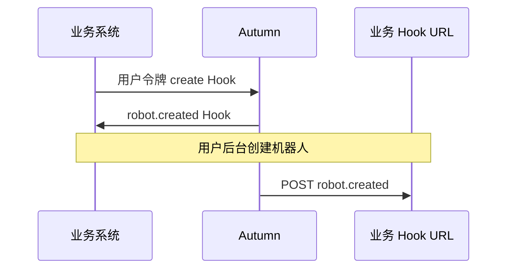
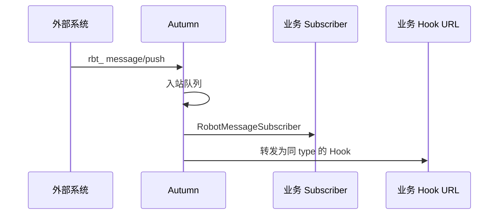
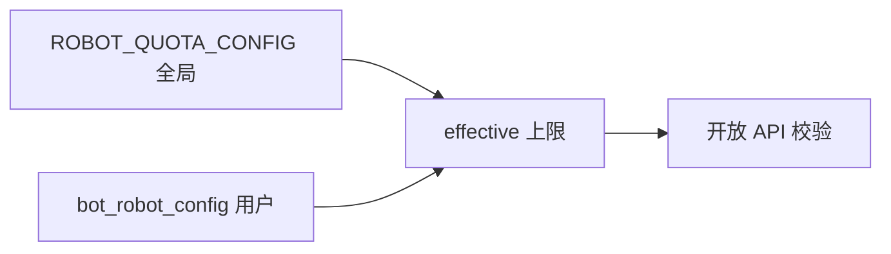

# 机器人（Bot）业务对接开发指南

> **Autumn 2.0.0 / master**（JDK 8、Spring Boot 2.7）。  
> **API 字段级手册**：**[`docs/AI_ROBOT_API.md`](AI_ROBOT_API.md)**（业务系统对接时建议两份文档一并加载）。  
> **框架内扩展**（Subscriber、队列、实体规范）：本文 §10 + `docs/AI_CODEGEN.md`。

---

## 文档导读

| 读者 | 阅读路径 |
|------|----------|
| 业务后端（首次对接） | §1 快速开始 → §2 典型场景 → §3 鉴权 → [`AI_ROBOT_API.md`](AI_ROBOT_API.md) |
| 业务后端（接收 Hook） | §4 Hook 验签 → §4.3 示例代码 |
| 业务后端（推送消息） | §5 入站消息 → [`AI_ROBOT_API.md` §2](AI_ROBOT_API.md) |
| Autumn 模块开发者 | §10 扩展点 + `docs/AI_STANDARDS.md` + skill `autumn-framework-2x` |
| 运维 / 管理员 | §6 配额与限流 → §7 故障排查 |

---

## 1. 快速开始（15 分钟）

### 1.1 前置条件

| 项 | 说明 |
|----|------|
| Autumn 应用 | 已部署且可 HTTPS 访问（生产环境推荐全站 TLS） |
| 用户账号 | 已在系统注册，且能获取 **用户 API 令牌**（`usr` 模块，非 `rbt_`） |
| 网络 | 管理 API 从你的服务端发起；Hook 回调 URL 须 **公网可达** Autumn |

### 1.2 变量约定

下文用占位符：

| 占位符 | 含义 |
|--------|------|
| `{ORIGIN}` | 如 `https://api.example.com` |
| `{USER_TOKEN}` | 用户访问令牌 |
| `{ROBOT_TOKEN}` | `rbt_` 机器人令牌 |
| `{ROBOT_UUID}` | 机器人 uuid |

### 1.3 四步最小闭环

```bash
# 1. 创建机器人（保存返回的 rbt_ 明文，只出现一次）
curl -sS -X POST '{ORIGIN}/bot/api/v1/create' \
  -H 'Content-Type: application/json' \
  -H 'Token: {USER_TOKEN}' \
  -d '{"data":{"name":"对接测试机器人","tokenExpireDays":365}}'

# 2. 登记 Hook（务必传入 secret 并自行保存）
curl -sS -X POST '{ORIGIN}/bot/api/v1/hook/create' \
  -H 'Content-Type: application/json' \
  -H 'Token: {USER_TOKEN}' \
  -d '{"data":{"robot":"{ROBOT_UUID}","name":"主回调","callbackUrl":"https://your.app/hook/robot","secret":"your-hook-secret-32chars","events":"*"}}'

# 3. 外部业务以机器人身份推送消息
curl -sS -X POST '{ORIGIN}/bot/api/v1/message/push' \
  -H 'Content-Type: application/json' \
  -H 'X-Robot-Token: {ROBOT_TOKEN}' \
  -H 'X-Robot-Message-Id: demo-001' \
  -d '{"data":{"type":"demo.ping","data":{"hello":"world"}}}'

# 4. 你的 Hook URL 将收到 POST（见 §4）
```

成功标准：

- 步骤 1：`code=0`，`data.token` 以 `rbt_` 开头。  
- 步骤 3：`code=0`，`data.queued=true`。  
- 步骤 4：Hook 端验签通过且 HTTP 返回 2xx。

---

## 2. 典型对接场景

### 2.1 场景 A：仅接收平台事件（生命周期）



1. `hook/create`，`events` 填 `robot.created,robot.disabled,...` 或 `*`。  
2. 实现 Hook HTTP 服务（§4）。  
3. 无需调用 `message/push`。

### 2.2 场景 B：外部系统向 Autumn 推送业务事件



1. 创建机器人并取得 `rbt_`。  
2. （可选）同一 Autumn 应用内实现 `RobotMessageSubscriber` 写库/驱动流程。  
3. （可选）`hook/create`，`events` 填业务 `type` 或 `*`。  
4. 外部系统用 **`rbt_`** 调 `message/push`。

### 2.3 场景 C：多令牌轮换

1. `token/create` 生成第二枚 `rbt_`（校验 `usedRows < maxRows`）。  
2. 灰度切换外部系统配置为新令牌。  
3. `token/revoke` 作废旧令牌行。  
4. 或使用 `token/rotate`（注意满额策略，见 API 手册）。

---

## 3. 鉴权详解

### 3.1 两类令牌（切勿混用）

| | 用户令牌 | 机器人令牌 `rbt_` |
|--|----------|-------------------|
| **用途** | 管理机器人、Hook、配额 | **仅** 推送入站消息 |
| **请求头** | `Token` / `Authorization: Bearer` | **`X-Robot-Token`**（推荐） |
| **对应主体** | `sys_user` | `bot_robot` |

管理 API 收到 `rbt_` 会返回：`请使用用户令牌管理机器人`（`code=-10000`）。

### 3.2 机器人令牌校验失败排查

| 现象 | 可能原因 |
|------|----------|
| 机器人令牌无效 | 明文错误、已 revoke、已过期 |
| 机器人已停用 | `disable` 后令牌作废 |
| 所属用户不可用 | 主人账号冻结/删除 |
| 无 message.push 权限 | 机器人 `scopes` 已配置且不包含 `message.push` |

`scopes` **为空**：不限制 API。配置示例：`message.push` 或 `message.push,other.scope` 或 `*`。

### 3.3 获取用户令牌

用户令牌由 **`usr` 模块** 签发（具体路径以业务系统暴露的开放认证文档为准，非本文范围）。机器人模块 **不负责** 签发用户令牌。

### 3.4 `UserContext` 与遗留 `userUuid` hint

开放 API 注入的 `UserContext` 在运行时多为 `SysUserEntity` 或 `RobotEntity`；**数据权限**请用 `getSubject()`，勿把真人 `getOwner()` 当作主体 uuid。

| 请求携带 | 解析顺序 |
|----------|----------|
| Shiro 已登录 | 直接返回 Session 主体 |
| 令牌（`Token` / `X-Robot-Token` 等） | 校验令牌后返回对应实体 |
| 令牌 + `userUuid` query/header | 二者须一致，否则视为未认证 |
| 仅 `userUuid`、无令牌 | 遗留 minclouds 行为（内网/网关场景）；生产开放 API 应始终带令牌 |

### 3.5 业务表 `user` 字段：真人或机器人 uuid

框架层 **`SysUserEntity`** 与 **`RobotEntity`** 是**两种类型**，各自 **`uuid` 全局互斥**（`UuidNamespaceService` 统一分配，禁止同一字符串同时出现在 `sys_user` 与 `bot_robot`）。

业务层为简化开发，通常**将机器人视作一种用户**，**不**为机器人单独复制一套业务表：

| 场景 | 约定 |
|------|------|
| 业务表 **`user`** 列（非 `UserBased`、非 §3.4 唯一语义） | 存 **`UserContext#getUuid()`**，可为 **`sys_user.uuid`** 或 **`bot_robot.uuid`** |
| **仅用户维度、无 `uuid` 第二主键**（**`AI_DUAL_KEY` §3.4**） | 自增 **`id`** + 非唯一 **`user`**；按 **`user`** 查询；**不必** `UuidBased` |
| 按真人唯一的 **`UserBased.user`**（如 `bot_robot_config`） | **仅** **`sys_user.uuid`** |
| **`RobotEntity.owner`** | **仅** 主人真人 **`sys_user.uuid`** |
| 解析 | **`UserContextService#getUserContext(uuid)`**；需区分机器/人时用 **`isRobot()`** |

写入示例：创建业务记录时 `entity.setUser(ctx.getUuid())`，勿假设 `user` 列只能是真人 uuid。

详见 **`docs/AI_DUAL_KEY.md` §1.1、§3.4**。

---

## 4. 接收 Hook 回调（HTTP 服务端）

### 4.1 你必须实现

1. 公网 `POST` 端点，与 `hook/create` 的 `callbackUrl` 一致。  
2. 读取 **原始 body 字节** 用于验签（勿先解析再重组 JSON）。  
3. 校验 `X-Robot-Signature`。  
4. 按 `event` 与 `data` 分支处理。  
5. 处理成功返回 **2xx**。

### 4.2 签名算法（规范）

```
body      = 完整 HTTP 请求体（UTF-8 字符串）
timestamp = 请求头 X-Robot-Timestamp（字符串）
secret    = 创建 Hook 时保存的 secret

sign_input = timestamp + "." + body
signature  = HMAC_SHA256(secret, sign_input) 转为小写十六进制

断言: signature == X-Robot-Signature
```

### 4.3 参考实现

**Java（JDK8）**

```java
import javax.crypto.Mac;
import javax.crypto.spec.SecretKeySpec;
import java.nio.charset.StandardCharsets;

public final class RobotHookVerifier {
    public static boolean verify(String secret, String timestamp, String body, String headerSig) {
        if (secret == null || timestamp == null || body == null || headerSig == null)
            return false;
        try {
            String payload = timestamp + "." + body;
            Mac mac = Mac.getInstance("HmacSHA256");
            mac.init(new SecretKeySpec(secret.getBytes(StandardCharsets.UTF_8), "HmacSHA256"));
            byte[] bytes = mac.doFinal(payload.getBytes(StandardCharsets.UTF_8));
            StringBuilder sb = new StringBuilder(bytes.length * 2);
            for (byte b : bytes) {
                sb.append(String.format("%02x", b & 0xff));
            }
            return sb.toString().equalsIgnoreCase(headerSig.trim());
        } catch (Exception e) {
            return false;
        }
    }
}
```

**Python 3**

```python
import hmac
import hashlib

def verify(secret: str, timestamp: str, body: str, header_sig: str) -> bool:
    msg = (timestamp + "." + body).encode("utf-8")
    digest = hmac.new(secret.encode("utf-8"), msg, hashlib.sha256).hexdigest()
    return hmac.compare_digest(digest, (header_sig or "").strip().lower())
```

### 4.4 幂等与重试

- Autumn 对非 2xx 会 **重试**（默认 5 次，可配置），故 Hook 端可能 **重复收到** 同一事件。  
- 建议用 `data.messageId`（入站转发）或 `timestamp+event+robot` 组合做 **幂等去重**。  
- 验签通过后再返回 2xx；不要长时间阻塞（建议 < 5s）。

---

## 5. 入站消息推送

### 5.1 契约摘要

| 项 | 说明 |
|----|------|
| 接口 | `POST {ORIGIN}/bot/api/v1/message/push` |
| 鉴权 | `X-Robot-Token: rbt_...` |
| `type` | 业务事件名，与 Hook `events` 对齐 |
| `data` | JSON 载荷（≤256KB） |
| 幂等 | `data.messageId` 或头 `X-Robot-Message-Id` |
| 成功 | `code=0`，`queued=true` 表示已入队 |

完整字段见 [**`AI_ROBOT_API.md` §2**](AI_ROBOT_API.md)。

### 5.2 载荷 JSON 说明

- 请求中 `data` 可传 **JSON 对象** 或 **JSON 字符串**（框架自动归一化）。  
- 系统内部与 `RobotMessage.getData()` 统一为 **JSON 文本**。  
- 转发到 Hook 时，`data.payload` 为 **解析后的对象**。

### 5.3 限流与幂等

| 机制 | 默认 | 配置键 |
|------|------|--------|
| 每分钟推送上限 | 60 / 机器人 | `ROBOT_QUOTA_CONFIG.maxMessagePushPerMinute`（0=不限） |
| 幂等窗口 | 24 小时 | `messageIdempotencyHours` |

重复幂等键响应：`duplicate=true`，`queued=false`，`messageId` 与首次一致。

### 5.4 不要假设同步完成

`message/push` 返回成功 ≠ Subscriber 已执行 ≠ Hook 已送达。若需「处理完成」确认，应：

- 由 Subscriber 写业务状态后，再通过你们自己的 API 通知外部；或  
- 仅依赖 Hook 回调作为「已投递」信号（仍为 at-least-once）。

---

## 6. 配额、配置与限制

### 6.1 配置层级



| 层级 | 存储 | 管理途径 |
|------|------|----------|
| 全局 | 系统配置 `ROBOT_QUOTA_CONFIG` | 后台系统配置 |
| 用户 | `bot_robot_config` | `config/save`（管理员） |

用户配置 **-1** 表示该项继承全局。

### 6.2 配额计数规则（对接必读）

| 资源 | 计数方式 |
|------|----------|
| 机器人 | **`status >= 0` 行数**：含**停用(0)**、正常(1)；**不含软删(-1)**与销毁(-2)。用户 `delete` 后立即释放名额；软删记录后台保留约 30 天由定时任务硬销毁，**用户不可 enable 恢复** |
| 软删门禁 | 全局 `RobotQuotaConfig.maxSoftDeletePending`（默认 **5**）：软删数 **> 该值** 禁止 `create`，降至 **≤ 该值** 可恢复（管理员 `destroy` 或 `deletedRetentionDays` 自动清理） |
| 软删保留 | 全局 `RobotQuotaConfig.deletedRetentionDays`（默认 **30**），超期由 **`RobotService.onOneDay`** 每日硬销毁 |
| 有效令牌 | **status=1** 的行数 |
| Hook | 表行数（按机器人） |

### 6.3 队列与重试（运维）

| 队列 | 默认重试 | 死信 |
|------|----------|------|
| 入站消息 | 3 | 是 |
| Hook HTTP | 5 | 是 |

日志关键字：`入站消息进入死信`、`Hook回调进入死信`。死信重放见 `QueueService` 运维能力（`docs/AI_CODEGEN.md`）。

---

## 7. 故障排查

| 症状 | 检查项 |
|------|--------|
| 管理 API 返回请登录 | 是否带用户令牌；`code=-10000` |
| message/push 请使用机器人令牌 | 是否误用用户令牌 |
| 已达 xxx 上限 | `config/get` 查看 `used*` 与 `effective*` |
| Hook 从未收到 | Hook `events` 是否匹配；机器人是否 active；URL 是否公网；死信日志 |
| 验签失败 | 是否用**原始 body**；`secret` 是否与创建时不一致 |
| 推送 429/频繁 | 调大 `maxMessagePushPerMinute` 或客户端降频 |
| duplicate=true | 正常幂等行为，非错误 |

---

## 8. 对接清单（上线前）

### 8.1 管理面

- [ ] 已安全存储用户令牌与 `rbt_` 明文（密钥管理系统，禁止写日志）  
- [ ] 创建机器人并记录 `robot.uuid`  
- [ ] Hook `callbackUrl` 公网可达且 TLS 有效  
- [ ] Hook `secret` 由己方生成并已保存（勿依赖服务端自动生成）  
- [ ] `events` 已按最小权限配置（避免一律 `*`）  
- [ ] 令牌轮换/作废流程已文档化  

### 8.2 入站推送

- [ ] 使用 `X-Robot-Token` 调用 `message/push`  
- [ ] `type` 命名规范已团队共识（小写+点分）  
- [ ] 客户端实现幂等键（`messageId`）  
- [ ] 处理 `duplicate=true` 与 `queued=true`  
- [ ] 载荷 < 256KB  

### 8.3 Hook 接收端

- [ ] 验签与原始 body 一致  
- [ ] 2xx 响应 < 5s  
- [ ] 重复投递幂等  
- [ ] 区分生命周期 `data` 与入站 `data.payload` 结构  

### 8.4 运维

- [ ] 已配置 `ROBOT_QUOTA_CONFIG`  
- [ ] 监控队列堆积与死信日志  
- [ ] Autumn 版本锁定 `cn.org.autumn:2.0.0`  

---

## 9. 数据模型摘要

| 表 | 说明 |
|----|------|
| `bot_robot` | 机器人；`uuid` 为业务主键 |
| `bot_robot_token` | 令牌哈希；明文不落库 |
| `bot_robot_hook` | 回调配置 |
| `bot_robot_config` | 用户级配额 |

机器人 `status`：`1` 正常，`0` 停用，`-1` 软删，`-2` 销毁。

---

## 10. Autumn 应用内扩展（非 HTTP 对接）

### 10.1 入站消息订阅

```java
@Component
@Order(100)
public class MyOrderPaidSubscriber implements RobotMessageSubscriber {
    @Override
    public String events() {
        return "order.paid";
    }
    @Override
    public void receive(RobotMessage message) {
        // message.getData() 为 JSON 文本
    }
}
```

### 10.2 自定义出站分发

实现 `cn.org.autumn.handler.RobotHookDispatch` 并注册 Spring Bean（可 `@Primary`）替换默认 `RobotHookDispatcher`。

### 10.3 框架实现包

`cn.org.autumn.modules.bot`（模块 `autumn-modules`）

---

## 11. 相关文档

| 文档 | 用途 |
|------|------|
| [**`AI_ROBOT_API.md`**](AI_ROBOT_API.md) | **全量 API 请求/响应** |
| `docs/AI_INDEX.md` | 文档总索引 |
| `docs/AI_CODEGEN.md` | `BaseQueueService`、缓存 |
| `docs/AI_DISTRIBUTED_LOCK.md` | 幂等锁 |
| `docs/AI_STANDARDS.md` | Autumn 模块开发规范 |

---

## 12. 版本与兼容

- 本文档对应 **Autumn 2.0.0**（`javax.*`、Boot 2.7）。  
- **Autumn 3.0.0** 分支请使用 `autumn-framework-3x` 与对应文档（`jakarta.*`）。  
- 升级 Autumn 后请重新核对 [`AI_ROBOT_API.md`](AI_ROBOT_API.md) 与发行说明。

---

*文档维护：机器人模块变更时请同步更新 `AI_ROBOT.md`、`AI_ROBOT_API.md` 及 `autumn-framework-2x` Skill。*
