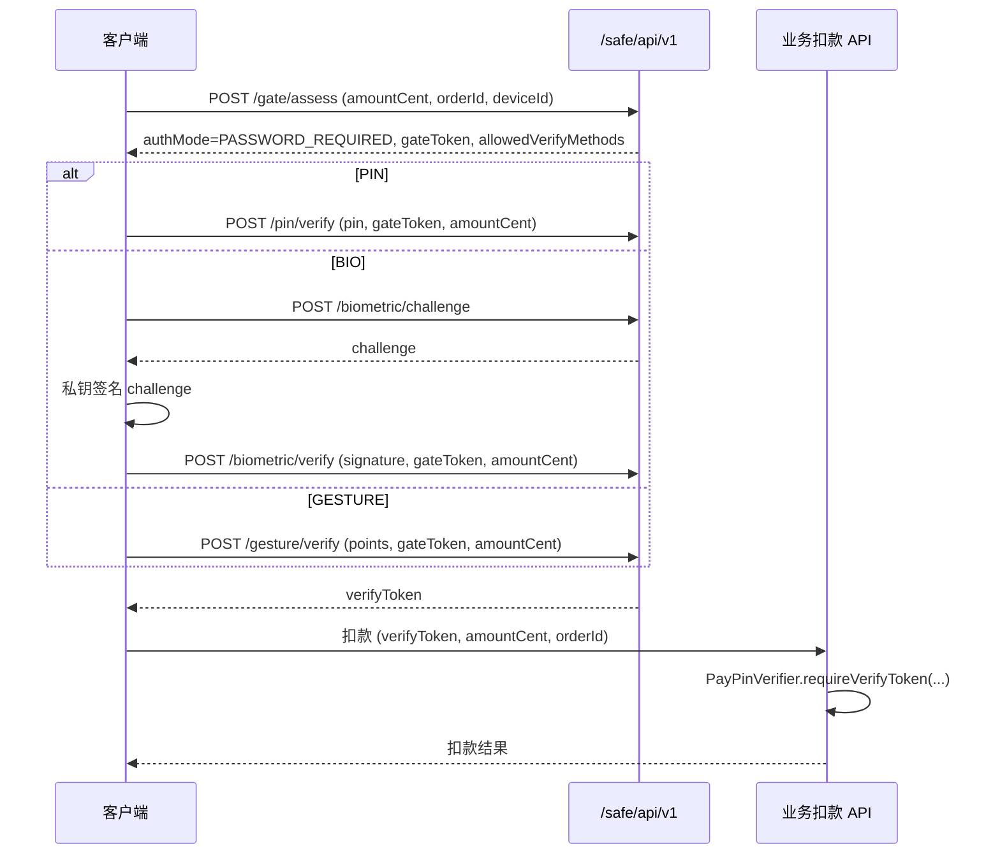
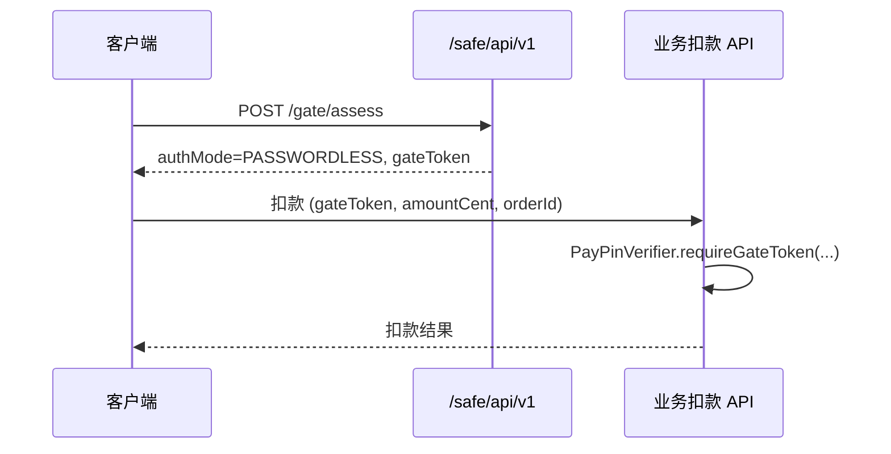

# 支付安全凭证 — 客户端对接手册

> **适用对象**：iOS / Android / H5 / 小程序 / 前端团队  
> **服务端模块**：`cn.org.autumn.modules.safe`  
> **开放 API 入口**：`PayCredentialApiController`  
> **基础路径**：`{ORIGIN}/safe/api/v1`（全部为 **POST**，无尾斜杠）  
> **接口总数**：**22** 个  
> **框架版本**：Autumn 2.0.0 / 3.0.0（报文格式一致）

服务端实现参考：`docs/AI_SAFE_CREDENTIAL.md`；业务仓扣款对接：`docs/AI_SAFE_CREDENTIAL_INTEGRATION.md`。

---

## 目录

1. [快速开始](#1-快速开始)
2. [通用约定](#2-通用约定)
3. [功能模块概览](#3-功能模块概览)
4. [支付密码 API](#4-支付密码-api)
5. [手势密码 API](#5-手势密码-api)
6. [生物识别 API](#6-生物识别-api)
7. [支付安全设置 API](#7-支付安全设置-api)
8. [支付闸门 API](#8-支付闸门-api)
9. [完整支付流程](#9-完整支付流程)
10. [令牌生命周期](#10-令牌生命周期)
11. [错误码与客户端处理](#11-错误码与客户端处理)
12. [安全与 UX 规范](#12-安全与-ux-规范)
13. [传输加密（可选）](#13-传输加密可选)
14. [接口速查表](#14-接口速查表)
15. [FAQ](#15-faq)

---

## 1. 快速开始

### 1.1 最小接入（仅支付密码）

```
用户登录（人类用户令牌，非 rbt_）
    ↓
pin/status          → 是否已设置、是否锁定
    ↓（未设置）
pin/set             → 首次设置 6 位数字密码
    ↓（发起支付）
gate/assess         → 评估金额与环境，获取 gateToken、authMode
    ↓（authMode = PASSWORD_REQUIRED）
pin/verify          → 校验 PIN，获取 verifyToken
    ↓
业务扣款接口         → 提交 verifyToken + amountCent + orderId
```

### 1.2 请求示例（curl）

```bash
curl -X POST '{ORIGIN}/safe/api/v1/pin/status' \
  -H 'Content-Type: application/json;charset=UTF-8' \
  -H 'Token: {用户访问令牌}' \
  -d '{}'
```

带业务字段：

```bash
curl -X POST '{ORIGIN}/safe/api/v1/pin/verify' \
  -H 'Content-Type: application/json;charset=UTF-8' \
  -H 'Authorization: Bearer {用户访问令牌}' \
  -d '{
    "data": {
      "pin": "135790",
      "gateToken": "abc123...",
      "amountCent": 1000
    }
  }'
```

---

## 2. 通用约定

### 2.1 HTTP

| 项 | 值 |
|----|-----|
| Method | 全部为 **POST** |
| Content-Type | `application/json;charset=UTF-8` |
| 字符编码 | UTF-8 |
| 基础路径 | `{ORIGIN}/safe/api/v1` |

`{ORIGIN}` 为业务部署域名，如 `https://api.example.com`。

### 2.2 鉴权

须使用**当前登录人类用户**的访问令牌（与 `usr` 模块登录一致），**禁止**使用机器人令牌（`rbt_` 前缀）。

任选一种请求头：

```http
Token: <用户访问令牌>
```

或

```http
Authorization: Bearer <用户访问令牌>
```

| 场景 | code | msg 示例 |
|------|------|----------|
| 未登录 / 令牌无效 | `-10000` | 请登录 |
| 机器人令牌 | `-10000` | 请使用用户令牌 |
| 用户 UUID 不可用 | `-10000` | 用户不可用 |

> Shiro 对 `/safe/api/v1/**` 配置为 `anon`，实际鉴权由 `@Authenticated` + `UserContext` 在 Controller 内完成。

### 2.3 请求体 `Request<T>`

业务字段统一放在 **`data`** 对象内：

```json
{
  "data": {
    "pin": "135790",
    "confirm": "135790"
  }
}
```

| 规则 | 说明 |
|------|------|
| 无业务字段 | 可传 `{}`、省略 body，或 `{"data":{}}`（如 `pin/status`、`biometric/list`） |
| 必填接口 | `data` 不能为 `null`；缺失时返回 `code != 0`，msg 为「请求体不能为空」 |
| 金额字段 | 一律 **`amountCent`（分）**：10 元 = `1000`，500 元 = `50000` |

### 2.4 响应体 `Response<T>`

```json
{
  "code": 0,
  "msg": "success",
  "data": { }
}
```

| 字段 | 类型 | 说明 |
|------|------|------|
| `code` | int | **`0` 表示成功**；非 0 为失败 |
| `msg` | string | 提示文案；成功时多为 `success` 或空 |
| `data` | object / array / null | 业务数据；无体接口成功时可能为 `null` |

**客户端判断**：`code === 0` 为成功；其余展示 `msg` 并按 [§11](#11-错误码与客户端处理) 处理。

### 2.5 全局策略默认值

以下由后台「支付凭证」配置（`PAY_CREDENTIAL_CONFIG`）控制，客户端应兼容服务端动态值；`security/status` 可读取部分生效策略。

| 配置项 | 默认值 | 客户端含义 |
|--------|--------|------------|
| `pinLength` | 6 | 支付密码位数（全数字） |
| `maxFailAttempts` | 5 | 连续失败锁定阈值 |
| `lockMinutes` | 30 | 锁定时长（分钟） |
| `verifyTokenMinutes` | 5 | `verifyToken` 有效分钟 |
| `challengeMinutes` | 5 | 生物 `challenge` 有效分钟 |
| `gestureMinPoints` | 4 | 手势最少连接点数 |
| `gateEnabled` | true | 是否启用支付闸门 |
| `gateTokenMinutes` | 5 | `gateToken` 有效分钟 |
| `passwordlessEnabled` | true | 是否启用小额免密 |
| `passwordlessMaxAmountCent` | 1000 | 免密金额上限（分） |
| `passwordlessWindowMinutes` | 15 | 校验成功后的免密窗口 |
| `highAmountThresholdCent` | 50000 | 超过该金额强制输密 |

---

## 3. 功能模块概览

```
┌─────────────────────────────────────────────────────────────┐
│                    POST /safe/api/v1                         │
├──────────────┬──────────────┬──────────────┬────────────────┤
│  支付密码 PIN │  手势 GESTURE │  生物 BIO     │  安全 / 闸门    │
│  pin/* (5)   │  gesture/* (5)│ biometric/* (5)│ security/* (6) │
│              │              │              │  gate/* (1)    │
└──────────────┴──────────────┴──────────────┴────────────────┘
```

| 模块 | 路径前缀 | 接口数 | 说明 |
|------|----------|--------|------|
| 支付密码 | `/pin/*` | 5 | 6 位数字 PIN 的设置、修改、重置、校验 |
| 手势密码 | `/gesture/*` | 5 | 九宫格手势，与 PIN 独立存储 |
| 生物识别 | `/biometric/*` | 5 | RSA 公钥注册 + challenge/verify |
| 安全设置 | `/security/*` | 6 | 免密偏好、常用设备/IP |
| 支付闸门 | `/gate/*` | 1 | 支付前安全评估 |

**校验方式常量**（`allowedVerifyMethods` 返回值）：

| 值 | 含义 |
|----|------|
| `PIN` | 6 位支付密码 |
| `BIO` | 生物识别（指纹/面容等） |
| `GESTURE` | 手势密码（须用户开启 `gesturePaymentEnabled`） |

---

## 4. 支付密码 API

### 4.1 查询状态 — `POST /pin/status`

查询当前用户是否已设置支付密码、是否锁定、剩余尝试次数。

**请求 `data`**：可省略。

**响应 `data`（`PayPinStatusResult`）**

```json
{
  "code": 0,
  "msg": "success",
  "data": {
    "set": true,
    "locked": false,
    "remainingAttempts": 5
  }
}
```

| 字段 | 类型 | 说明 |
|------|------|------|
| `set` | boolean | 是否已设置支付密码 |
| `locked` | boolean | 是否处于锁定态 |
| `remainingAttempts` | int | 锁定前剩余可尝试次数 |

**客户端逻辑**

- `set === false` → 引导用户 `pin/set`
- `locked === true` → 禁用输入，提示锁定；可展示倒计时（锁定时长见配置 `lockMinutes`）
- 支付前建议先查状态，避免未设置或已锁定时进入支付页

---

### 4.2 首次设置 — `POST /pin/set`

**请求 `data`（`PayPinSetRequest`）**

| 字段 | 类型 | 必填 | 说明 |
|------|------|------|------|
| `pin` | string | 是 | 支付密码，默认 6 位全数字 |
| `confirm` | string | 是 | 确认密码，须与 `pin` 完全一致 |

**请求示例**

```json
{
  "data": {
    "pin": "135790",
    "confirm": "135790"
  }
}
```

**响应**：成功时 `data` 为 `null`。

**密码规则**

- 长度等于配置的 `pinLength`（默认 6）
- 必须全部为数字 `0-9`
- 禁止使用弱密码：`123456`、`654321`、`111111`～`999999`、`000000`、`121212`、`112233` 等

**错误码**

| code | 说明 |
|------|------|
| 851 | 已设置过，不可重复 set |
| 855 | 格式不符（空、位数不对、非数字） |
| 854 | 弱密码 |
| 852 | 两次输入不一致 |

---

### 4.3 修改密码 — `POST /pin/change`

已知原密码时修改。

**请求 `data`（`PayPinChangeRequest`）**

| 字段 | 类型 | 必填 | 说明 |
|------|------|------|------|
| `oldPin` | string | 是 | 原支付密码 |
| `newPin` | string | 是 | 新密码 |
| `confirm` | string | 是 | 确认新密码 |

**请求示例**

```json
{
  "data": {
    "oldPin": "135790",
    "newPin": "246801",
    "confirm": "246801"
  }
}
```

**错误码**

| code | 说明 |
|------|------|
| 850 | 未设置支付密码 |
| 853 | 已锁定 |
| 852 | 原密码错误或 confirm 不一致 |
| 855 / 854 | 新密码格式或弱密码 |

---

### 4.4 重置密码 — `POST /pin/reset`

忘记支付密码时使用；须通过身份校验（**默认校验登录密码**）。

**请求 `data`（`PayPinResetRequest`）**

| 字段 | 类型 | 必填 | 说明 |
|------|------|------|------|
| `newPin` | string | 是 | 新支付密码 |
| `confirm` | string | 是 | 确认新密码 |
| `loginPassword` | string | 条件 | 登录密码（默认校验方式） |
| `smsCode` | string | 条件 | 短信验证码（须业务方实现 SPI 后才可用） |

**请求示例**

```json
{
  "data": {
    "newPin": "135790",
    "confirm": "135790",
    "loginPassword": "MyLoginPass123"
  }
}
```

**错误码**

| code | 说明 |
|------|------|
| 902 | 登录密码错误 |
| 804 | 无可用校验方式（未传 loginPassword 且无 SPI） |
| 855 / 854 / 852 | 新密码规则 |

---

### 4.5 校验密码 — `POST /pin/verify`

支付或敏感操作前校验 PIN；成功返回短期 **`verifyToken`**。

**请求 `data`（`PayPinVerifyRequest`）**

| 字段 | 类型 | 必填 | 说明 |
|------|------|------|------|
| `pin` | string | 是 | 支付密码 |
| `gateToken` | string | 条件 | `gate/assess` 返回；**启用闸门时必传** |
| `amountCent` | long | 条件 | 与 assess 时一致的金额（分）；**启用闸门时必传** |

**请求示例**

```json
{
  "data": {
    "pin": "135790",
    "gateToken": "xK9mN2pQ7rS4tU6vW8yZ1aB3cD5eF0gH",
    "amountCent": 1000
  }
}
```

**响应 `data`（`PayPinVerifyResult`）**

```json
{
  "code": 0,
  "msg": "success",
  "data": {
    "verifyToken": "a1b2c3d4e5f6g7h8i9j0k1l2m3n4o5p6"
  }
}
```

| 字段 | 说明 |
|------|------|
| `verifyToken` | 32 位随机串；**一次性**；默认有效 5 分钟；须交给业务扣款接口消费 |

**错误码**

| code | 说明 |
|------|------|
| 850 | 未设置 |
| 853 | 已锁定 |
| 852 | PIN 错误（会累计失败次数） |
| 863 | 未传 gateToken（闸门开启时） |
| 861 | gateToken 无效或已过期 |
| 862 | amountCent 与 assess 不一致 |
| 860 | assess 时已被拒绝（DENIED） |
| 804 | authMode 为 PASSWORDLESS 时不应调 verify |

> **重要**：调用 verify 时 **`gateToken` 会立即被消费**（无论 PIN 对错）。PIN 输错后须重新 `gate/assess` 获取新 `gateToken`。

---

## 5. 手势密码 API

### 5.1 九宫格编号

```
┌───┬───┬───┐
│ 0 │ 1 │ 2 │
├───┼───┼───┤
│ 3 │ 4 │ 5 │
├───┼───┼───┤
│ 6 │ 7 │ 8 │
└───┴───┴───┘
```

- 轨迹为 **按顺序** 经过的点编号数组，如 `[0,1,2,5]`
- **不可连续重复同一点**（如 `[0,0,1]` 非法）
- 最少连接点数默认 **4**（`gestureMinPoints`）
- 服务端存储规范化串，如 `"0-1-2-5"`

### 5.2 状态 — `POST /gesture/status`

响应结构同 `PayPinStatusResult`（`set` / `locked` / `remainingAttempts`）。

### 5.3 设置 — `POST /gesture/set`

**请求 `data`（`PayGestureSetRequest`）**

| 字段 | 类型 | 必填 | 说明 |
|------|------|------|------|
| `points` | int[] | 是 | 手势轨迹 |
| `confirmPoints` | int[] | 是 | 确认轨迹，规范化后须与 `points` 一致 |

```json
{
  "data": {
    "points": [0, 1, 2, 5],
    "confirmPoints": [0, 1, 2, 5]
  }
}
```

### 5.4 修改 — `POST /gesture/change`

**请求 `data`（`PayGestureChangeRequest`）**

| 字段 | 类型 | 必填 |
|------|------|------|
| `oldPoints` | int[] | 是 |
| `newPoints` | int[] | 是 |
| `confirmPoints` | int[] | 是 |

### 5.5 重置 — `POST /gesture/reset`

**请求 `data`（`PayGestureResetRequest`）**

| 字段 | 类型 | 必填 |
|------|------|------|
| `points` | int[] | 是 |
| `confirmPoints` | int[] | 是 |
| `loginPassword` | string | 是（默认 SPI） |

### 5.6 校验 — `POST /gesture/verify`

**请求 `data`（`PayGestureVerifyRequest`）**

| 字段 | 类型 | 必填 | 说明 |
|------|------|------|------|
| `points` | int[] | 是 | 手势轨迹 |
| `gateToken` | string | 条件 | 启用闸门或已 assess 时必传 |
| `amountCent` | long | 条件 | 与 assess 一致（分） |

**响应 `data`**：同 `PayPinVerifyResult`（含 `verifyToken`）。

**前置条件**

- 用户须已通过 `security/settings/update` 开启 **`gesturePaymentEnabled`**（默认 **false**）
- `gate/assess` 返回的 `allowedVerifyMethods` 须包含 `GESTURE`

**错误码**

| code | 说明 |
|------|------|
| 864 | 未开启手势支付 |
| 856 | 手势无效 |
| 850 / 853 / 851 | 未设置 / 锁定 / 重复设置（set 时） |
| 863 / 861 / 862 | 闸门相关 |

---

## 6. 生物识别 API

### 6.1 算法约定

| 项 | 值 |
|----|-----|
| 密钥对 | 客户端生成 RSA 密钥对 |
| 公钥格式 | **X.509 SubjectPublicKeyInfo**，Base64 编码 |
| 签名算法 | **SHA256withRSA** |
| 签名内容 | **`challenge` 字符串的 UTF-8 字节** |
| signature | Base64 编码 |

### 6.2 注册/更新 — `POST /biometric/register`

**请求 `data`（`PayBiometricRegisterRequest`）**

| 字段 | 类型 | 必填 | 说明 |
|------|------|------|------|
| `deviceId` | string | 是 | 业务侧设备唯一 ID（建议持久化） |
| `platform` | string | 否 | 如 `ios` / `android` |
| `credentialId` | string | 否 | 凭据标识（Passkey 等扩展） |
| `publicKey` | string | 是 | Base64 公钥 |

```json
{
  "data": {
    "deviceId": "iphone-15-pro-uuid-xxx",
    "platform": "ios",
    "publicKey": "MIIBIjANBgkqhkiG9w0BAQEFAAOCAQ8A..."
  }
}
```

同一 `deviceId` 再次注册视为**更新公钥**。超过 `maxBiometricDevices`（默认 0=不限）时拒绝。

### 6.3 设备列表 — `POST /biometric/list`

**请求 `data`**：可省略。

**响应 `data`**：`PayBiometricDeviceView[]`

```json
{
  "code": 0,
  "data": [
    {
      "uuid": "业务主键",
      "deviceId": "iphone-15-pro-uuid-xxx",
      "platform": "ios",
      "credentialId": null,
      "lastUsedTime": "2026-06-01T10:30:00.000+00:00",
      "createTime": "2026-05-01T08:00:00.000+00:00"
    }
  ]
}
```

> 不返回公钥。

### 6.4 吊销 — `POST /biometric/revoke`

**请求 `data`（`PayBiometricDeviceRequest`）**

| 字段 | 类型 | 必填 |
|------|------|------|
| `deviceId` | string | 是 |

### 6.5 挑战 — `POST /biometric/challenge`

**请求 `data`（`PayBiometricDeviceRequest`）**：`deviceId`

**响应 `data`（`PayBiometricChallengeResult`）**

```json
{
  "code": 0,
  "data": {
    "deviceId": "iphone-15-pro-uuid-xxx",
    "challenge": "随机32位挑战串"
  }
}
```

- 须在 `challengeMinutes`（默认 5 分钟）内用于 verify
- **单次消费**：同一 challenge 不可重复使用

### 6.6 验签 — `POST /biometric/verify`

**请求 `data`（`PayBiometricVerifyRequest`）**

| 字段 | 类型 | 必填 | 说明 |
|------|------|------|------|
| `deviceId` | string | 是 | 设备 ID |
| `challenge` | string | 是 | challenge 接口返回值 |
| `signature` | string | 是 | Base64 签名 |
| `gateToken` | string | 条件 | 启用闸门时必传 |
| `amountCent` | long | 条件 | 与 assess 一致（分） |

**响应 `data`**：同 `PayPinVerifyResult`（`verifyToken`）。

**客户端伪代码（Android/iOS 思路）**

```
1. challenge = POST /biometric/challenge { deviceId }
2. signature = RSA_SHA256_Sign(privateKey, challenge.getBytes("UTF-8"))
3. verifyToken = POST /biometric/verify { deviceId, challenge, signature, gateToken, amountCent }
4. 将 verifyToken 提交业务扣款接口
```

**错误码**

| code | 说明 |
|------|------|
| 857 | 设备未注册 |
| 858 | 验签失败或 challenge 无效/过期 |
| 863 / 861 / 862 | 闸门相关 |

---

## 7. 支付安全设置 API

### 7.1 查询状态 — `POST /security/status`

**请求 `data`**：可省略。

**响应 `data`（`PaySecurityStatusResult`）**

```json
{
  "code": 0,
  "data": {
    "gateEnabled": true,
    "passwordlessEnabled": true,
    "passwordlessMaxAmountCent": 1000,
    "passwordlessWindowMinutes": 15,
    "highAmountThresholdCent": 50000,
    "passwordlessWindowActive": true,
    "passwordlessRemainingSeconds": 720,
    "gesturePaymentEnabled": false,
    "trustedDevices": [],
    "trustedIps": []
  }
}
```

| 字段 | 说明 |
|------|------|
| `passwordlessWindowActive` | 当前是否处于免密窗口内 |
| `passwordlessRemainingSeconds` | 免密窗口剩余秒数 |
| `gesturePaymentEnabled` | 是否开启手势支付 |
| `trustedDevices` | 常用设备列表（含 `deviceId`、`deviceName`、`platform`、`trustTime` 等） |
| `trustedIps` | 常用 IP 列表（含 `ip`、`locationLabel`、`trustTime` 等） |

**建议**：支付设置页、收银台入口调用，用于展示免密状态与开关。

### 7.2 更新用户偏好 — `POST /security/settings/update`

**请求 `data`（`PaySecuritySettingsUpdateRequest`）**

| 字段 | 类型 | 必填 | 说明 |
|------|------|------|------|
| `passwordlessEnabled` | boolean | 否 | 用户级免密开关 |
| `passwordlessMaxAmountCent` | long | 否 | 用户级免密上限（分）；`0` 表示沿用全局 |
| `passwordlessWindowMinutes` | int | 否 | 用户级免密窗口；`0` 表示沿用全局 |
| `gesturePaymentEnabled` | boolean | 否 | 是否允许用手势支付 |

```json
{
  "data": {
    "passwordlessEnabled": true,
    "gesturePaymentEnabled": true
  }
}
```

### 7.3 常用设备 — `POST /security/device/trust` / `untrust`

**trust 请求 `data`（`PayTrustedDeviceRequest`）**

| 字段 | 类型 | 必填 |
|------|------|------|
| `deviceId` | string | 是 |
| `deviceName` | string | 否 |
| `platform` | string | 否 |

**untrust 请求 `data`**：`deviceId`

> assess 成功时的 `touchSuccess` **不会**自动加入信任列表；须用户主动调用 `trust`。

### 7.4 常用 IP — `POST /security/ip/trust` / `untrust`

**trust 请求 `data`（`PayTrustedIpRequest`）**

| 字段 | 类型 | 必填 | 说明 |
|------|------|------|------|
| `ip` | string | 否 | 为空时使用当前请求 IP |
| `locationLabel` | string | 否 | 地点展示名 |

**untrust 请求 `data`**：`ip`（必填）

---

## 8. 支付闸门 API

### 8.1 评估 — `POST /gate/assess`

支付前综合评估金额、设备、IP、短时同额等；决定是否需要输密或可走免密。

**请求 `data`（`PayGateAssessRequest`）**

| 字段 | 类型 | 必填 | 说明 |
|------|------|------|------|
| `amountCent` | long | **是** | 支付金额（**分**），须 ≥ 1 |
| `currency` | string | 否 | 默认 `CNY` |
| `reason` | string | 否 | 支付理由/商品说明 |
| `orderId` | string | 否 | 业务订单号（**强烈建议传**，用于幂等与风控） |
| `merchantId` | string | 否 | 商户标识 |
| `payScene` | string | 否 | 场景：`APP` / `H5` / `扫码` 等 |
| `deviceId` | string | 否 | 稳定设备 ID（**强烈建议传**） |
| `deviceFingerprint` | string | 否 | 设备指纹 |
| `platform` | string | 否 | `ios` / `android` 等 |
| `location` | string | 否 | 城市名或 `lat,lng` |
| `environment` | string | 否 | 环境摘要 JSON 字符串 |
| `clientTime` | long | 否 | 客户端时间戳（毫秒） |

服务端还会读取请求 **IP**、**User-Agent** 参与评估。

**请求示例**

```json
{
  "data": {
    "amountCent": 1000,
    "currency": "CNY",
    "orderId": "ORD202606010001",
    "reason": "购买月度会员",
    "deviceId": "iphone-15-pro-uuid-xxx",
    "platform": "ios",
    "payScene": "APP",
    "clientTime": 1717238400000
  }
}
```

**响应 `data`（`PayGateAssessResult`）**

```json
{
  "code": 0,
  "data": {
    "authorized": true,
    "authMode": "PASSWORD_REQUIRED",
    "needPassword": true,
    "passwordlessEligible": false,
    "gateToken": "xK9mN2pQ7rS4tU6vW8yZ1aB3cD5eF0gH",
    "trustedDevice": false,
    "trustedIp": true,
    "effectivePasswordlessMaxCent": 1000,
    "effectivePasswordlessWindowMinutes": 15,
    "reasons": [],
    "warnings": ["当前设备非常用支付设备"],
    "allowedVerifyMethods": ["PIN", "BIO"]
  }
}
```

| 字段 | 说明 |
|------|------|
| `authorized` | 是否允许进入下一步（输密或免密扣款） |
| `authMode` | `DENIED` / `PASSWORD_REQUIRED` / `PASSWORDLESS` |
| `needPassword` | 是否须校验支付凭证 |
| `passwordlessEligible` | 本次是否满足免密条件 |
| `gateToken` | 授权通过时返回；默认有效 5 分钟；**单次消费** |
| `trustedDevice` / `trustedIp` | 是否常用设备/IP |
| `effectivePasswordlessMaxCent` | 生效免密上限（分） |
| `effectivePasswordlessWindowMinutes` | 生效免密窗口（分钟） |
| `reasons` | 拒绝原因（`authorized=false` 时展示） |
| `warnings` | 风险提示（不阻断，应提示用户） |
| `allowedVerifyMethods` | 本次允许的校验方式 |

**authMode 含义**

| authMode | 客户端动作 |
|----------|------------|
| `DENIED` | 展示 `reasons`，终止支付 |
| `PASSWORD_REQUIRED` | 按 `allowedVerifyMethods` 展示 PIN/BIO/GESTURE 校验 UI → verify → 拿 `verifyToken` → 扣款 |
| `PASSWORDLESS` | **免输密码**；将 `gateToken` + `amountCent` 直接交业务扣款接口 |

**评估规则摘要**

- PIN 已锁定 → `DENIED`
- 金额 > `highAmountThresholdCent` → 强制 `PASSWORD_REQUIRED`
- 短时相同金额过多 → `PASSWORD_REQUIRED` + warning
- 非常用设备（`newDeviceRequirePassword=true`）→ `PASSWORD_REQUIRED`
- 免密须：全局+用户开启、金额 ≤ 上限、**免密窗口内**、可选常用设备/IP、日累计未超限
- 扩展风控可通过服务端 SPI 追加 `reasons`

---

## 9. 完整支付流程

### 9.1 需输密支付（PASSWORD_REQUIRED）



### 9.2 免密支付（PASSWORDLESS）



> 免密窗口：用户最近一次 PIN/BIO/GESTURE **verify 成功**后开启，默认 15 分钟内、金额 ≤ 10 元（可配置）可免密。

### 9.3 首次使用（开通支付密码）

```
1. POST /pin/status
2. 若 set=false → 展示设置页 → POST /pin/set
3. （可选）POST /biometric/register 绑定指纹
4. （可选）POST /security/settings/update 开启免密/手势
5. 进入 §9.1 或 §9.2 支付流程
```

### 9.4 忘记支付密码

```
1. 展示重置页
2. POST /pin/reset { newPin, confirm, loginPassword }
3. POST /pin/status 确认已恢复
```

### 9.5 客户端状态机（收银台）

```
进入收银台
  → pin/status（未设置则跳转设置）
  → gate/assess
  → authorized=false → 展示 reasons，结束
  → authMode=PASSWORDLESS → 调业务扣款(gateToken)
  → authMode=PASSWORD_REQUIRED
       → 展示校验方式（读 allowedVerifyMethods）
       → verify 成功 → 调业务扣款(verifyToken)
       → verify 失败 → 若 gateToken 已消费则重新 assess
```

---

## 10. 令牌生命周期

| 令牌 | 来源 | 有效期（默认） | 消费时机 | 可否复用 |
|------|------|----------------|----------|----------|
| `gateToken` | `gate/assess` | 5 分钟 | verify 或业务 `requireGateToken` | **否**，单次 |
| `verifyToken` | `pin/gesture/biometric verify` | 5 分钟 | 业务 `requireVerifyToken` | **否**，单次 |
| `challenge` | `biometric/challenge` | 5 分钟 | `biometric/verify` | **否**，单次 |

**客户端缓存建议**

- 勿持久化 PIN、手势、私钥、`verifyToken`
- `gateToken` 仅内存持有，绑定当前 `amountCent` + `orderId`
- PIN 输错导致 `gateToken` 失效时，**自动重新 assess**，勿复用旧 token

**金额一致性**

- assess、verify、扣款三处 **`amountCent` 必须相同**
- 启用 `verifyTokenBindAmount`（默认 true）时，业务扣款的 `amountCent`/`orderId` 须与 verify 一致

---

## 11. 错误码与客户端处理

### 11.1 鉴权错误

| code | msg 示例 | 客户端处理 |
|------|----------|------------|
| `-10000` | 请登录 / 请使用用户令牌 | 跳转登录 |

### 11.2 支付密码 / 凭证（850～864）

| code | 枚举 | 说明 | 建议处理 |
|------|------|------|----------|
| 850 | PAY_PIN_NOT_SET | 未设置支付密码/手势 | 跳转设置页 |
| 851 | PAY_PIN_ALREADY_SET | 已设置（重复 set） | 提示改密入口 |
| 852 | PAY_PIN_MISMATCH | 密码不正确或 confirm 不一致 | 提示重试；展示剩余次数 |
| 853 | PAY_PIN_LOCKED | 已锁定 | 禁用输入；提示等待或找回 |
| 854 | PAY_PIN_WEAK | 弱密码 | 提示更换 |
| 855 | PAY_PIN_FORMAT | 格式不符 | 提示位数/数字要求 |
| 856 | PAY_GESTURE_INVALID | 手势无效 | 提示重绘 |
| 857 | PAY_BIOMETRIC_NOT_FOUND | 设备未注册 | 引导 register |
| 858 | PAY_BIOMETRIC_VERIFY_FAILED | 生物验签失败 | 重试 challenge 流程 |
| 859 | PAY_VERIFY_TOKEN_INVALID | verifyToken 无效/过期 | 重新 verify |
| 860 | PAY_GATE_DENIED | 未通过安全评估 | 展示 assess reasons |
| 861 | PAY_GATE_TOKEN_INVALID | gateToken 无效/过期 | 重新 assess |
| 862 | PAY_GATE_AMOUNT_MISMATCH | 金额与闸门不一致 | 检查 amountCent |
| 863 | PAY_GATE_REQUIRED | 须先 assess | 调 gate/assess |
| 864 | PAY_GESTURE_PAYMENT_DISABLED | 未开启手势支付 | 改用 PIN/BIO 或开开关 |

### 11.3 其他常见错误

| code | 说明 | 建议处理 |
|------|------|----------|
| 804 | 操作不允许 | 检查流程（如 PASSWORDLESS 误调 verify） |
| 808 | 数据格式错误 | 检查必填字段、amountCent > 0 |
| 902 | 登录密码错误 | 重置页重新输入 |

### 11.4 错误处理伪代码

```javascript
async function pay(amountCent, orderId) {
  const assess = await post('/safe/api/v1/gate/assess', {
    data: { amountCent, orderId, deviceId: getDeviceId(), platform: 'ios' }
  });
  if (assess.code !== 0) return showError(assess.msg);

  const { authorized, authMode, gateToken, allowedVerifyMethods, warnings } = assess.data;
  if (warnings?.length) showWarnings(warnings);
  if (!authorized) return showError(assess.data.reasons.join('\n'));

  if (authMode === 'PASSWORDLESS') {
    return charge({ gateToken, amountCent, orderId });
  }

  const method = await pickMethod(allowedVerifyMethods); // PIN | BIO | GESTURE
  const verifyToken = await verifyByMethod(method, { gateToken, amountCent });
  if (!verifyToken) return; // 内部已处理 assess 重试

  return charge({ verifyToken, amountCent, orderId });
}
```

---

## 12. 安全与 UX 规范

### 12.1 安全（必须）

| 项 | 要求 |
|----|------|
| 传输 | 生产环境 **HTTPS**；敏感字段建议走传输加密（见 §13） |
| 本地存储 | **禁止**持久化 PIN、手势轨迹、RSA 私钥、`verifyToken` |
| 日志 | **禁止**在客户端日志打印 PIN、token、私钥 |
| 截屏 | 支付密码页建议防截屏/录屏（平台能力） |
| 键盘 | 使用自定义数字键盘，禁用系统自动填充 PIN |
| 令牌 | `gateToken` / `verifyToken` 仅内存、单次使用 |

### 12.2 UX（推荐）

| 场景 | 建议 |
|------|------|
| 支付前 | 先 `pin/status`，避免未设置/锁定用户进入收银台 |
| 金额展示 | UI 用元：`amountCent / 100`；API 一律传分 |
| warnings | 展示但不阻断（如「非常用设备」） |
| 锁定 | 展示剩余锁定时间；提供「忘记密码」→ `pin/reset` |
| 失败次数 | 结合 `remainingAttempts` 提示 |
| 免密 | 读 `security/status` 的 `passwordlessRemainingSeconds` 展示免密状态 |
| 常用设备 | 支付成功后可选弹窗引导 `device/trust` |
| 手势 | 默认关闭；设置页明确开关说明 |
| 生物 | 首次支付前引导 `biometric/register` |

### 12.3 弱密码列表（服务端拒绝）

`123456`、`654321`、`111111`、`222222`、`333333`、`444444`、`555555`、`666666`、`777777`、`888888`、`999999`、`000000`、`121212`、`112233`

---

## 13. 传输加密（可选）

生产环境建议对 **PIN、手势、登录密码** 等敏感字段启用 Autumn 传输加密。

| 项 | 说明 |
|----|------|
| 文档 | `docs/AI_CRYPTO.md` |
| 握手 | `POST /rsa/api/v1/init` 等（不参与业务加密） |
| 能力探测 | `getEncryptEndpoints` 读取 `wrap.request/response` |
| 密文请求 | body 含 `ciphertext` + `session` |
| 密文响应 | 请求头 `X-Encrypt-Session` |

未启用加密时，接口仍接受标准 `{"data":{...}}` 明文 JSON。

---

## 14. 接口速查表

| # | Method | Path | 说明 |
|---|--------|------|------|
| 1 | POST | `/safe/api/v1/pin/status` | 支付密码状态 |
| 2 | POST | `/safe/api/v1/pin/set` | 首次设置 |
| 3 | POST | `/safe/api/v1/pin/change` | 修改 |
| 4 | POST | `/safe/api/v1/pin/reset` | 重置 |
| 5 | POST | `/safe/api/v1/pin/verify` | 校验 → verifyToken |
| 6 | POST | `/safe/api/v1/gesture/status` | 手势状态 |
| 7 | POST | `/safe/api/v1/gesture/set` | 设置手势 |
| 8 | POST | `/safe/api/v1/gesture/change` | 修改手势 |
| 9 | POST | `/safe/api/v1/gesture/reset` | 重置手势 |
| 10 | POST | `/safe/api/v1/gesture/verify` | 校验手势 → verifyToken |
| 11 | POST | `/safe/api/v1/biometric/register` | 注册公钥 |
| 12 | POST | `/safe/api/v1/biometric/list` | 设备列表 |
| 13 | POST | `/safe/api/v1/biometric/revoke` | 吊销设备 |
| 14 | POST | `/safe/api/v1/biometric/challenge` | 获取挑战串 |
| 15 | POST | `/safe/api/v1/biometric/verify` | 验签 → verifyToken |
| 16 | POST | `/safe/api/v1/security/status` | 安全状态 |
| 17 | POST | `/safe/api/v1/security/settings/update` | 更新偏好 |
| 18 | POST | `/safe/api/v1/security/device/trust` | 信任设备 |
| 19 | POST | `/safe/api/v1/security/device/untrust` | 取消信任设备 |
| 20 | POST | `/safe/api/v1/security/ip/trust` | 信任 IP |
| 21 | POST | `/safe/api/v1/security/ip/untrust` | 取消信任 IP |
| 22 | POST | `/safe/api/v1/gate/assess` | 支付闸门评估 |

---

## 15. FAQ

**Q：金额为什么用「分」？**  
A：避免浮点精度问题；10 元传 `1000`，展示层除以 100。

**Q：必须先 assess 再 verify 吗？**  
A：全局 `gateEnabled=true`（默认）时**必须**；关闭闸门时可不传 `gateToken`，但不建议客户端依赖此行为。

**Q：PIN 输错了 gateToken 还能用吗？**  
A：**不能**。verify 调用时 gateToken 即被消费；须重新 assess。

**Q：verifyToken 可以给下一个订单用吗？**  
A：**不能**。一次性且默认绑定 amountCent/orderId。

**Q：手势和 PIN 是什么关系？**  
A：独立存储、独立设置；手势支付默认关闭，须用户主动开启。

**Q：生物识别和系统指纹是什么关系？**  
A：客户端用系统 API 解锁私钥后对 challenge 签名；服务端只存公钥验签。

**Q：免密窗口怎么刷新？**  
A：任意 verify 成功（PIN/BIO/GESTURE）后刷新，时长见 `passwordlessWindowMinutes`。

**Q：同 orderId 可以多次 assess 吗？**  
A：不建议；服务端有短时重复订单风控。每笔支付 assess 一次。

**Q：从旧 `/pay/api/v1` 迁移？**  
A：路径改为 `/safe/api/v1`；表前缀 `pay_*` → `safe_pay_*`；数据需 DBA 迁移，框架不自动迁。

---

## 相关文档

- `docs/AI_SAFE_CREDENTIAL.md` — 服务端实现与 SPI 参考  
- `docs/AI_SAFE_CREDENTIAL_INTEGRATION.md` — 业务仓扣款对接  
- `docs/AI_CRYPTO.md` — 传输加密  
- `docs/AI_ROBOT_API.md` — 同类 Request/Response 风格参考
