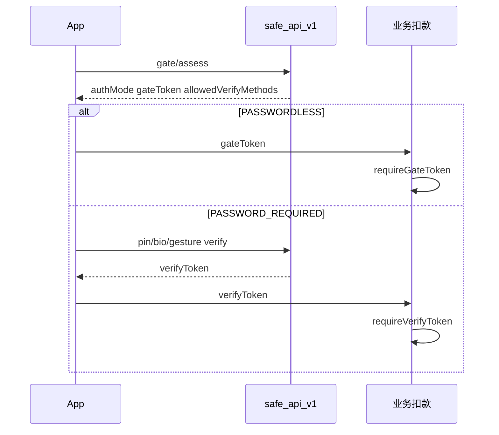

# 支付安全对接指南（safe 模块）

> 客户端（App/H5）见 **`docs/AI_SAFE_CREDENTIAL_CLIENT_API.md`**；API 字段见 **`docs/AI_SAFE_CREDENTIAL.md`**；业务仓注入 **`PayPinVerifier`**。

## 1. 流程（必记）

1. 用户令牌登录（**非** `rbt_`）。
2. 支付前 **`gate/assess`**（`amountCent` 单位**分**、`deviceId`、`orderId` 建议传）。
3. 按 `authMode` 与 `allowedVerifyMethods`：
   - **`PASSWORDLESS`**：扣款前 `requireGateToken(userUuid, gateToken, amountCent)`。
   - **`PASSWORD_REQUIRED`**：`pin/verify` / `biometric/verify` / `gesture/verify`（闸门开启时须 `gateToken` + 相同 `amountCent`）→ `verifyToken` → `requireVerifyToken(userUuid, token, amountCent, orderId)`。
4. 展示金额：`amountCent / 100`。



## 2. 业务仓示例

```java
@Autowired private PayPinVerifier payPinVerifier;

public void charge(String userUuid, long amountCent, String orderId,
        String gateToken, String verifyToken) throws Exception {
    if (StringUtils.isNotBlank(verifyToken)) {
        payPinVerifier.requireVerifyToken(userUuid, verifyToken, amountCent, orderId);
        return;
    }
    payPinVerifier.requireGateToken(userUuid, gateToken, amountCent);
}
```

assess 与 verify 的 **`amountCent` 必须一致**；`gateToken` / `verifyToken` **勿复用**。

## 3. UX 与策略

| 点 | 说明 |
|----|------|
| `warnings` | 不阻断，应提示用户 |
| 免密 | 小额 + 窗口内 + 规则通过；高额仍要输密 |
| 手势 | 默认关；`security/settings/update` 开 `gesturePaymentEnabled` 后 assess 才返回 `GESTURE` |
| 常用设备 | `touchSuccess` ≠ 自动 trust；须用户 `device/trust` |
| 幂等 | 同 `orderId` 勿重复 assess；框架已防短时重复订单 assess |

`security/status` 可读 `passwordlessRemainingSeconds`、`gesturePaymentEnabled`。

## 4. 常见错误

| code | 处理 |
|------|------|
| 863 | 先 `gate/assess` |
| 862 | assess 与 verify/扣款 `amountCent` 一致 |
| 861 | `gateToken` 过期或已消费，重新 assess |
| 864 | 未开启手势支付，改用 PIN/BIO |
| 859 | `verifyToken` 无效或已消费，重新 verify |

## 5. 安全清单

- HTTPS + **`docs/AI_CRYPTO.md`** 传输加密  
- 勿本地缓存 PIN/手势  
- 扣款接口业务幂等（`orderId`）  

## 6. 扩展 SPI

- 重置：`PayCredentialResetVerifier`（默认登录密码）  
- 闸门：`PayGateRiskContributor`；框架已提供 `DuplicateOrderRiskContributor`、`AbnormalTimeRiskContributor`  

实现类注册为 Spring `@Component`；`evaluate` 返回非空 `reasons` 即拒绝 assess。字段级说明见 **`docs/AI_SAFE_CREDENTIAL.md` §7**。
