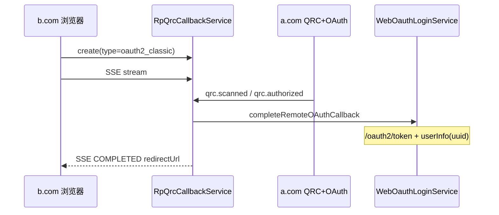
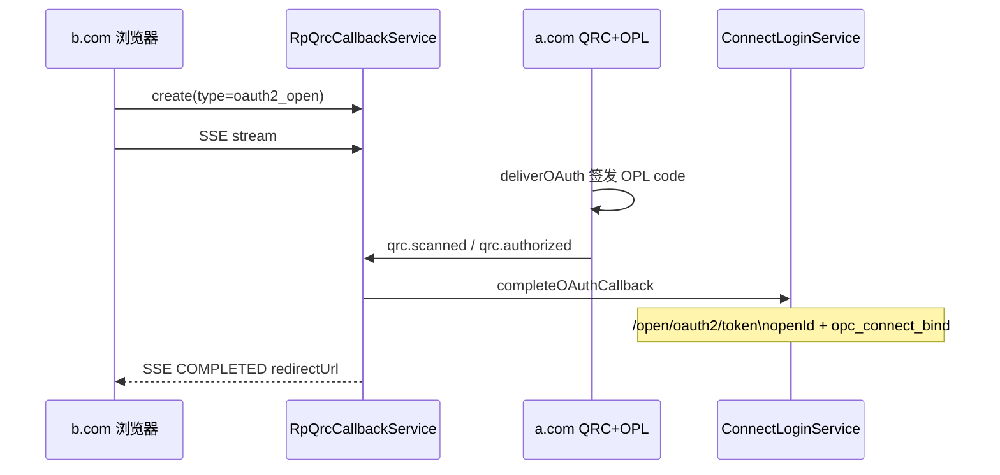
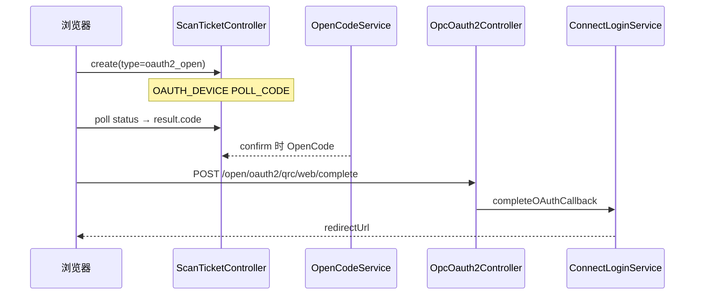

# 扫码登录双模式回归评估（经典 OAuth2 × 开放授权）

> **评估基线**：Autumn 3.0.0，Phase 2（双 Webhook + SSE + 统一凭证）+ 双模式完成编排修复已合入。  
> **关联文档**：[`AI_SCAN_LOGIN_FLOWS.md`](AI_SCAN_LOGIN_FLOWS.md)、[`AI_AUTH_LOGIN_PROVIDERS.md`](AI_AUTH_LOGIN_PROVIDERS.md)、[`AI_AUTH_LOGIN_MODES.md`](AI_AUTH_LOGIN_MODES.md)。

---

## 1. 评估范围

| 维度 | 经典 OAuth2（`oauth2_classic`） | 开放授权 OPC（`oauth2_open`） |
|------|--------------------------------|------------------------------|
| 授权登录 **Tab 跳转** | `/oauth2/login?client_id=` | `/open/oauth2/login?appId=` |
| 授权登录 **扫码**（`pageLogin` 2/3） | `qrProviders` + `AutumnQrc` | 同上，共用外壳 |
| **网页授权**扫码子路径 | B2 同源 / D 联邦 | 同源 B2（OPC OAuth）/ 跨站 D |
| **服务端建票** B3 | `client_id` → `open/create` | `appId` 作 `clientId` → 远程 `open/create`（需 AS 登记） |

---

## 2. 能力矩阵（与代码对照）

| 能力 | 经典 `oauth2_classic` | 开放 `oauth2_open` | 代码位置 |
|------|----------------------|-------------------|----------|
| 统一凭证 `type/id` | ✅ | ✅ | `ScanLoginCredentialService` |
| 凭证解析 API | ✅ | ✅ | `POST /client/scan-login/credential/resolve` |
| `pageLogin` 0–3 | ✅ `WebAuthenticationEntity` | ✅ `ConnectAppEntity` | `PageLoginSupport` |
| Tab Provider 列表 | ✅ | ✅ | `listClassicTabProviders` / `listOpenTabProviders` |
| QR Provider 列表 | ✅ | ✅ | `listClassicQrProviders` / `listOpenQrProviders` |
| `qrMode` 判定 | `hasRemoteOrigin` → `rp`/`as` | 同站 `as` / 跨站 `rp` | `ScanLoginCredentialService` |
| 同源扫码 B2 | ✅ `SELF_WEB_LOGIN` + exchange | ✅ `OAUTH_DEVICE` + `complete` | `ScanLoginFacade` / `OpcOauth2Controller` |
| 跨站联邦 D（建票） | ✅ WEBHOOK + SSE | ✅ 同路径 | `RpQrcCallbackService.createTicket` |
| 跨站联邦 D（`qrc.scanned`） | ✅ | ✅ | `QrcWebhookDeliveryService` + `RpQrcInboundService` |
| 跨站联邦 D（`qrc.authorized` 完成登录） | ✅ `WebOauthLoginService` | ✅ `ConnectLoginService` | `RpQrcCallbackService.finishInboundLogin` |
| AS 确认发码 | 经典 `issueAuthCode` | OPL `OpenCodeService.issue`（appId 活跃时） | `ClientGrantService.deliverOAuth` |
| 绑定冲突页 | `/client/oauth2/bind/choice` | `/open/oauth2/bind/choice` | 各 `*LoginService.bindChoicePageUrl` |
| B3 服务端 `open/*` | ✅ | ✅（`clientId`=appId） | `QrcApiSupport` + `ScanLoginFacade` |
| 单测 | classic QR / 联邦 / inbound | open 凭证 / deliver / callback | 见 §5 |
| 集成测 | `RpFederatedLoginIntegrationTest` | `RpOpenFederationIntegrationTest` | `web/.../integration/qrc` |

**结论（摘要）**

- **经典 OAuth2**：网页授权（B2/D）与服务端建票（B3）扫码链路 **完整闭环**。
- **开放授权 OPC**：跨站 D 与同源 B2 均经 **`ConnectLoginService`**（`/open/oauth2/token` + `opc_connect_bind`），与 Tab 跳转一致。

---

## 3. 两种模式扫码时序

### 3.1 经典 OAuth — 跨站 D

### 3.2 开放 OPC — 跨站 D

### 3.3 开放 OPC — 同源（`qrMode=as`）

---

## 4. 服务端建票（B3）与两种模式

两种模式在 B3 层 **共用 AS 侧** `POST /qrc/api/v1/ticket/open/*`：

| 步骤 | 说明 |
|------|------|
| 建票 | body `clientId` + `clientSecret`；开放场景 `clientId` = OPL `appId`（须在 `oauth_client_details` + `qrc_client_grant` 存在） |
| 轮询 | `open/status`（`delivery=POLL_CODE`） |
| 换票 | 经典 `/oauth2/token`；OPL appId 场景 `/open/oauth2/token` |

开放 OPC **网页**扫码（B2/D）不经过 B3 轮询集成面；B3 面向持 secret 的服务端集成。

**同源开放 B2 前置**：`appId` 须在 `oauth_client_details`（trusted）登记，且 OPL `opl_open_app` 存在同 `appId` 活跃应用。`pageLogin` 含 QR 时 `ConnectAppService` 会自动同步 `oauth_client_details`。

---

## 5. 测试覆盖

| 测试类 | 经典 | 开放 | 说明 |
|--------|------|------|------|
| `ScanLoginCredentialServiceTest` | ✅ | ✅ | 凭证解析 |
| `AuthLoginProviderServiceTest` | ✅ Tab + QR | ✅ Tab + open `qrProviders` | Provider 列表 |
| `ClientGrantServiceDeliverOAuthTest` | ✅ | ✅ OPL code | AS 发码分支 |
| `RpQrcCallbackServiceTest` | ✅ | ✅ + bind choice | RP 完成编排 |
| `RpFederatedLoginIntegrationTest` | ✅ | — | 经典联邦 |
| `RpOpenFederationIntegrationTest` | — | ✅ D + B2 | 开放联邦 + 同源 complete |

---

## 6. 代码质量（摘要）

| 项 | 说明 |
|----|------|
| 凭证统一 | `ScanLoginCredentialService` 单一入口 |
| 完成编排对称 | 经典 `WebOauthLoginService` / 开放 `ConnectLoginService` |
| AS 发码 | OPL `appId` 自动走 `OpenCodeService` |
| 联邦 Phase 2 | 双 Webhook + SSE；已移除 `pollStatus`/`completeTicket` 死代码 |
| 门面 | `ScanLoginFacade` 统一 B2/D/B3；`ScanTicketController` 支持凭证建票 |

---

## 7. 验收结论（回归）

| 模式 | 扫码接口（Provider / 凭证 / 建票 / SSE / Webhook） | 扫码授权流程（换票 / userInfo / 绑定 / Session） |
|------|---------------------------------------------------|------------------------------------------------|
| **经典 OAuth2** | ✅ 完整 | ✅ 完整（`WebOauthLoginService`） |
| **开放 OPC** | ✅ 完整 | ✅ 完整（`ConnectLoginService`） |

**总体**：两种模式在登录页扫码入口、AS 双回调、RP 完成编排上与 Tab 授权 **语义对齐**，可宣称双模式完整支持。

---

## 8. 相关文档

| 文档 | 内容 |
|------|------|
| [`AI_SCAN_LOGIN_FLOWS.md`](AI_SCAN_LOGIN_FLOWS.md) | 时序图、拓扑、双模式绑定 |
| [`AI_AUTH_LOGIN_PROVIDERS.md`](AI_AUTH_LOGIN_PROVIDERS.md) | Provider 契约与 `pageLogin` |
| [`AI_AUTH_LOGIN_MODES.md`](AI_AUTH_LOGIN_MODES.md) | 方式一经典 / 方式二开放总览 |
