# 扫码登录流程、拓扑与鉴权（与代码一致）

> **版本线**：Autumn 2.0.0（master）/ 3.0.0（`3.0.0` 分支）契约一致。  
> **配套入口**：配置与 API 字段见 **`docs/AI_SCAN_LOGIN_STANDARD.md`**、**`docs/AI_QRC_API.md`**。  
> **进程内门面**：`cn.org.autumn.modules.client.service.ScanLoginFacade`；前端 **`autumn-qrc-core.js`**（`mode: 'as' | 'rp'`）。

本文用**时序图、流程图、拓扑图**描述两套标准扫码登录，并与当前实现类/端点一一对应。文中 **a.com = AS（身份源）**，**b.com = RP（接入站）**，仅为示例域名。

---

## 1. 两套标准与代码映射

| 标准 | 适用场景 | 典型子模式 | 建票 | 取结果 / 完成登录 | 前端/调用方 |
|------|----------|------------|------|-------------------|-------------|
| **标准一：网页授权** | 浏览器登录页、OAuth 授权页 | **B2** 同源 PC 扫码 | `POST /qrc/scanticket/web/ticket/create` | 轮询 `GET .../ticket/status` → `POST .../session/exchange` | `autumn-qrc-core.js` `mode:'as'` |
| | | **D** RP 联邦（B←A） | `POST /client/oauth2/qrc/web/ticket/create` | **SSE** `GET .../ticket/stream`；入站自动 `completeRemoteOAuthCallback` | `mode:'rp'` 或 `qrProviders` |
| | | **B1** OAuth Redirect | `GET /oauth2/authorize` | `redirect_uri?code=` → token | 浏览器跳转 |
| **标准二：服务端建票** | 第三方后台、Native、自建 UI | **B3** Open API | `POST /qrc/api/v1/ticket/open/create` | 按 `delivery` 轮询 / Webhook / DeepLink → `/oauth2/token` | 服务端 HTTP，无 Autumn 登录页 |

**实现分层（勿重复造轮子）**

| 层次 | 类 / 文件 | 职责 |
|------|-----------|------|
| 统一门面 | `ScanLoginFacade` | B2 / D / B3 进程内入口 |
| AS 票据 | `ScanTicketService` | 建票、scan、confirm、状态、Redis 锁 |
| AS OAuth 桥 | `ClientGrantService` | 发 `code`；`delivery=WEBHOOK` 时 `qrc.authorized` |
| AS Webhook 投递 | `QrcWebhookDeliveryService` | `qrc.scanned`（scan 后）、`qrc.authorized`（confirm 后） |
| RP 联邦建票 | `RpQrcCallbackService` | 代理 AS `open/create`，注入 WEBHOOK，绑定 `browserSessionId` |
| RP 入站 | `RpQrcInboundService` | 验签；`scanned` / `authorized` 分支 |
| RP SSE | `RpQrcEventStreamService` | `SseEmitter` + Redis Pub/Sub 广播 |
| RP Session 绑定 | `RpQrcSessionContextService` + `ShiroSessionService` | 入站完成登录时恢复建票浏览器 Session |
| RP OAuth 编排 | `WebOauthLoginService` | `completeRemoteOAuthCallback` → 换票 / userInfo / bind / `establishSession` |
| PC 网页 API | `ScanTicketController` | `/qrc/scanticket/web/*` |
| RP 网页 API | `ClientOauth2QrcController` | `/client/oauth2/qrc/web/*`（**无** `local-status` / `complete`） |
| Open API | `QrcApiController` | `/qrc/api/v1/ticket/open/*`、APP `scan`/`confirm` |
| 前端 | `autumn-qrc-core.js` | B2 轮询；D **EventSource** |

---

## 2. 部署拓扑与信任边界

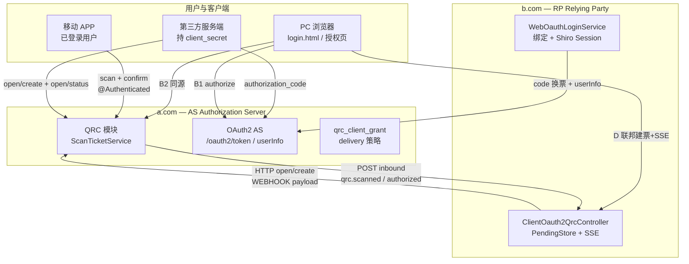

**信任边界摘要**

| 边界 | 凭证 | 校验点 |
|------|------|--------|
| APP → AS | `UserToken`（`@Authenticated`） | `QrcApiController` scan/confirm |
| 第三方 → AS Open API | `client_id` + `client_secret`（body） | `QrcApiSupport.requireOpenClient` |
| AS → RP Webhook | `webhookSecret`（建票 payload） | RP `RpQrcInboundService` 校验 `X-Qrc-Signature` |
| RP 浏览器 → RP | Shiro Session Cookie | 建票时写入 `browserSessionId`；`authorized` 入站时绑定完成登录 |
| 第三方 → AS OAuth | `client_secret` | `/oauth2/token` |

**跨站联邦 QR 规则**：D 模式 `qrUrl` **主机名必须为 a.com**（`https://a.com/qrc/api/v1/t/{uuid}`），由 RP 代理 AS 建票返回，不得在 b.com 本域自建 Redis 票据。

---

## 3. 标准一：网页授权登录

### 3.1 子模式选型（流程图）

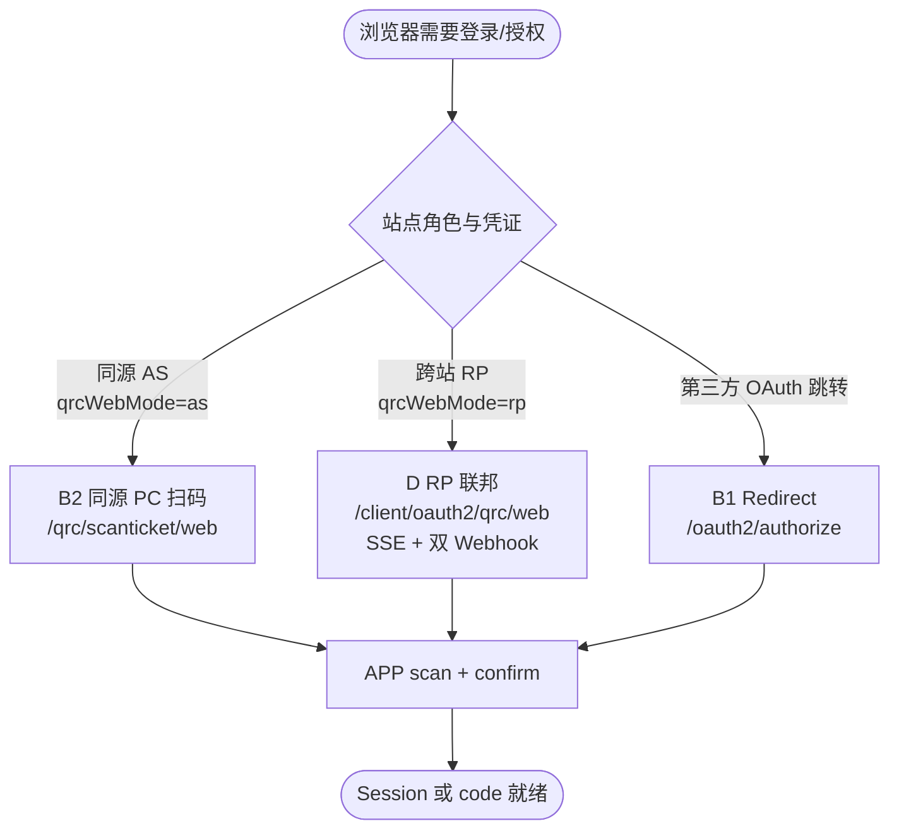

### 3.2 B2 — 同源 Autumn PC 扫码（单站 AS）

**场景**：a.com 登录页；PC 与 APP 同属一个 Autumn 站点。QR 内容为 **a.com** 域 `/qrc/api/v1/t/{uuid}`。

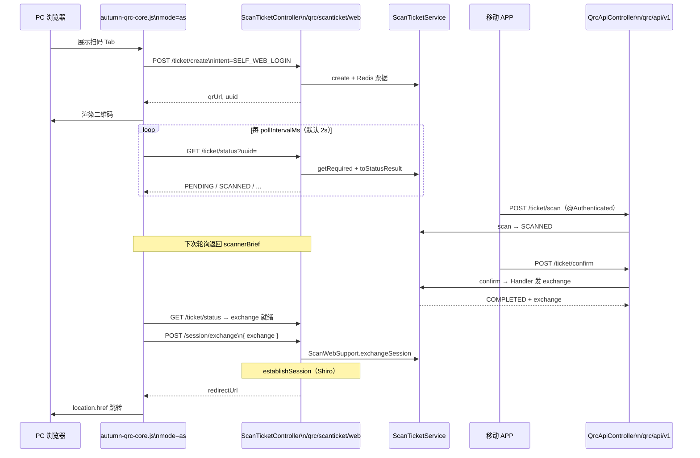

**鉴权要点**

- APP：`scan` / `confirm` 须 **已登录**（`@Authenticated` + `UserContext`），且扫码用户与确认用户一致（`8617`）。
- PC：`create` / `status` / `exchange` 为 **anon**（`@SkipInterceptor`），`exchange` 一次性 token 短 TTL（`QRC_CONFIG.exchangeTokenTtlSeconds`）。
- 无 `client_secret` 暴露给浏览器；B2 不经过 OAuth `code`，直接 `exchange` 建 Session。

**状态机（B2）**

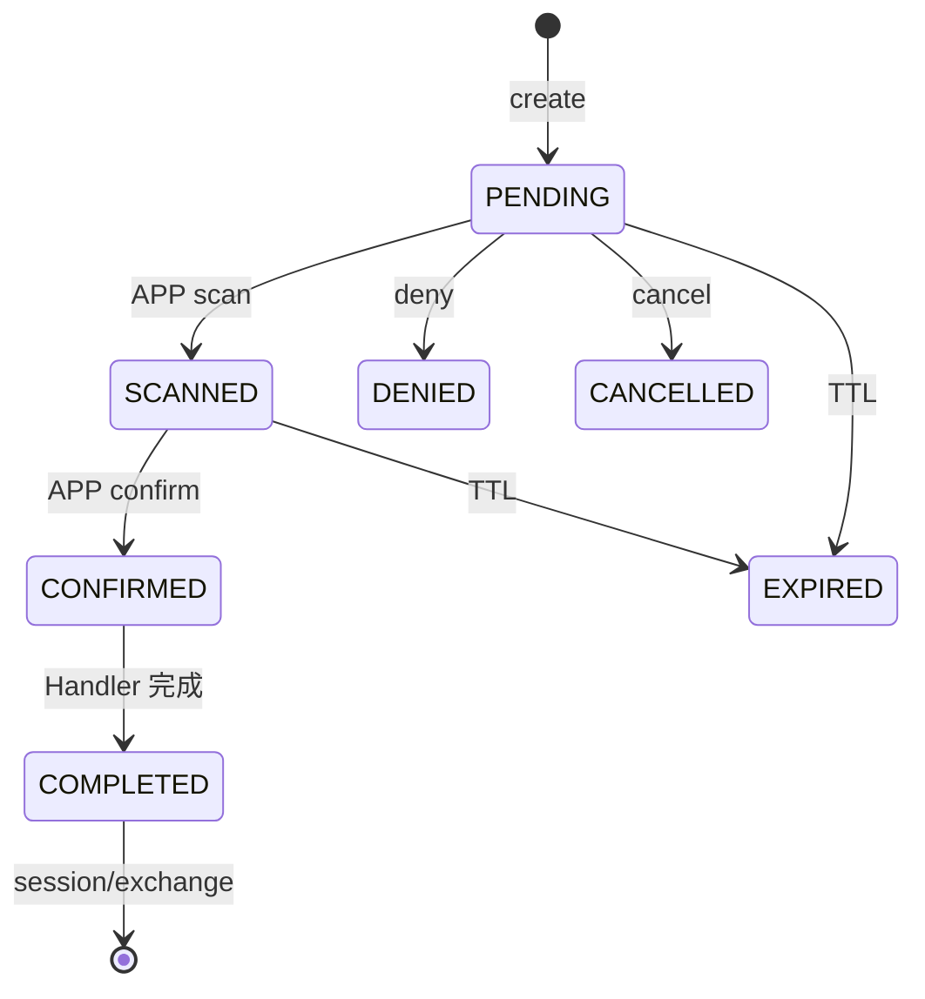

### 3.3 D — RP 联邦扫码（b.com ← a.com）

**场景**：b.com 登录页扫码，身份来自 a.com；**零轮询**——浏览器仅一条 SSE，AS 两次 Webhook 驱动状态与登录完成。

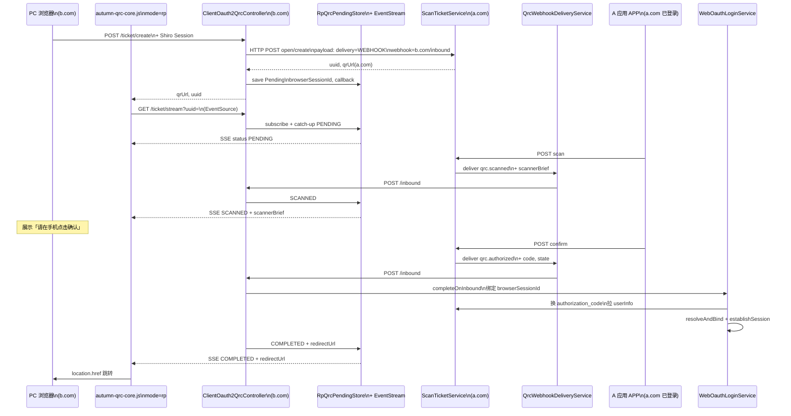

**Webhook 入站鉴权（AS → RP）**

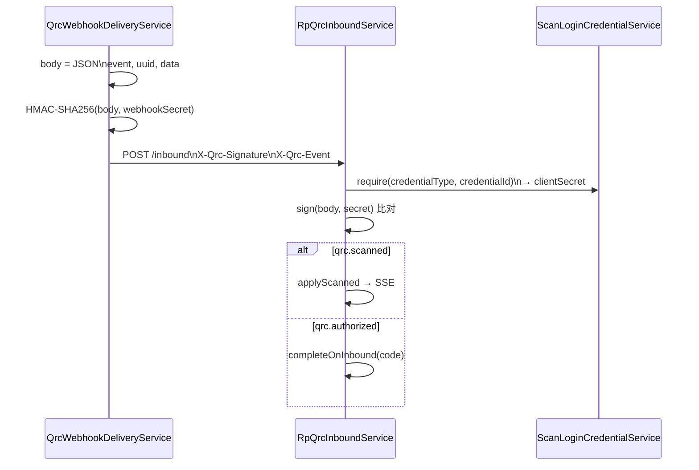

**Session 绑定（`authorized` 自动完成登录）**

| 步骤 | 代码位置 | 说明 |
|------|----------|------|
| 建票记录 Session | `RpQrcCallbackService.createTicket` | `pending.setBrowserSessionId(request.getSession().getId())` |
| 入站恢复 Subject | `RpQrcSessionContextService.runWithBrowserSession` | `ShiroSessionService.readSessionById` + `Subject.Builder` |
| 完成 OAuth | `WebOauthLoginService.completeRemoteOAuthCallback` | 与 B1 `/client/oauth2/callback` 共用 `finishOAuthLogin` |
| Session 失效 | `markSessionExpired` | SSE 推送 `SESSION_EXPIRED`，前端刷新二维码 |

**多实例 RP**：`RpQrcPendingStore` 使用 Redis；`RpQrcEventStreamService` 经 `RedisListenerService` Pub/Sub（`rp:qrc:sse`）将事件广播到持有 SSE 连接的节点。SSE 响应头：`Cache-Control: no-cache`、`X-Accel-Buffering: no`。

**D 模式禁止路径（已删除，勿调用）**

- `GET|POST .../ticket/local-status`
- `POST .../ticket/status`（RP 代理 AS 轮询）
- `POST .../ticket/complete`
- `ScanLoginConfig.legacyRemotePoll`

### 3.4 B1 — OAuth 浏览器 Redirect（简述）

第三方 Web 不走 QRC 自建票，直接跳转 AS 授权页；未登录时 AS 可预建 `OAUTH_AUTHORIZE` 票，UI 与 B2 共用 `login.html` 扫码 Tab。

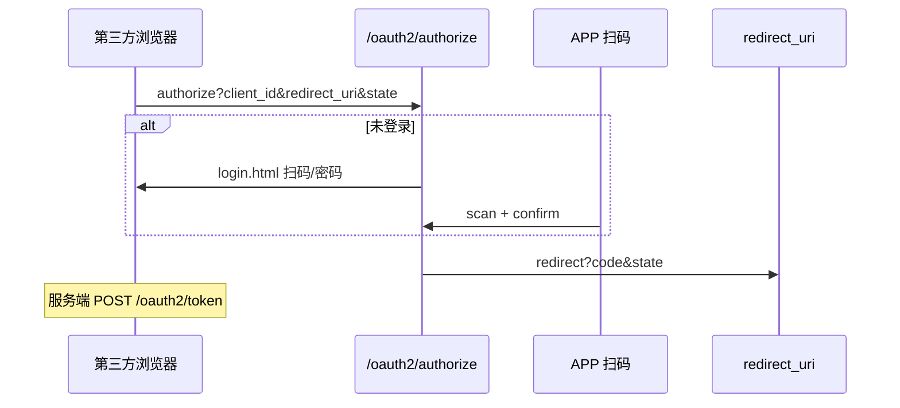

---

## 4. 标准二：服务端建票（Open API / B3）

**场景**：第三方**服务端**持 `client_secret`，自建 UI 展示 QR，**不**打开 Autumn 登录页；结果按 `qrc_client_grant.delivery` 获取。

### 4.1 POLL_CODE（最常见）

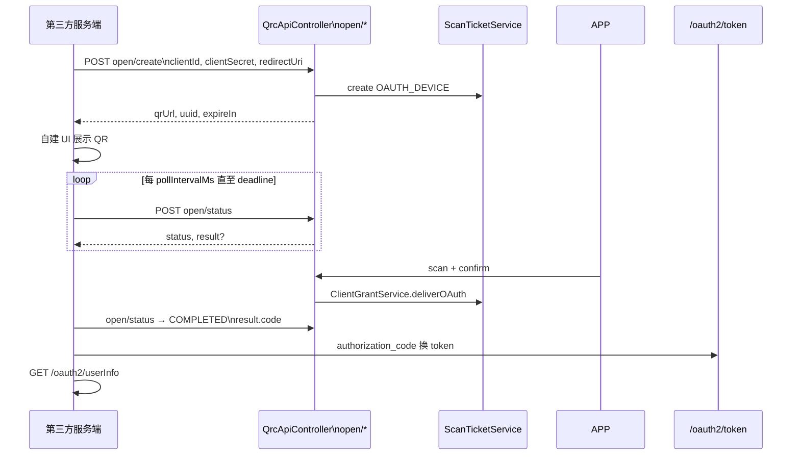

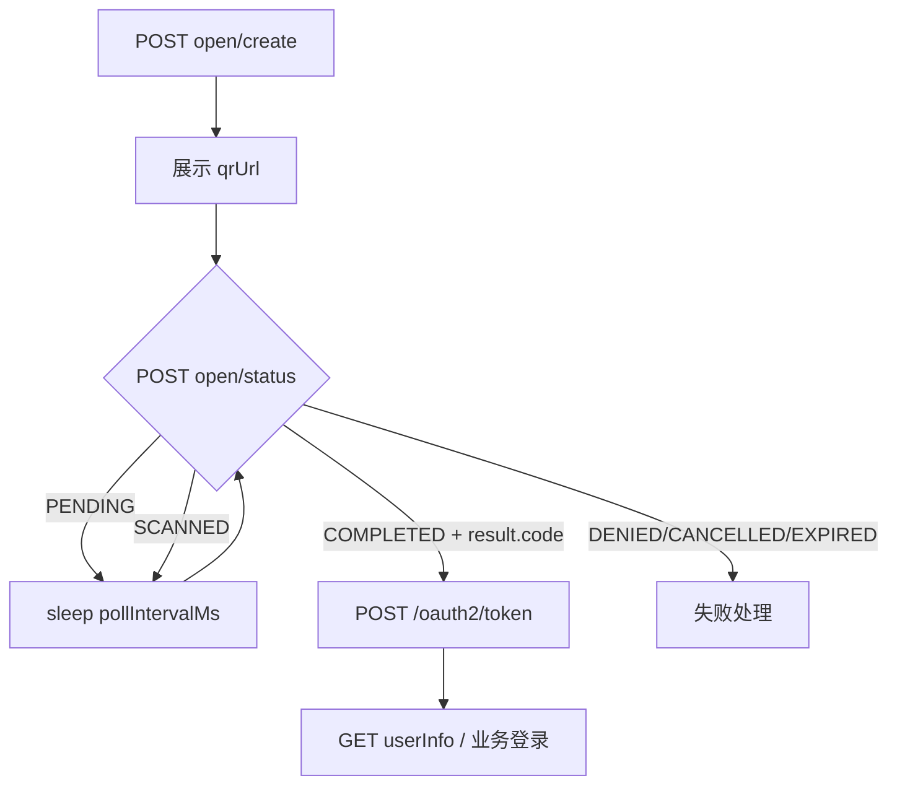

**鉴权**：每次 `open/create|status|cancel` body 均带 `clientId` + `clientSecret`；`open/status` 校验票据归属同一 client（`8619`）。

### 4.2 delivery 分支对比

| delivery | 取结果方式 | AS 侧触发 | 典型集成方 |
|----------|------------|-----------|------------|
| `POLL_CODE` | 轮询 `open/status` → `result.code` | `ClientGrantService.deliverOAuth` 写 result | 第三方服务端 B3 |
| `POLL_TOKEN` | 轮询 → `result.accessToken` | 同上 | 免二次 token 换票 |
| `WEBHOOK` | POST 第三方 URL | `qrc.authorized`（+ 联邦时 `qrc.scanned`） | 有公网回调的服务 |
| `DEEP_LINK` | APP 打开 `result.deepLink` | confirm 后生成 scheme 链接 | Native 壳 |

**联邦 D 模式建票**在 RP 侧强制 payload `delivery=WEBHOOK`、`webhook={b.com}/client/oauth2/qrc/web/inbound`，与 B3 第三方自建 Webhook **不是同一路径**——前者入站由 `RpQrcInboundService` 处理并推 SSE，后者由集成方自行验签换票。

### 4.3 WEBHOOK delivery（第三方直连 AS，非 RP 联邦）

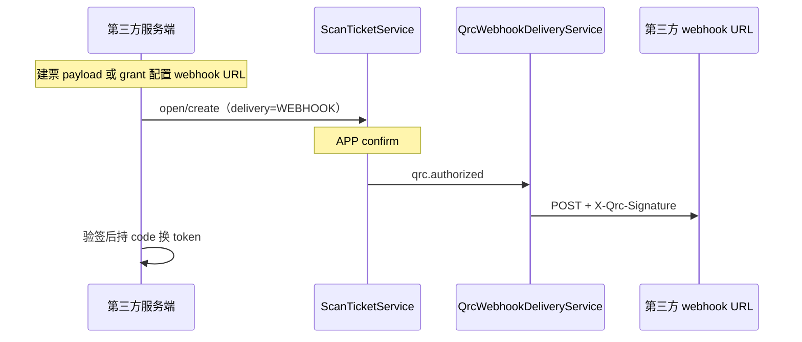

扫码步若建票含 `webhook` 且 `delivery=WEBHOOK`，`scan` 成功后另发 **`qrc.scanned`**（含 `scannerBrief`），便于第三方 UI 展示两步确认（与 D 模式联邦语义一致）。

---

## 5. 上下游交互矩阵

| 调用方 | 被调用方 | 协议 / 端点 | 携带凭证 | 代码入口 |
|--------|----------|-------------|----------|----------|
| PC 浏览器 | 同源 AS | `POST/GET /qrc/scanticket/web/*` | Cookie（exchange 时） | `ScanTicketController` |
| PC 浏览器 | RP | `POST create`、`GET stream`（SSE） | Shiro Session Cookie | `ClientOauth2QrcController` |
| RP 服务端 | AS | `POST {origin}/qrc/api/v1/ticket/open/create` | `client_secret`（服务端） | `RpQrcCallbackService` |
| AS 服务端 | RP | `POST /client/oauth2/qrc/web/inbound` | `X-Qrc-Signature` | `QrcWebhookDeliveryService` |
| APP | AS | `POST /qrc/api/v1/ticket/scan|confirm` | Bearer / UserToken | `QrcApiController` |
| 第三方服务端 | AS | `POST open/create|status|cancel` | `client_secret` | `QrcApiController` |
| RP 入站逻辑 | AS OAuth | `POST /oauth2/token`、userInfo | `client_secret` | `WebOauthLoginService` |
| 第三方服务端 | AS OAuth | `POST /oauth2/token` | `client_secret` | 标准 OAuth2 |

**RP 联邦明确不做的事**

- B 前端 **不** 轮询 `local-status` / `ticket/status`，**不** `POST complete`
- B 后台 **不** HTTP 调用 AS `open/status` 代理轮询

---

## 6. 统一票据状态机

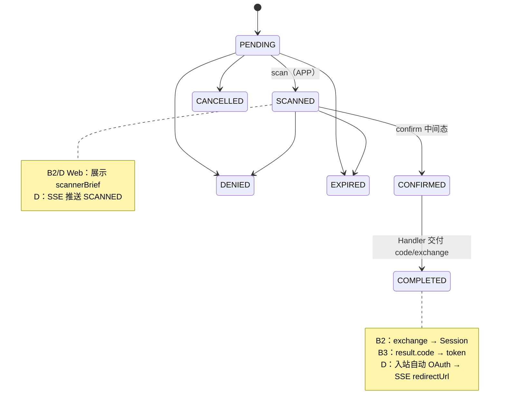

---

## 7. 绑定与冲突（D / B1 / B3 换票后共用）

`WebOauthLoginService.finishOAuthLogin` → `WebOauthBindService.resolveAndBind`：

```mermaid
flowchart TD
  A[拿到 upstream UserProfile] --> B{已有 upper 绑定?}
  B -->|是| C[登录已绑定本地用户]
  B -->|否| D{已登录 Session?}
  D -->|是| E[绑定当前 Session 用户]
  D -->|否| F{同实例且 upstream uuid 本地存在?}
  F -->|是| G[幂等补写绑定]
  F -->|否| H[BIND_CHOICE_REQUIRED]
  H --> I[/client/oauth2/bind/choice]
  C --> J[establishSession]
  E --> J
  G --> J
```

D 模式若冲突，`completeOnInbound` 将 `redirectUrl` 设为 bind choice 页，经 SSE 交给浏览器跳转。

**经典与开放双模式**：

- `oauth2_classic` 跨站 D → `WebOauthLoginService` → `/client/oauth2/bind/choice`
- `oauth2_open` 跨站 D → `ConnectLoginService` → `/open/oauth2/bind/choice`
- `oauth2_open` 同源 B2 → 轮询 `result.code` → `POST /open/oauth2/qrc/web/complete`

详见 [`AI_SCAN_LOGIN_DUAL_MODE_REGRESSION.md`](AI_SCAN_LOGIN_DUAL_MODE_REGRESSION.md)。

---

## 8. 相关文档

| 文档 | 内容 |
|------|------|
| **`AI_SCAN_LOGIN_STANDARD.md`** | 两套标准规范、配置清单、排查 |
| **`AI_QRC_API.md`** | HTTP 端点、报文、Webhook §5、错误码 |
| **`AI_AUTH_SITE_ROLES.md`** | AS/RP 双角色、联邦配置 |
| **`AI_QRC_INTEGRATION.md`** | 集成模式 A～D 选型 |
| **`AI_QRC_CLIENT_API.md`** | APP scan/confirm UX |
| **`AI_OAUTH_INTEGRATION.md`** | token / userInfo |

**集成测试**：`ScanLoginFacadeIntegrationTest`、`RpFederatedLoginIntegrationTest`、`RpQrcSseIntegrationTest`、`OpenApiServerScanLoginIntegrationTest`。
