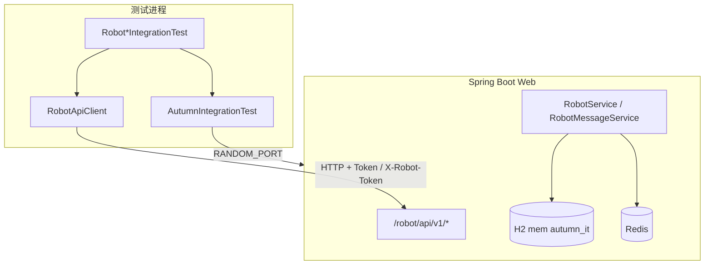

# web 模块集成测试指南

> **Autumn 2.0.0** · 测试代码位于 `web/src/test/java/cn/org/autumn/integration/`  
> 数据库：**H2 内存**（`application-it.yml`）· 缓存/限流/幂等：**Redis**（需本地或环境变量可达）

---

## 1. 架构概览



| 组件 | 路径 | 职责 |
|------|------|------|
| 基类 | `integration/base/AutumnIntegrationTest.java` | 启动 `Web`、等待 `InitFactory`、签发管理员 `userToken` |
| HTTP 客户端 | `integration/support/RobotApiClient.java` | 封装 `POST /robot/api/v1/*` |
| 假设 | `integration/support/IntegrationAssumptions.java` | Redis 不可用时 **Assume 跳过**（非失败） |
| 配置 | `src/test/resources/application-it.yml` | H2 + Redis + `autumn.redis.open=true` |
| Robot 用例 | `integration/robot/*IntegrationTest.java` | 管理 API、入站 push、鉴权边界 |

---

## 2. 环境要求

| 项 | 要求 |
|----|------|
| JDK | **8** |
| Maven | 3.6+ |
| Redis | 默认 `localhost:6379`，密码 `autumn`（与 `application.yml` dev 一致，可覆盖） |
| MySQL | **不需要**（H2 内存） |

### 2.1 Redis 环境变量（可选）

| 变量 | 默认 |
|------|------|
| `AUTUMN_IT_REDIS_HOST` | `localhost` |
| `AUTUMN_IT_REDIS_PORT` | `6379` |
| `AUTUMN_IT_REDIS_PASSWORD` | `autumn` |

---

## 3. 运行方式

### 3.1 仅跑集成测试（推荐）

在仓库根目录（**须带 `-am`**，确保 `autumn-modules` 等与测试一致；改 Shiro/机器人模块后建议加 `clean`）：

```bash
mvn -pl web -am test -Pintegration -DskipTests=false
# 或仅 Robot 用例：
mvn -pl web -am clean test -Pintegration -DskipTests=false -Dtest='Robot*IntegrationTest'
```

只执行 `*IntegrationTest.java` 类。

### 3.2 在 IDE 中运行

1. 确认 Redis 已启动。  
2. 对 `cn.org.autumn.integration.robot.RobotApiIntegrationTest`（或其它 `*IntegrationTest`）右键运行。  
3. VM 选项可加：`-Dspring.profiles.active=it`

### 3.3 默认构建（跳过测试）

根 `pom.xml` 中 `skipTests=true`，日常 `mvn install` **不会**跑 web 集成测试；需显式 `-Pintegration -DskipTests=false`。

---

## 4. 用例清单与 API 覆盖率

开放 API 共 **18** 个端点（管理 17 + 入站 1）。当前自动化覆盖 **100% 端点**（2026-05 全面回归升级后）。

| 端点 | 覆盖类 | 说明 |
|------|--------|------|
| `POST /create` | ApiIntegration、ApiRegression、Inbound* | 主流程 / 空名称 |
| `POST /list` | ApiIntegration、Auth | |
| `POST /disable` / `/enable` | ApiIntegration、InboundRegression | 停用作废全部 `rbt_`，push 鉴权失败 |
| `POST /delete` | ApiIntegration | 软删 |
| `POST /destroy` | ApiRegression | 销毁后不可 enable |
| `POST /hook/create` | ApiIntegration、ApiRegression | 含内网 URL 拒绝 |
| `POST /hook/list` | ApiRegression | |
| `POST /hook/update` | ApiRegression | |
| `POST /hook/delete` | ApiRegression | |
| `POST /hook/disable` / `/enable` | AdminRegression | |
| `POST /token/list` | ApiIntegration、ApiRegression、TokenRegression | |
| `POST /token/create` | ApiRegression、TokenRegression | |
| `POST /token/revoke` | ApiRegression、TokenRegression | |
| `POST /token/rotate` | TokenRegression | usedRows / 满额 |
| `POST /config/get` | ApiIntegration、AdminRegression | |
| `POST /config/save` | AdminRegression | 管理员 |
| `POST /message/push` | Inbound*、Auth、InboundRegression | 入队、幂等、类型/JSON、无令牌 |

**测试类一览**

| 类 | 用例数 | 职责 |
|----|--------|------|
| `RobotApiIntegrationTest` | 3 | 主流程冒烟 |
| `RobotApiRegressionTest` | 4 | Hook/令牌/销毁/回调 URL |
| `RobotAuthIntegrationTest` | 3 | 双令牌边界 |
| `RobotInboundApiIntegrationTest` | 3 | push 成功与幂等 |
| `RobotInboundRegressionTest` | 4 | push 负向；停用后令牌作废→`-10000` |
| `RobotTokenRegressionTest` | 2 | rotate、满额 usedRows |
| `RobotScopesRegressionTest` | 2 | scopes 限制 message.push |
| `RobotAdminRegressionTest` | 2 | config/save、Hook 启停 |

**基建**：`AutumnIntegrationTest` 使用 `@TestInstance(PER_CLASS)`，同类共享一次启动与管理员令牌；`IntegrationJson.assertCode` / `assertBusinessFailure` / `assertAuthFailure`。

运行全部 Robot 用例：

```bash
mvn -pl web -am test -Pintegration -DskipTests=false -Dtest='Robot*IntegrationTest,Robot*RegressionTest'
```

### 4.1 `RobotApiIntegrationTest`

- 创建机器人 → 列表包含 → 创建 Hook → 令牌列表 → 停用/启用/软删  
- `config/get` 配额字段  
- 空名称创建失败  

Hook 回调地址使用公网占位 URL：`https://example.com/...`（框架禁止 localhost/内网）。

### 4.2 `RobotInboundApiIntegrationTest`

- `message/push` 入队成功（`queued=true`）  
- `messageId` 与 `X-Robot-Message-Id` 幂等（`duplicate=true`）  

依赖 **Redis**（幂等键、限流）。

### 4.4 `RobotApiRegressionTest` / `RobotInboundRegressionTest`

- Hook 列表 / 更新 / 删除；令牌创建与 revoke；`destroy`；Hook 内网回调拒绝  
- 停用后 `message/push` 鉴权失败（`disable` 作废全部令牌，见 `AI_ROBOT.md`）；非法 `type` / JSON；入站无令牌  

### 4.5 `RobotAuthIntegrationTest`

- `rbt_` 调用 `/list` → 要求用户令牌  
- 用户令牌调用 `/message/push` → 要求机器人令牌  
- 无令牌 → `code=-10000`  

---

## 5. 扩展新用例

### 5.1 继承基类

```java
public class MyFeatureIntegrationTest extends AutumnIntegrationTest {

    @Override
    protected void onReadyOnce() {
        // 可选：在 userToken 就绪后准备数据（PER_CLASS 仅执行一次）
    }

    @Test
    public void myCase() {
        JSONObject resp = robotApi.post("/create", userToken, body);
        IntegrationJson.assertSuccess(resp);
    }
}
```

### 5.2 实现 `AccountHandler` 监听机器人生命周期

机器人创建会触发 `AccountFactory.created`；在业务模块实现 `AccountHandler` 时通过 `user.isRobot()` 区分（参见 `docs/AI_ROBOT.md`）。

### 5.3 新增非 Robot 集成测试

1. 在 `integration/` 下新建包与 `*IntegrationTest` 类。  
2. 继承 `AutumnIntegrationTest`。  
3. 使用 `restTemplate` 或注入 Spring Bean 直接测 Service。  

---

## 6. 故障排查

| 现象 | 处理 |
|------|------|
| 测试被 **Skipped** | Redis 未启动或密码不对；检查 `IntegrationAssumptions` 日志 |
| `InitFactory 在 120s 内未完成` | H2 建表失败；查看 surefire 报告中的启动日志 |
| Hook 创建失败「内网或本机」 | 回调 URL 须为公网 https/http，勿用 `localhost` |
| `code=-10000` | 令牌缺失/过期/类型错误；检查 `Token` / `X-Robot-Token` 头 |
| WARN「请使用机器人/用户令牌」「名称不能为空」 | **多为集成测试负向用例**（`RobotAuthIntegrationTest`、`create_rejectsBlankName`）；接口仍返回非 0 `code`，非系统故障 |
| 端口冲突 | 已用 `server.port=0` 随机端口，一般无冲突 |

---

## 7. 与业务仓库联调

业务系统若依赖 autumn 机器人 API，可：

1. 复制 `RobotApiClient` + `IntegrationJson` 到业务测试工程；或  
2. 以本模块用例为参考，对 **已部署** 的 Autumn 实例跑契约测试（改 `baseUrl` 为真实 `{ORIGIN}`）。  

开放 API 字段说明见 **`docs/AI_ROBOT_API.md`**。

---

## 8. 文件清单

```
web/
  docs/INTEGRATION_TEST.md          # 本文
  src/test/resources/application-it.yml
  src/test/java/cn/org/autumn/integration/
    base/AutumnIntegrationTest.java
    support/IntegrationAssumptions.java
    support/IntegrationJson.java
    support/RobotApiClient.java
    robot/RobotApiIntegrationTest.java
    robot/RobotApiRegressionTest.java
    robot/RobotInboundApiIntegrationTest.java
    robot/RobotInboundRegressionTest.java
    robot/RobotAuthIntegrationTest.java
    support/RobotTestBodies.java
```

---

*维护：机器人 API 或鉴权变更时，请同步更新本目录用例与 `docs/AI_ROBOT_API.md`。*
